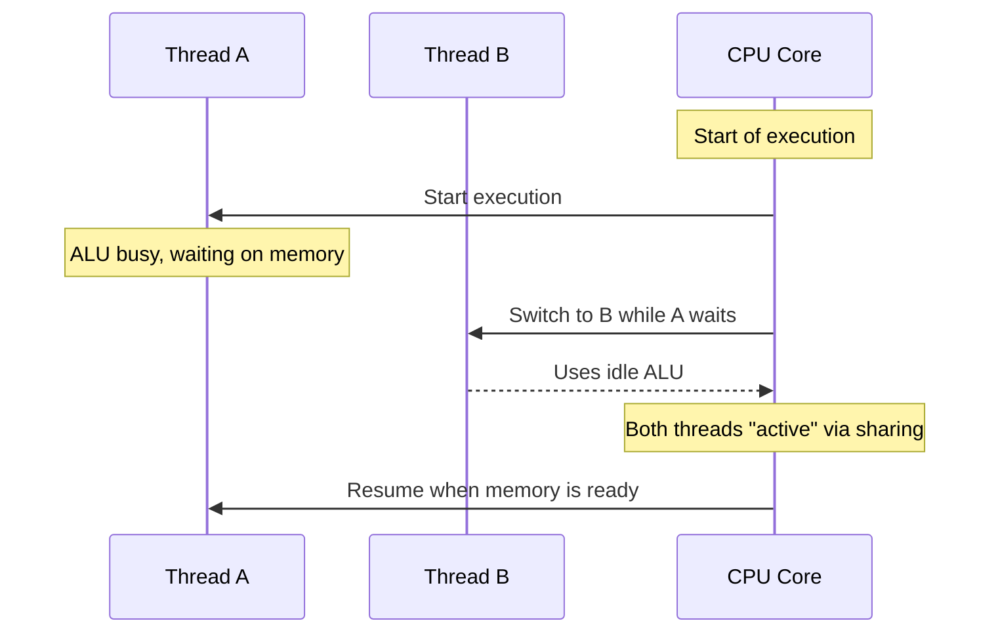
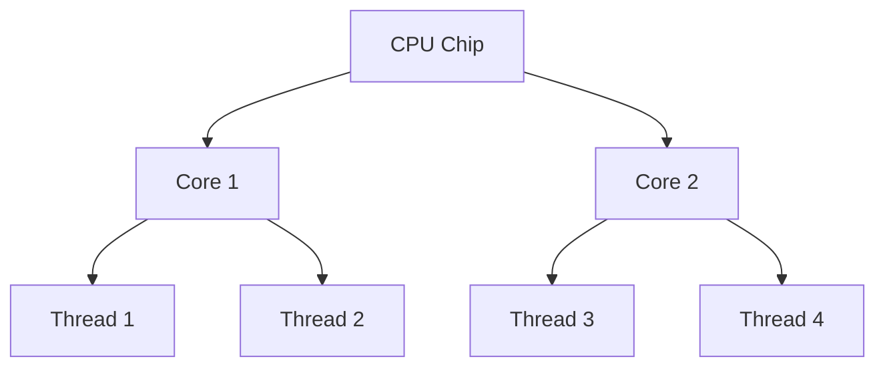

# 🧠⚙️ CPU Cores, Threads & Hyper-Threading (SMT)

_🤯 Understand how your code turns into machine instructions and how the CPU handles it with software threads and physical execution units._

---

## 🧭 Overview: Why It Matters to You

As a .NET developer, backend engineer, or DevOps pro:

- Knowing **what actually runs on the CPU** helps you optimize threading, async code, and parallelism.
- Without this, you'll misuse threads or expect "true" parallelism where it doesn't exist.

---

## 🧱 1. What Is a CPU Core?

🧩 A **CPU core** is a **physical unit** on your processor chip.
It contains all the hardware needed to **execute machine instructions**:

### ✅ Key Hardware Inside a Core

| Component              | Role                                  |
| ---------------------- | ------------------------------------- |
| 🧠 ALU                 | Arithmetic and logic operations       |
| 📦 Register File       | Fast storage for current thread state |
| 🔁 Branch Unit         | Handles if/else decisions             |
| ⏳ Load/Store Unit     | Reads/writes memory                   |
| 🎛️ Instruction Decoder | Decodes machine instructions          |

Each core is **fully capable** of running 1 instruction stream (aka thread).

---

## 🧵 2. What Is a Thread?

> A **thread** is a **logical unit of execution**, not hardware.

It consists of:

- A **sequence of instructions**
- A **register context** (e.g., program counter, stack pointer)
- A **call stack**

🧠 **A thread needs a core to run**, and the OS schedules it on available cores.

---

## 🔀 3. What Is Hyper-Threading / SMT?

> **Simultaneous Multi-Threading (SMT)** or **Hyper-Threading (HT)** allows a core to **appear as 2 logical processors**.

🧠 The idea: instead of letting the core sit idle when Thread A is waiting (e.g., on memory), let Thread B use it.

### 🧩 What’s Shared vs Duplicated?

| Part of Core        | Shared Between Threads | Duplicated Per Thread |
| ------------------- | ---------------------- | --------------------- |
| ALU / FPU           | ✅ Shared              | ❌                    |
| L1 / L2 Cache       | ✅ Shared              | ❌                    |
| Register Set        | ❌                     | ✅                    |
| Instruction Pointer | ❌                     | ✅                    |
| Program State       | ❌                     | ✅                    |

---

### 📈 Real-World Result

| Scenario                             | Performance      |
| ------------------------------------ | ---------------- |
| Thread A only                        | Baseline         |
| Thread A + Thread B (Hyper-Threaded) | \~30–50% gain    |
| Two physical cores                   | 100% gain (true) |

---

## 🎯 4. How Threads Run on Hyper-Threaded Cores (Sequence)

Let’s walk through a simplified timeline.

---

### 🔁 Sequence Diagram: Hyper-Threaded Core Behavior

> 💡 From your OS perspective: **both threads are “running”**, but under the hood they’re just **taking turns using idle parts of the core**.

---

## 👀 5. Diagram: CPU → Cores → Threads

- If you have a 4-core CPU with HT, you’ll see **8 logical processors**
- These 8 threads are scheduled by the OS
- Only **4 real cores** are doing the actual execution

---

## 🧮 6. OS Thread Scheduling + Context Switching

The OS (like Windows or Linux) uses a **scheduler** to manage:

- Which threads run on which logical CPUs
- When to switch between threads (every few milliseconds)
- When threads are blocked, ready, or running

---

### ⛓️ Example: Your .NET Web App

Let’s say your API handles 100 requests/second:

- ASP.NET Core queues work in the **ThreadPool**
- OS assigns **Thread A → Logical CPU 1**
- While Thread A waits for DB, **Thread B is assigned**
- If both use same physical core, they’re **hyper-threaded**

---

## 💬 Summary Table

| Concept             | Type     | Meaning                                           |
| ------------------- | -------- | ------------------------------------------------- |
| **Core**            | Physical | Executes 1 or more threads (via HT)               |
| **Thread**          | Logical  | Instruction stream needing a core to run          |
| **vCPU**            | Logical  | OS-visible thread slot (1 core = 2 vCPUs w/ HT)   |
| **Hyper-threading** | Feature  | Enables 2 threads per core (not true parallelism) |

---

## ✅ TL;DR

> 🔹 Threads are **not physical**.
> 🔹 Each physical core can **support 2 threads via HT**, using internal **resource sharing**.
> 🔹 This helps keep the CPU busy when one thread stalls.
> 🔹 **But** it’s not the same as having 2 actual cores.

---

Would you like to go next into:

1. 🔍 How .NET's **ThreadPool** uses these threads?
2. 🧵 How to write your own multi-threaded logic in C# with `Thread` and `ThreadPool`?
3. 🌀 How `async/await` does **not use threads** in the way you think?

Let’s go next level!
