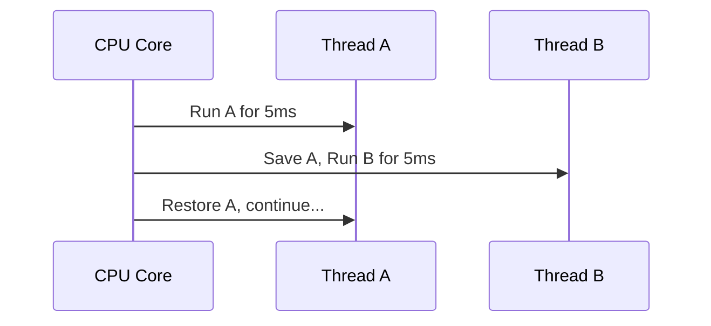

# ⚙️ How OS and CPU Actually Execute a Process & Threads

_🔥 Deep but clear explanation for developers!_

---

## 🧠 Step 1: Your Code → Compiled → Executable

When you build your .NET app:

- It gets compiled to **IL (Intermediate Language)** → then **JIT-compiled to machine code**.
- The result is something the **CPU understands** (binary instructions like `MOV`, `ADD`, `JMP`, etc.).

---

## 🚦 Step 2: OS Creates a **Process**

When you run:

```bash
dotnet MyApp.dll
```

The **Operating System** (Windows/Linux) does this:

| Action              | Explanation                                                  |
| ------------------- | ------------------------------------------------------------ |
| 🧠 Allocates memory | Gives the process space in **RAM** (code, data, heap, stack) |
| 🪪 Assigns PID       | Gives it a **Process ID** (unique identifier)                |
| 🧵 Starts 1 thread  | Every process starts with **one main thread**                |
| 🎫 Sets up context  | CPU registers, permissions, working directory, etc.          |

👉 Now you have a **running process** and **at least one thread**.

---

## ⚙️ Step 3: CPU Executes via Threads (Time-Sliced)

🧠 **A CPU core can only execute ONE instruction at a time.**
So how does it handle multiple processes or threads?

### 🧮 The Magic: **Context Switching**

- The **OS scheduler** switches between threads **very fast** (every few milliseconds).
- Looks like everything runs "at the same time", but it's just **fast switching**.



---

## 🔧 What is a **Thread** in Low-Level Terms?

Think of a **thread** as:

- A set of **CPU instructions + memory stack + context**.
- All threads in the **same process** share:

  - The same code
  - The same heap (global variables, static fields)

- But each thread has its **own call stack and CPU register state**.

---

## 🧩 Real Analogy: Kitchen (OS), Cooks (Threads), and Recipes (Process Code)

| Component             | Meaning                                |
| --------------------- | -------------------------------------- |
| 🧑‍🍳 Cooks (Threads) | Workers executing instructions         |
| 📜 Recipe (Code)      | Set of instructions (your program)     |
| 🏠 Kitchen (Process)  | Shared space for tools and ingredients |
| 🍳 Counter (Stack)    | Each cook uses their own small area    |

Even though they share the kitchen (process), each cook (thread) has their own tools (registers/stack).

---

## 🔥 How It Works in Web Servers

1. User sends a request.
2. Web server assigns a **ThreadPool thread** to handle it.
3. That thread:

   - Enters your controller/middleware
   - Executes logic
   - Writes response back to the network

4. If your code is **sync** → thread is blocked until done.
   If your code is **async** → thread is **freed** during I/O wait (better!).

---

## 🧪 Summary: Execution Flow (From Code to CPU)

```text
YourApp.cs → IL → Machine Code → OS Loads Process
→ OS Allocates RAM, Stack, Registers
→ CPU Executes Threads
→ OS Schedules Threads (Context Switch)
→ You See Multiple Requests Handled "Concurrently"
```

---

## 📌 Key Low-Level Insights

| Concept        | Meaning                                                                 |
| -------------- | ----------------------------------------------------------------------- |
| Process        | Isolated memory + resources (app in execution)                          |
| Thread         | Unit of execution within the process (instructions + registers + stack) |
| CPU Core       | Executes one thread at a time (but switches fast)                       |
| Context Switch | CPU saves/restores thread state to switch between threads               |
| Thread Safety  | Needed because threads share memory                                     |
