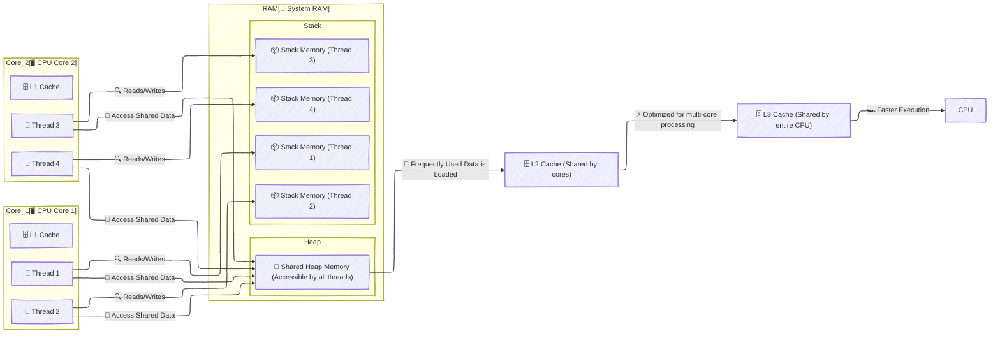

# **🚀Communication Between CPU, RAM In Depth**

Every thread and core in a modern CPU operates with a structured memory hierarchy. Here’s how it works:

---

---

## **🧵 1. Threads & Stack Memory (Private Space)**

✅ Each **CPU thread** has its own **private stack memory**, storing:

- **Local variables** used in functions.
- **Function execution history (call stack)**.  
  ✅ Threads **cannot** access each other’s stack, ensuring safety.

📝 **Example:** When a function runs, its variables are stored in the **thread's stack**. Once execution ends, those variables are **automatically erased**.

---

## **🔄 2. Shared Heap (Global Memory)**

✅ Unlike stack memory, the **heap is shared across all threads**.  
✅ **Stores global objects & dynamically allocated data**.  
✅ **Threads can read/write the same heap data**, requiring **synchronization mechanisms** (like **mutexes** or **locks**) to prevent conflicts.

📝 **Example:** If multiple threads need to modify the same object, **race conditions can occur**, causing unexpected results.

---

## **🖥️ 3. Multi-Core CPU Architecture**

🔹 **Each CPU core can handle 2 threads** (due to **Hyper-Threading or SMT**).  
🔹 **Multiple cores process tasks in parallel**, improving performance.

### **🧠 CPU Core Structure**

| **Core**   | **Threads**               | **Purpose**                         |
| ---------- | ------------------------- | ----------------------------------- |
| **Core 1** | 🧵 Thread 1 & 🧵 Thread 2 | Runs separate tasks simultaneously. |
| **Core 2** | 🧵 Thread 3 & 🧵 Thread 4 | Handles multi-threaded workloads.   |

🔹 Threads **execute independently but may access shared heap memory**.

---

## **⚡ 4. CPU Cache System (Speeds Up Memory Access)**

### **🚀 CPU Cache Breakdown**

✅ **L1 Cache (Fastest & Smallest)** – Each CPU core has its own **L1 cache**, which stores **very frequently used data & instructions** to minimize delays.  
✅ **L2 Cache (Shared by Core Pair or Per Core)** – Acts as a **backup** to L1 cache, storing additional data. It’s **slower than L1 but larger**. Some CPUs have **dedicated L2 per core**, others share L2 across core pairs.  
✅ **L3 Cache (Shared Across All Cores)** – **Biggest & slowest**, used to **coordinate data between cores**, improving efficiency in multi-threaded processing.

### **🗄️ Cache Levels**

✅ **L1 Cache (Fastest & Smallest)** – Private to each core, stores **most-used instructions & data**.  
✅ **L2 Cache (Shared per core pair)** – **Larger & slower** than L1, **used when L1 misses a request**.  
✅ **L3 Cache (Shared across all cores)** – **Biggest & slowest**, coordinates data between cores.

📌 **How it works:**  
🔹 The **CPU first checks L1 cache** before going to L2, then L3, and finally RAM if needed.  
🔹 **Minimizes direct RAM access**, improving speed dramatically. 🚀

---

## **🏎️ 5. Execution Flow: How CPU Handles Memory**

🔹 **Threads use private stacks** → Store temporary local variables.  
🔹 **Threads read/write shared heap** → Requires locking to avoid conflicts.  
🔹 **CPU caches frequently used data** → Improves execution speed.  
🔹 **Process executes** using cached memory before writing to RAM.

---

### **🔥 Final Takeaway**

🚀 **Efficient memory management ensures high-performance execution.**  
📝 **Stack memory is private per thread**, heap is shared, and caching improves speed.  
💡 Understanding this system helps optimize **multi-threaded applications & software design**.

Would you like additional details on **cache misses, thread synchronization, or memory allocation strategies**? 🚀🔥  
Let me know if you'd like more **technical depth or practical use cases**! 🎯💡
