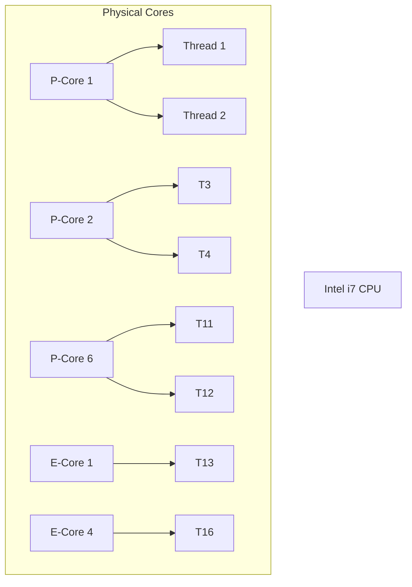

# 🧩 Understand CPU Cores, Threads

_Using your own machine as the example!_

---

## 🧠 First: What is a **Core**?

> A **Core** is a physical processing unit inside the CPU chip.
> Each core can run **one task (thread)** at a time.

🔧 Example:

- A **quad-core CPU** has **4 physical cores** → it can run 4 threads truly in parallel.

Your **Intel Core i7 12th Gen** has:

- **6 Performance Cores (P-Cores)**
- **4 Efficiency Cores (E-Cores)**
  Total = **10 physical cores**

---

## 🧵 What is a **Thread**?

> A **Thread** is a single stream of execution.

Now modern CPUs support **Hyper-Threading (HT)**:

- Each core can run **2 threads** at once by sharing core resources.
- So 1 core = 2 **logical processors (aka virtual cores / vCPUs)**

🔢 In your case:

| Core Type | Count | Threads per Core | Total Threads              |
| --------- | ----- | ---------------- | -------------------------- |
| P-Cores   | 6     | 2                | 12                         |
| E-Cores   | 4     | 1                | 4                          |
| **Total** | 10    | —                | **16 Threads** (aka vCPUs) |

🧠 This is why **your Task Manager shows 16 logical processors**.

---

## 📟 vCPU, vCore, Logical Core?

| Term       | Meaning                                                          |
| ---------- | ---------------------------------------------------------------- |
| **Core**   | Physical core on the CPU                                         |
| **Thread** | Execution unit inside the core                                   |
| **vCPU**   | Virtual CPU, same as a **logical processor** (used in cloud/VMs) |
| **vCore**  | Sometimes used interchangeably with vCPU                         |

> In simple terms:
> **1 Physical Core → 2 Threads → 2 vCPUs (if Hyper-Threaded)**

---

## 🔥 In Cloud Platforms (like AWS, Azure, Docker)

When you see:

- “2 vCPUs” = Usually **1 physical core with hyper-threading**
- “4 vCPUs” = 2 physical cores with 2 threads each

🧠 Virtual CPUs are what **VMs and containers get**, not full physical CPUs.

---

## 💻 Back to Your Lenovo IdeaPad (Summary)

| Spec                         | Value                  |
| ---------------------------- | ---------------------- |
| **CPU**                      | Intel Core i7-12700H   |
| **P-Cores (Hyper-Threaded)** | 6 cores → 12 threads   |
| **E-Cores (No HT)**          | 4 cores → 4 threads    |
| **Total Logical Threads**    | **16 threads (vCPUs)** |
| **Visible in Task Manager**  | 16 logical processors  |

---

## 🎮 In Real Life (What It Means for You)

| Scenario                    | What Happens                                   |
| --------------------------- | ---------------------------------------------- |
| You open a C# app           | It runs on a thread on one core                |
| You run multiple apps       | OS schedules them across multiple threads      |
| You handle web requests     | Each request may run on a **different thread** |
| You compile code/play games | Uses **all cores and threads** for speed       |

---

## 🧪 Check for Yourself

- Open **Task Manager → Performance → CPU**
- You'll see:

  - “Cores: 10”
  - “Logical processors: 16”

---

## 💡 Summary Diagram

