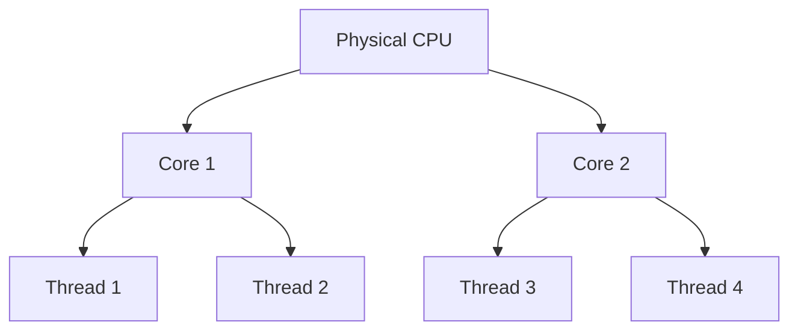

# 💻🔍 What is a **Virtual CPU (vCPU)?**

_And why you see it in laptop specs, VM instances, and cloud hosting requirements!_

---

## ✅ TL;DR

> A **vCPU** (virtual CPU) is a **logical representation of a physical CPU core or thread** — usually used by **virtual machines, cloud servers, or hypervisors**.

---

## 🧠 Let's Simplify First

### 📦 Physical CPU = The actual chip on your motherboard

### 🔩 Core = A processing unit inside that chip

### 🧵 Logical Processor = A thread the OS sees (via hyper-threading)

---

## 🌀 So What Is a vCPU?

- A **vCPU** is a **portion of a physical CPU** that’s **allocated to a virtual machine or container**.
- It’s what **VMware**, **VirtualBox**, **Docker**, **AWS**, **Azure**, etc., give to **virtual systems**.
- It's also how laptops/servers express **total usable CPU capacity**.

---

## 🎯 Real Examples

| Situation                      | What vCPU Means                                  |
| ------------------------------ | ------------------------------------------------ |
| 🧳 Laptop spec says “8 vCPUs”  | You likely have 4 cores + hyper-threading        |
| 🖥️ VirtualBox shows 2 vCPUs    | Your VM will use 2 **threads** from the host CPU |
| ☁️ AWS EC2 t3.medium = 2 vCPUs | You get 2 threads (not full physical cores)      |

---

## 🧩 How It’s Calculated

> **1 vCPU = 1 logical thread (not 1 physical core!)**

So if your CPU has:

- 4 cores
- Hyper-Threading (2 threads per core)

Then:

> **You have 8 vCPUs available** to the OS, VMs, or containers.

---

## 💡 Diagram: Physical CPU vs vCPU

> Cloud or VM platforms **allocate** vCPUs from this pool.
> You **never get full control** of the actual hardware — just **virtual access**.

---

## ⚙️ In Cloud Hosting

When AWS/Azure/Google say:

- `t3.micro = 2 vCPUs`
  They mean:
- You’re getting **2 logical threads**, which are **shared** with other tenants (burstable, not guaranteed full speed).

---

## 🛠️ In Local Laptops or Desktops

- If you see “8 vCPUs” in Task Manager → It means:

  - You have 4 cores
  - Hyper-threading = 8 logical processors (aka 8 vCPUs)

So even without VMs, **the OS treats threads as virtual CPUs**.

---

## 🧪 Summary Table

| Term         | Means                                  | Used In                        |
| ------------ | -------------------------------------- | ------------------------------ |
| Core         | Physical execution unit                | Hardware spec                  |
| Thread       | Logical execution path                 | OS scheduler, task manager     |
| vCPU         | Virtual thread used by VMs or OS       | VirtualBox, Docker, AWS, Azure |
| Logical Core | Same as vCPU (usually OS-level naming) | Windows/Linux task manager     |

---

## 🧠 TL;DR (Again)

> ✅ A **vCPU is a logical thread** seen by the OS or assigned to a virtual machine.
> 🧵 It maps to **one physical thread**, not a full core.
> 🧳 Laptop showing “8 vCPUs” = 4 cores × 2 threads per core.
> ☁️ Cloud giving “2 vCPUs” = 2 threads (shared, not dedicated hardware).

---

Would you like to explore:

1. 🧵 How .NET manages threads across these vCPUs using the ThreadPool?
2. ⚙️ How containers like Docker use vCPUs and enforce CPU limits?
3. ☁️ How AWS allocates vCPUs in EC2 and how to calculate CPU usage in cloud cost?

Pick your next curiosity 😎
