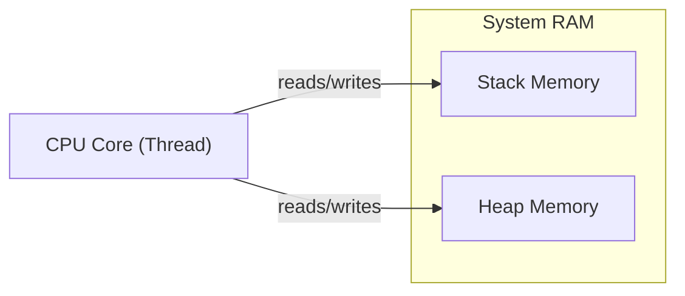
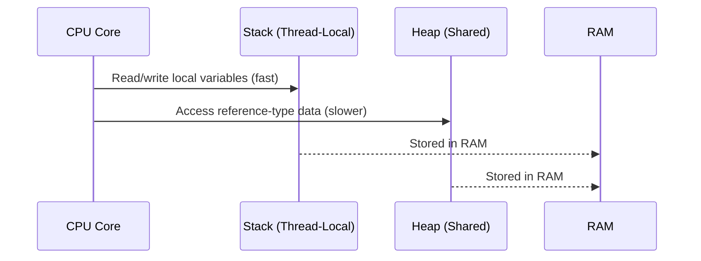

# 🧠💾 Stack vs Heap in **C#**

_And how RAM, CPU, cores, and threads all work together!_

---

## 🧭 Why You Should Care

If you ever wondered:

- Why `int` feels faster than `class`?
- Why memory leaks happen?
- Why passing by value vs reference matters?
- Why threads don’t mess each other up (usually)?

👉 You need to understand **Stack**, **Heap**, and how they relate to the **CPU ↔ RAM communication**.

---

## 💾 1. First: What Is RAM?

> 🧠 **RAM (Random Access Memory)** is your system’s **working memory** —
> where all active programs **store data** while they're running.

When you run a C# program:

- The **OS loads it from disk into RAM**
- The CPU **reads instructions and data from RAM** constantly

---

### 🧠 How CPU Communicates with RAM

- Each **thread** has its **own private stack**
- All threads **share the same heap**
- The CPU loads stack/heap data into **L1/L2 cache** for speed, then operates on it

---

<div align="center">



</div>

---

## 🧵 2. What Is the **Stack**?

> 📦 A **stack** is a small, fast, structured memory space used to store:

- Local variables
- Method call info
- Parameters
- Return addresses

📌 **Each thread has its own stack**, so stack data is **thread-safe by default**.

---

### 🔁 Stack in Action (Call Stack)

```csharp
void Main() {
   int x = 5;
   DoSomething(x);
}

void DoSomething(int y) {
   int z = y * 2;
}
```

Each method call:

- Pushes a **stack frame**
- Stores local variables (`x`, `y`, `z`) in that frame
- Pops the frame after return

---

### 💡 Properties of Stack

| Property            | Description                               |
| ------------------- | ----------------------------------------- |
| ⚡ Fast Access      | Grows/shrinks in predictable order (LIFO) |
| 🧵 Thread-local     | Each thread gets its own                  |
| 📏 Fixed size       | Usually 1 MB per thread by default        |
| ❌ Not for big data | Don’t store large arrays or objects       |

---

## 📦 3. What Is the **Heap**?

> 📚 The **heap** is a large, shared memory area used to store **objects**, **arrays**, and anything with dynamic lifetime.

- Managed by the **.NET Garbage Collector (GC)**
- **All threads can access** the heap → must protect against race conditions
- Data is accessed **by reference**

### 📌 Example

```csharp
class Person {
    public string Name;
}

var p = new Person(); // Allocated on the heap
```

> `p` is a reference to the object — the actual data lives on the heap.

---

### 💡 Properties of Heap

| Property             | Description                                           |
| -------------------- | ----------------------------------------------------- |
| 🧠 Large Space       | Good for big objects and long-living data             |
| 🔁 Shared Memory     | All threads see and use same heap                     |
| 🧹 Garbage Collected | .NET tracks object lifetimes and frees them           |
| 🐢 Slower Access     | Indirect access via reference → cache misses possible |

---

## ⚔️ Stack vs Heap: Battle Table

| Feature     | 🧱 Stack                         | 📦 Heap                              |
| ----------- | -------------------------------- | ------------------------------------ |
| Scope       | Method-local, short-lived        | Objects, arrays, dynamic allocations |
| Speed       | ⚡ Very fast                     | 🐢 Slower                            |
| Thread-safe | ✅ Yes (each thread has its own) | ❌ No (needs locks if shared)        |
| Managed by  | OS/Runtime                       | Garbage Collector                    |
| Allocation  | LIFO (Last In First Out)         | Free-form                            |
| Lifetime    | Ends with method                 | Until GC frees it                    |

---

## 🔁 4. Stack, Heap, CPU, and Threads — Working Together

Here’s how it all flows:



🧠 Each **thread executes instructions**, reads/writes to its **stack**, and accesses the **shared heap** when needed.

---

## 🛑 Gotchas & Tips

| Problem                        | Cause                                          | Fix                                   |
| ------------------------------ | ---------------------------------------------- | ------------------------------------- |
| ❌ StackOverflowException      | Too many recursive calls or large structs      | Refactor or move data to heap         |
| 🐢 Slow object access          | Heap causes cache misses                       | Keep value types on stack if possible |
| ⚠️ Race conditions             | Multiple threads accessing same heap object    | Use locks or thread-safe collections  |
| ❌ Memory leaks (even in .NET) | Holding references too long (GC can't collect) | Null unused references, use `using`   |

---

## ✅ TL;DR Summary

| Concept       | Stack                      | Heap                     |
| ------------- | -------------------------- | ------------------------ |
| Owned by      | Each thread                | Shared by all threads    |
| What’s stored | Value types, method frames | Reference types, objects |
| Managed by    | OS / runtime               | .NET Garbage Collector   |
| Performance   | ⚡ Very fast (CPU cache)   | 🐢 Slower but flexible   |
| Thread safety | ✅ Thread-safe             | ❌ Needs synchronization |

---

Would you like to go deeper into:

1. 🔬 How .NET garbage collector (GC) tracks and clears heap objects?
2. 🧵 How thread safety affects heap access in multi-threaded apps?
3. 🔄 How structs behave differently on stack vs heap?

Pick the rabbit hole 🕳️ and we’ll go full dev-mode 😎
