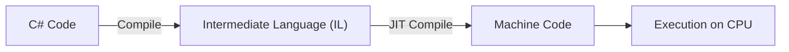

# **🌍 Understanding .NET Environment – A Complete Guide**

.NET provides a flexible **runtime and development environment**, allowing developers to work with multiple SDKs, frameworks, and dependencies **without conflicts**.

This guide will cover:  
✔ **What is .NET and How It Works**  
✔ **.NET SDK vs. .NET Runtime**  
✔ **.NET Execution Model**  
✔ **Managing Multiple .NET Versions**  
✔ **Dependency Management (NuGet, `.csproj`)**  
✔ **.NET Global and Local Tools**  
✔ **Configuring and Checking the .NET Environment**

---

## **1️⃣ What is .NET?**

.NET is a **cross-platform framework** developed by Microsoft that allows developers to build and run various types of applications, including:

- **Web Applications** → (ASP.NET Core, Blazor)
- **Desktop Applications** → (WPF, Windows Forms)
- **Mobile Applications** → (Xamarin, .NET MAUI)
- **APIs & Microservices** → (REST APIs using .NET Core)
- **Game Development** → (Unity uses C# with .NET)
- **Cloud & DevOps Tools**

📌 **.NET allows you to write code once and run it on multiple operating systems (Windows, Linux, macOS).**

---

## **2️⃣ .NET SDK vs. .NET Runtime**

.NET is split into two parts:

| Component        | Description                                                                        | Needed for Development? | Needed for Running? |
| ---------------- | ---------------------------------------------------------------------------------- | ----------------------- | ------------------- |
| **.NET SDK**     | Includes **everything** needed for development (compilers, CLI tools, runtime).    | ✅ Yes                  | ✅ Yes              |
| **.NET Runtime** | Allows execution of compiled .NET applications but does **not include compilers**. | ❌ No                   | ✅ Yes              |

### **🔹 How to Check Installed SDKs and Runtimes**

```sh
dotnet --list-sdks  # Lists installed SDK versions
dotnet --list-runtimes  # Lists installed .NET runtimes
```

If you only need to **run** a .NET application (not develop), you only need the **runtime**.  
If you want to **develop and compile** .NET apps, you need the **SDK**.

---

## **3️⃣ .NET Execution Model (How .NET Runs Code)**

When you write code in **C#**, it does not run directly on the operating system like an `.exe` file. Instead, .NET follows these steps:

### **🛠️ Step 1: Write C# Code**

Example C# program:

```csharp
Console.WriteLine("Hello, .NET!");
```

### **🔨 Step 2: Compilation (C# → IL)**

Before execution, the C# code is compiled into an **Intermediate Language (IL)** using the .NET **C# compiler (Roslyn)**.

### **⚙️ Step 3: Just-in-Time (JIT) Compilation**

At runtime, the **.NET Common Language Runtime (CLR)** converts IL into **machine code**, optimized for the operating system.

### **📌 Visual Representation of .NET Execution Model**



This **multi-step execution** makes .NET **platform-independent**, as the IL can be run on different operating systems.

---

## **4️⃣ Managing Multiple .NET Versions**

### **🔹 How .NET Chooses the SDK Version**

When you run a `.NET` command, it looks for an SDK version in this order:

1️⃣ **Checks for `global.json`** → Uses the specified SDK (if installed).  
2️⃣ **If no `global.json`, uses the latest installed SDK**.  
3️⃣ **If an SDK is missing, it fails or picks the closest available version**.

### **🔹 Installing a Specific .NET Version**

Download and install different .NET versions from:  
[.NET Download Page](https://dotnet.microsoft.com/en-us/download/dotnet)

To install a specific version:

```sh
dotnet new globaljson --sdk-version 6.0.100
```

To list installed versions:

```sh
dotnet --list-sdks
```

---

## **5️⃣ Dependency Management in .NET (How .NET Handles Packages (NuGet))**

When you install a NuGet package, it is **not installed globally** but **per project**.

Each .NET project manages dependencies using a `.csproj` file, which specifies:

- Required **packages**.
- Target **framework**.
- Other project settings.

Example `.csproj`:

```xml
<Project Sdk="Microsoft.NET.Sdk">
  <PropertyGroup>
    <TargetFramework>net8.0</TargetFramework>
  </PropertyGroup>
  <ItemGroup>
    <PackageReference Include="Newtonsoft.Json" Version="13.0.1" />
    <PackageReference Include="Dapper" Version="2.0.90" />
  </ItemGroup>
</Project>
```

To **install a package**:

```sh
dotnet add package Newtonsoft.Json --version 13.0.1
```

To **restore dependencies**:

```sh
dotnet restore
```

To **list installed dependencies**:

```sh
dotnet list package
```

📌 **NuGet ensures project isolation by storing dependencies per project.**

### 🔹 **Where Are NuGet Packages Stored?**

- **Project-Specific Packages:** Installed inside the project’s `obj/` and `bin/` folders.
- **NuGet Global Cache:** .NET **does cache** some packages globally at:
  - **Windows:** `C:\Users\YourUser\.nuget\packages`
  - **Linux/macOS:** `~/.nuget/packages`

📌 **Why?**  
When you install the same package **in another project**, .NET reuses it from the cache instead of downloading it again.

---

## **6️⃣ .NET Global and Local Tools**

### **🔹 What Are .NET Tools?**

.NET **Tools** are CLI commands that can be installed:

- **Globally** (available for all projects).
- **Locally** (installed per project).

### **🔹 Installing a Global Tool**

```sh
dotnet tool install --global dotnet-ef
```

This makes `dotnet-ef` available **system-wide**.

### **🔹 Installing a Local Tool (Project-Specific)**

```sh
dotnet tool install --local dotnet-ef
```

This installs `dotnet-ef` **only for the current project**.

To **list installed tools**:

```sh
dotnet tool list -g  # Global tools
dotnet tool list  # Local tools in the project
```

---

## **7️⃣ Checking and Configuring the .NET Environment**

### **🔹 Checking Installed SDKs and Runtimes**

```sh
dotnet --info
```

Output example:

```ini
.NET SDK:
 Version:   8.0.200
 Commit:    123456abc

.NET Runtimes:
 Microsoft.NETCore.App 6.0.10
 Microsoft.NETCore.App 8.0.2
```

### **🔹 Checking Which .NET Version a Project Uses**

Navigate to the project folder and run:

```sh
dotnet --version
```

If a **`global.json`** file is present, the output will match the version in `global.json`.

---

## **8️⃣ How .NET Handles Environments (Final Recap)**

| Feature                           | How .NET Handles It                                                      |
| --------------------------------- | ------------------------------------------------------------------------ |
| **.NET SDK & Runtime**            | Installed **globally** on the system.                                    |
| **Project-Specific .NET Version** | Defined using `global.json`, but the SDK **must be installed globally**. |
| **NuGet Packages**                | Installed **per project**, isolated from other projects.                 |
| **.NET Global Tools**             | Installed system-wide and available for all projects.                    |
| **.NET Local Tools**              | Installed inside the project, isolated from others.                      |

📌 **Final Understanding:**  
✔ **.NET SDKs are always installed globally, but projects can specify which version to use via `global.json`**.  
✔ **NuGet dependencies are isolated per project to prevent conflicts**.  
✔ **.NET tools can be global or project-specific**.
