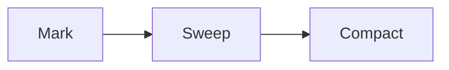

# ♻️ **Garbage Collection Internals in .NET**

> How .NET automatically manages memory and frees up unused objects 💡

---

## 🧠 What Is Garbage Collection (GC)?

> The **GC** is a .NET runtime component that automatically:

- Tracks which **heap objects** are still in use
- **Reclaims memory** from unused objects (a.k.a. "garbage")
- Helps prevent memory leaks and manual cleanup errors

✅ It’s **automatic**, but understanding how it works helps you:

- Write more performant apps
- Avoid GC pressure
- Improve latency

---

## 📦 What Does GC Manage?

- Only **heap-allocated memory** (reference types)
- Stack memory is cleaned up automatically when methods end
- GC doesn't manage unmanaged resources (like files or sockets) — we'll cover that with `IDisposable`

---

## 🔄 1. The GC Works in **Generations**

> Generational GC optimizes memory by grouping objects by **age**:

| Generation | Description                          | Frequency of Collection    |
| ---------- | ------------------------------------ | -------------------------- |
| Gen 0      | Short-lived objects (temporary vars) | Most frequently collected  |
| Gen 1      | Medium-lived (cache, buffers)        | Occasionally collected     |
| Gen 2      | Long-lived (app-wide state)          | Least frequently collected |

> 🔁 The older an object is, the less often it’s collected.

---

## 🧪 2. When Does GC Run?

- Heap runs **low on memory**
- Gen 0/1 fills up
- You explicitly call `GC.Collect()` (not recommended!)
- System triggers cleanup (like low RAM)

✅ The GC is **non-deterministic** — it runs when needed, not on a fixed schedule.

---

## ⚙️ 3. GC Phases



| Phase   | Description                                               |
| ------- | --------------------------------------------------------- |
| Mark    | Identify which objects are still in use (reachable)       |
| Sweep   | Remove unreachable ones (garbage)                         |
| Compact | Move remaining objects to reduce fragmentation (optional) |

> ⚠️ Large Object Heap (LOH) is not compacted by default to avoid CPU cost.

---

## 🧱 4. GC Modes

| Mode                  | Description                                     |
| --------------------- | ----------------------------------------------- |
| Workstation (default) | Optimized for desktop apps (low-latency)        |
| Server GC             | Optimized for throughput in multi-threaded apps |
| Background GC         | Reduces pause time — concurrent collection      |

Check mode in `.csproj` or `runtimeconfig.json`.

---

## 💬 5. Forcing a Collection (Not Recommended)

```csharp
GC.Collect();          // Force GC now
GC.WaitForPendingFinalizers(); // Wait for cleanup

// Good only for rare performance testing
```

> ❌ Avoid in production — disrupts GC optimization!

---

## 📊 6. Monitoring the GC

You can inspect GC behavior via:

- **Performance counters**
- **dotnet-counters**
- **Visual Studio Diagnostic Tools**
- **.NET GC logs** (add env vars to collect data)

---

## 💣 Common GC Performance Problems

| Issue                                   | Why it’s bad                                |
| --------------------------------------- | ------------------------------------------- |
| Allocating too many short-lived objects | GC runs too often (Gen 0)                   |
| Holding long-lived references           | Prevents GC from cleaning memory            |
| Using finalizers unnecessarily          | Delays collection (goes to finalizer queue) |
| Boxing value types                      | Creates heap allocations                    |

---

## 🧠 Interview Insight

> "The GC works in generations and runs when needed to reclaim heap memory. Developers should avoid GC abuse, minimize allocations, and understand the impact of long-lived object references."

---

## ✅ Summary Table

| Concept           | Value                                |
| ----------------- | ------------------------------------ |
| What is collected | Heap objects (reference types)       |
| Not collected     | Stack variables, unmanaged resources |
| GC Strategy       | Generational                         |
| Gen 0             | Short-lived, fast cleanup            |
| Gen 2             | Long-lived, rare cleanup             |
| Avoid             | Manual `GC.Collect()`, finalizers    |

---

## 🧠 Real-World Analogy

| GC Phase | Analogy                                 |
| -------- | --------------------------------------- |
| Mark     | Making a list of things you still use   |
| Sweep    | Throwing out everything not on the list |
| Compact  | Rearranging your drawer neatly          |

---

## 📍 What’s Next?

➡️ **Topic 4: `IDisposable` and the Dispose Pattern** — learn how to clean up unmanaged resources (files, DB connections, etc.) properly with `using` blocks and finalizers.
Shall we continue?
