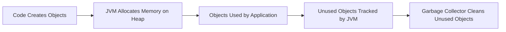

# 🧠 What Does **“Java has Automatic Memory Management”** Mean?

> ✅ Java automatically **allocates** and **frees up memory** during program execution — so **you don’t have to manage memory manually** (unlike in C/C++).

In short: **You create objects. Java takes care of memory cleanup.**

---

## 💡 Why Is This Important?

In languages like C/C++, **you must manually allocate and free memory**:

```c
int* p = malloc(sizeof(int)); // allocate
free(p);                      // free it manually
```

🤕 If you forget to free it → **memory leak**
💣 If you free too early → **crash or corruption**

✅ In Java, **you don’t use `malloc()` or `free()`**. The JVM handles memory via:

---

## 🧰 The Java Memory Management Workflow



Let’s unpack this:

---

### 🔹 1. **Memory Allocation**

- When you do:

  ```java
  Person p = new Person();
  ```

- Java creates the `Person` object in the **heap memory**.

The reference `p` is stored in **stack memory** (fast access), but the actual object lives in the **heap**.

---

### 🔹 2. **Garbage Collection (GC)**

When your object is no longer needed (no references pointing to it)…

✅ Java's **Garbage Collector (GC)** will:

- **Identify unreachable objects**
- **Automatically reclaim their memory**

You don’t have to do anything! 🙌

---

### 🔥 Example of Memory Cleanup

```java
public class Demo {
    public static void main(String[] args) {
        Person p = new Person("Alice");
        p = null; // Now no reference to Person object
        // JVM will eventually clean it up
    }
}
```

---

## 🤖 What Is the **Garbage Collector (GC)**?

The **GC** is a background process in the JVM that:

- Runs **automatically**
- Scans for **unreachable objects**
- Frees memory **safely**
- Can pause the application temporarily (called **stop-the-world** pause)

---

## 🧠 How Does the GC Work?

Java has **different types of garbage collectors**, but most follow this general strategy:

| GC Step                | What Happens                         |
| ---------------------- | ------------------------------------ |
| **Mark**               | Finds which objects are still in use |
| **Sweep**              | Clears out unused objects            |
| **Compact** (optional) | Moves objects together to avoid gaps |

---

## 🚦 Common GC Types in JVM

| GC Type              | Description                                         |
| -------------------- | --------------------------------------------------- |
| **Serial GC**        | Simple, single-threaded GC (good for small apps)    |
| **Parallel GC**      | Uses multiple threads for GC (default in many JVMs) |
| **G1 GC**            | Low-pause GC for large apps                         |
| **ZGC / Shenandoah** | Very low-latency GC for big systems                 |

---

## 🧪 Bonus: `System.gc()` – Should You Use It?

```java
System.gc(); // Suggests JVM to run GC
```

🚫 Java **doesn’t guarantee** when GC will run. It's **just a request**, not a command.

Let the JVM decide — it's smarter than us here. 😄

---

## ✅ Summary

✔️ **Java has Automatic Memory Management** because:

| ✅ Feature                      | ✅ Supported  |
| ------------------------------- | ------------- |
| No manual memory free           | ✅ Yes        |
| JVM manages heap                | ✅ Yes        |
| Garbage Collector               | ✅ Yes        |
| GC runs automatically           | ✅ Yes        |
| No memory leaks (if used right) | ✅ Mostly yes |

---

## 🤯 Fun Fact

Even **big enterprise frameworks** like Spring, Hibernate, etc., rely on Java’s automatic memory management. They don’t worry about freeing memory — they just handle business logic, and Java does the rest.
