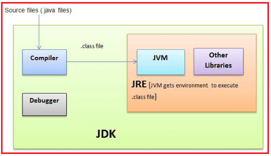
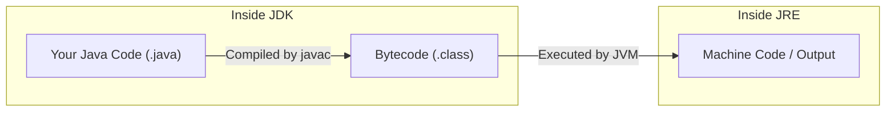

# ☕ Java Application Development Lifecycle

When you build and run a Java program, there are **3 major components (`JDK`, `JRE`, `JVM`)** involved:

---

  

---

## 🧰 1. **JDK (Java Development Kit)** – For Developers

> ✅ Think of **JDK** as the **Java toolbox** for writing and building Java programs.

### What it includes:

- Compiler (`javac`) to convert `.java` → `.class` (bytecode)
- Debugger, packaging tools (`jar`, `javadoc`)
- Everything from **JRE** (so you can run programs too)

🧱 Without JDK, you **can't write or compile Java code**.

---

## ⚙️ 2. **JRE (Java Runtime Environment)** – For Running Code

> ✅ **JRE** is what **end users or developers use to run Java apps**.

### What it includes:

- JVM (Java Virtual Machine)
- Required **libraries and class files**
- Tools like **Java Web Start**, **Java Plug-in**

📦 It **does not include a compiler**, so you **can run** but **not write/compile** Java code.

---

## 🧠 3. **JVM (Java Virtual Machine)** – The Brain

> ✅ **JVM** reads **compiled Java bytecode** and turns it into **machine code** for your computer.

### What it does:

- Executes `.class` files
- Performs **memory management**, **security**, **garbage collection**
- Interprets or **JIT-compiles** code at runtime

💡 JVM is part of JRE, and **it's platform-independent** — so you can “Write once, run anywhere.”

---

## 🔄 Java Development Flow (Diagram)

---

## 🔍 Summary: JDK vs JRE vs JVM

| Feature      | JDK (Dev Kit)             | JRE (Runtime)              | JVM (Virtual Machine)   |
| ------------ | ------------------------- | -------------------------- | ----------------------- |
| 📄 Full Form | Java Development Kit      | Java Runtime Environment   | Java Virtual Machine    |
| 👨‍💻 Use       | **Write + Compile + Run** | **Only Run** Java programs | **Execute bytecode**    |
| 📦 Contains  | JRE + Compiler + Tools    | JVM + Libraries            | Executes `.class` files |
| 🔨 Tools     | Yes (compiler, debugger)  | No                         | No                      |
| 👷 For Devs? | ✅ Yes                    | ❌ No (just run time)      | ❌ Used internally      |

---

## 🧪 Real World Analogy

| Role    | Real World Analogy                                  |
| ------- | --------------------------------------------------- |
| **JDK** | Full workshop with tools 🔧                         |
| **JRE** | The factory floor where products run ⚙️             |
| **JVM** | The machine that understands and runs the design 🧠 |

---

## ✅ Final Thoughts

- ☕ **JDK** is for **developers** (write + compile + run)
- ⚙️ **JRE** is for **users** (just run apps)
- 🧠 **JVM** is the **engine** that makes Java run anywhere
