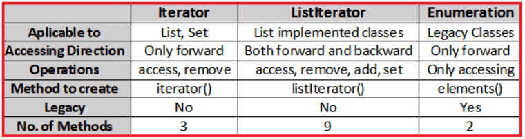

# 🔁 Java Collection Cursors

Cursors are Java tools used to **traverse elements in a collection** one by one. They work like **pointers** that move through lists, vectors, etc.

---

<div style="text-align: center;">
  
</div>

---

## 🧭 Types of Cursors in Java

Java provides **3 types of cursors**:

| Cursor Type      | Direction      | Modifies Collection?    | Works With                                          |
| ---------------- | -------------- | ----------------------- | --------------------------------------------------- |
| **Iterator**     | Forward only   | ✅ Remove only          | All Collections (`List`, `Set`, etc.)               |
| **ListIterator** | Forward & Back | ✅ Add, Remove, Replace | Only `List` (e.g., `ArrayList`, `LinkedList`)       |
| **Enumeration**  | Forward only   | ❌ Read-only            | Legacy collections (`Vector`, `Stack`, `Hashtable`) |

---

## 1️⃣ Iterator – Universal Cursor 🔍

### ✅ Used for:

- Iterating in **forward** direction
- Used with **any collection**
- Can **remove** elements during iteration

### 🧪 Example:

```java
import java.util.*;

public class IteratorExample {
    public static void main(String[] args) {
        List<String> fruits = new ArrayList<>();
        fruits.add("Apple"); fruits.add("Banana"); fruits.add("Orange");

        Iterator<String> it = fruits.iterator();
        while (it.hasNext()) {
            String fruit = it.next();
            if (fruit.equals("Banana")) it.remove(); // remove "Banana"
            else System.out.println(fruit);
        }
        System.out.println("Updated List: " + fruits);
    }
}
```

### 🛠 Key Methods:

- `hasNext()`: Checks if more elements exist
- `next()`: Moves to next element
- `remove()`: Removes the current element

---

## 2️⃣ ListIterator – Bidirectional Cursor ↔️

### ✅ Used for:

- **Both forward and backward** traversal
- Only for **List collections**
- **Add, update, or remove** elements during iteration

### 🧪 Example:

```java
import java.util.*;

public class ListIteratorExample {
    public static void main(String[] args) {
        List<Integer> numbers = new LinkedList<>(List.of(10, 20, 30, 40));
        ListIterator<Integer> it = numbers.listIterator();

        while (it.hasNext()) {
            int val = it.next();
            if (val == 20) it.add(25);     // insert after 20
            if (val == 30) it.set(300);    // replace 30 with 300
        }

        System.out.println("Updated list: " + numbers);

        // Traverse in reverse
        System.out.print("Reverse: ");
        while (it.hasPrevious()) {
            System.out.print(it.previous() + " ");
        }
    }
}
```

### 🛠 Key Methods:

- `hasNext()` / `next()`
- `hasPrevious()` / `previous()`
- `add(obj)` → insert
- `set(obj)` → replace
- `remove()` → delete

---

## 3️⃣ Enumeration – Legacy Cursor 🧓

### ✅ Used for:

- **Forward-only** read access
- Works with **legacy classes only** (`Vector`, `Stack`, `Hashtable`)
- **Cannot modify** the collection

### 🧪 Example:

```java
import java.util.*;

public class EnumerationExample {
    public static void main(String[] args) {
        Vector<String> animals = new Vector<>();
        animals.add("Dog");
        animals.add("Cat");
        animals.add("Elephant");

        Enumeration<String> e = animals.elements();
        while (e.hasMoreElements()) {
            System.out.println(e.nextElement());
        }
    }
}
```

### 🛠 Key Methods:

- `hasMoreElements()`
- `nextElement()`

---

## 🧠 Cursor Comparison Table

| Feature             | `Iterator`                              | `ListIterator`         | `Enumeration`     |
| ------------------- | --------------------------------------- | ---------------------- | ----------------- |
| ✅ Direction        | Forward only                            | Forward & Backward     | Forward only      |
| ✅ Modify Elements? | Yes (remove only)                       | Yes (add, set, remove) | ❌ No             |
| ✅ Read Elements?   | ✅ Yes                                  | ✅ Yes                 | ✅ Yes            |
| 🧠 Collection Type  | Any Collection                          | Only `List` types      | Only Legacy types |
| 💡 Supports Null?   | ✅ Yes                                  | ✅ Yes                 | ✅ Yes            |
| 🚫 Fail-safe?       | ❌ No (ConcurrentModificationException) | ❌ No                  | ❌ No             |

---

## 📝 Summary

| When to Use…                        | Use This Cursor |
| ----------------------------------- | --------------- |
| Need simple forward loop            | `Iterator`      |
| Need add/remove/set + backward move | `ListIterator`  |
| Reading from legacy classes         | `Enumeration`   |
| Avoid modification during iteration | `Enumeration`   |

---

## ⚠️ Tip for Interviews

💥 All cursors **fail-fast**, meaning if you modify the collection directly (e.g., `list.add()` outside the iterator), you’ll get a **ConcurrentModificationException**.
