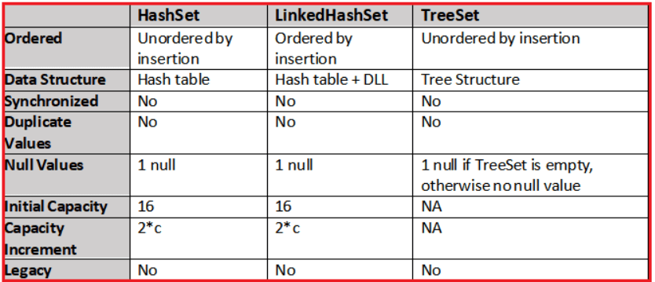
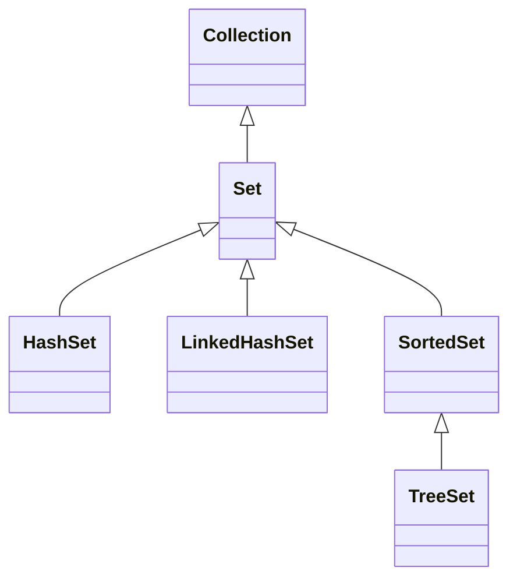

# 🌿 Java `Set` Collection

## 🎯 What is `Set` in Java?

A `Set` is a **Collection** that:

- **Does not allow duplicates**
- Is used to **store unique elements**
- Allows at most **one null** (depends on implementation)

---

<div style="text-align: center;">
  
</div>

---

```java
Set<String> fruits = new HashSet<>();
fruits.add("Apple");
fruits.add("Banana");
fruits.add("Apple"); // ❌ ignored, duplicate
System.out.println(fruits); // [Apple, Banana]
```

---

## 🧬 Set Interface Hierarchy

<div align="center">



</div>

---

## 📦 1. `HashSet` – Fast, Unordered, Unique

- ✅ Stores elements using **hashing**
- ❌ No guarantee of **insertion order**
- ⚡ Fast lookups, inserts, deletes

```java
Set<String> colors = new HashSet<>();
colors.add("Red");
colors.add("Blue");
colors.add("Green");
fruits.add("Blue"); // ❌ ignored, duplicate
System.out.println(colors); // ❗ Order NOT guaranteed
```

### ✨ Complex Object HashSet (With `equals()` + `hashCode()`)

```java
class Item {
    String name;
    int price;

    public Item(String name, int price) {
        this.name = name;
        this.price = price;
    }

    public boolean equals(Object o) {
        if (o instanceof Item other)
            return name.equals(other.name) && price == other.price;
        return false;
    }

    public int hashCode() {
        return name.hashCode() + 31 * price;
    }

    public String toString() {
        return name + ": $" + price;
    }
}

Set<Item> items = new HashSet<>();
items.add(new Item("Banana", 10));
items.add(new Item("Banana", 10)); // ❌ Duplicate by content!
System.out.println(items); // Only 1 entry
```

---

## 📘 2. `LinkedHashSet` – Maintains Insertion Order

- ✅ Ordered by **insertion**
- ⚡ Slower than HashSet
- 🔄 Good when order matters (like caching)

```java
Set<String> cities = new LinkedHashSet<>();
cities.add("Dubai");
cities.add("Cairo");
cities.add("Paris");
System.out.println(cities); // [Dubai, Cairo, Paris]
```

---

## 🌲 3. `TreeSet` – Sorted, Unique Elements

- ✅ Sorted order (default: ascending)
- ⚠️ No `null` if not empty
- ⚠️ Requires elements to be **comparable**

```java
Set<Integer> nums = new TreeSet<>();
nums.add(50);
nums.add(20);
nums.add(10);
nums.add(30);
System.out.println(nums); // [10, 20, 30, 50]
```

### 🧠 Complex TreeSet with Comparable

```java
class Employee implements Comparable<Employee> {
    int id;
    String name;

    public Employee(int id, String name) {
        this.id = id;
        this.name = name;
    }

    public int compareTo(Employee other) {
        return this.id - other.id;
    }

    public String toString() {
        return id + " - " + name;
    }
}

Set<Employee> set = new TreeSet<>();
set.add(new Employee(101, "Raj"));
set.add(new Employee(100, "Sara"));
set.add(new Employee(100, "Ahmed")); // ❌ Duplicate
System.out.println(set); // Sorted by ID
```

---

## 🔄 `SortedSet` – Specialized TreeSet View

`SortedSet` is an interface implemented by `TreeSet`.

```java
SortedSet<String> letters = new TreeSet<>();
letters.add("A");
letters.add("D");
letters.add("B");
System.out.println(letters.headSet("C")); // [A, B]
System.out.println(letters.subSet("A", "D")); // [A, B]
```

---

## ⚖️ HashSet vs LinkedHashSet vs TreeSet – Comparison

| Feature              | HashSet       | LinkedHashSet      | TreeSet                   |
| -------------------- | ------------- | ------------------ | ------------------------- |
| Ordering             | ❌ No         | ✅ Insertion Order | ✅ Sorted (Ascending)     |
| Null Support         | ✅ One `null` | ✅ One `null`      | ⚠️ Only if empty          |
| Performance          | ⚡ Fastest    | ⚡ Medium          | 🐢 Slower (Balanced Tree) |
| Duplicate Prevention | ✅ Yes        | ✅ Yes             | ✅ Yes                    |
| Backed By            | Hash Table    | Hash Table + DLL   | Red-Black Tree            |
| Thread Safe          | ❌ No         | ❌ No              | ❌ No                     |

---

## 🧪 HashSet vs TreeSet - Speed Test (Visual)

```java
Set<Integer> hashSet = new HashSet<>();
Set<Integer> treeSet = new TreeSet<>();

long t1 = System.nanoTime();
for (int i = 0; i < 1_000_000; i++) hashSet.add(i);
long t2 = System.nanoTime();

long t3 = System.nanoTime();
for (int i = 0; i < 1_000_000; i++) treeSet.add(i);
long t4 = System.nanoTime();

System.out.println("HashSet time: " + (t2 - t1));
System.out.println("TreeSet time: " + (t4 - t3));
```

---

## 🧠 Best Practices

| Use Case                    | Recommended Set                        |
| --------------------------- | -------------------------------------- |
| Need unique items, no order | `HashSet`                              |
| Need insertion order        | `LinkedHashSet`                        |
| Need sorted items           | `TreeSet`                              |
| Need concurrency            | `CopyOnWriteArraySet` or sync wrappers |
