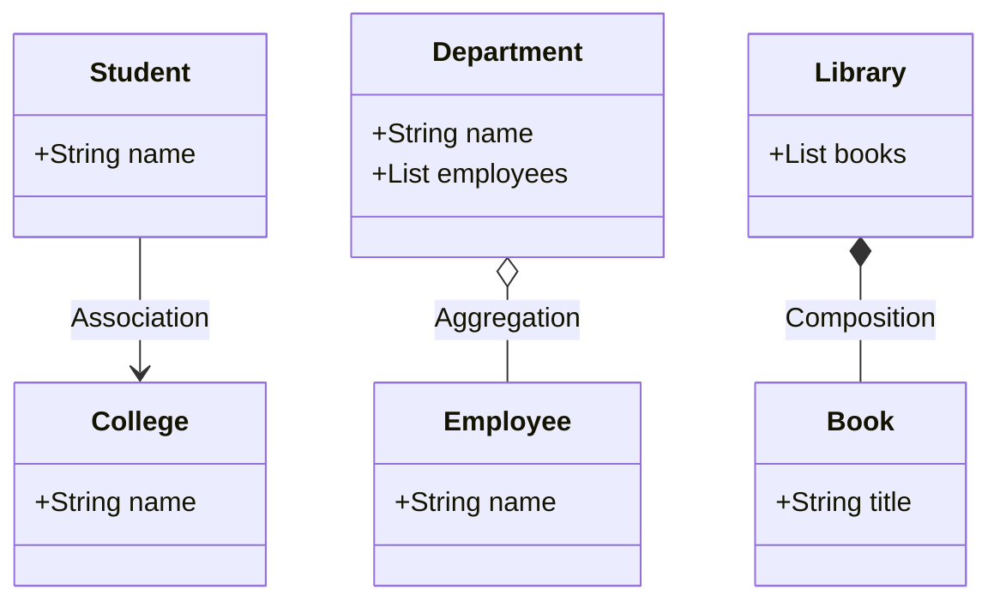

# ☕ Association, Aggregation & Composition in Java

## 🔗 Association in Java

### 🧠 Definition:

> Association defines a **relationship between two separate classes** that communicate with each other.
> It shows **"uses-a" or "knows-a"** relationships.

- Both classes can **exist independently**.
- It may be **one-to-one**, **one-to-many**, **many-to-one**, or **many-to-many**.
- Can be **unidirectional** or **bidirectional**.

---

### 🎓 Real-World Example: Student and College

```java
class College {
    private String name;
    public College(String name) {
        this.name = name;
    }
    public String getCollegeName() {
        return name;
    }
}

class Student {
    private String name;
    public Student(String name) {
        this.name = name;
    }
    public String getStudentName() {
        return name;
    }
}

public class AssociationDemo {
    public static void main(String[] args) {
        College college = new College("MIT");
        Student student = new Student("Ali");

        System.out.println(student.getStudentName() + " studies at " + college.getCollegeName());
    }
}
```

🧾 **Output**:
`Ali studies at MIT`

🔎 This is **Association**: both can exist independently, and there's a logical link.

---

## 1️⃣ Aggregation (💼 "Has-a" but Loosely Coupled)

### 🧠 Definition:

> Aggregation is a **weaker form of association** where one class **has-a** reference to another but both have **independent lifecycles**.

- Think of it as **"owns" but doesn't manage life"**
- If the parent is destroyed, the child can **still exist**
- One-way relationship

---

### 📦 Real-World Example: Department has Employees

```java
class Employee {
    String name;
    int id;
    public Employee(String name, int id) {
        this.name = name;
        this.id = id;
    }
}

class Department {
    String name;
    List<Employee> employees;

    public Department(String name, List<Employee> employees) {
        this.name = name;
        this.employees = employees;
    }

    public void showEmployees() {
        System.out.println("Department: " + name);
        for (Employee e : employees) {
            System.out.println("- " + e.name + " (ID: " + e.id + ")");
        }
    }
}

public class AggregationDemo {
    public static void main(String[] args) {
        Employee e1 = new Employee("Mia", 101);
        Employee e2 = new Employee("Alex", 102);

        List<Employee> employeeList = new ArrayList<>();
        employeeList.add(e1);
        employeeList.add(e2);

        Department d = new Department("HR", employeeList);
        d.showEmployees();
    }
}
```

🧾 **Output**:

```ini
Department: HR
- Mia (ID: 101)
- Alex (ID: 102)
```

✅ Even if the department object is destroyed, employees can be reused elsewhere. That's aggregation.

---

## 2️⃣ Composition (🏗️ Stronger "Has-a", Tightly Coupled)

### 🧠 Definition:

> Composition is a **stronger form of aggregation**.
> If the parent is destroyed, the child also **ceases to exist**. Lifecycles are **tightly bound**.

- Think of it as **"part-of"**.
- Child cannot exist without the parent.

---

### 📚 Real-World Example: Library has Books

```java
class Book {
    String title;
    String author;
    public Book(String title, String author) {
        this.title = title;
        this.author = author;
    }
}

class Library {
    private final List<Book> books = new ArrayList<>();

    public Library() {
        books.add(new Book("Clean Code", "Robert C. Martin"));
        books.add(new Book("Effective Java", "Joshua Bloch"));
    }

    public void listBooks() {
        for (Book b : books) {
            System.out.println("- " + b.title + " by " + b.author);
        }
    }
}

public class CompositionDemo {
    public static void main(String[] args) {
        Library library = new Library();
        library.listBooks();
    }
}
```

🧾 **Output**:

```ini
- Clean Code by Robert C. Martin
- Effective Java by Joshua Bloch
```

🚨 You can’t access `Book` objects outside `Library` easily. If `Library` is destroyed, its books are too.

---

## 🧠 Summary Table: Association vs Aggregation vs Composition

| Feature      | Association         | Aggregation            | Composition              |
| ------------ | ------------------- | ---------------------- | ------------------------ |
| Relationship | Uses-a / Knows-a    | Has-a (Weak ownership) | Has-a (Strong ownership) |
| Lifetime     | Independent objects | Child survives parent  | Child dies with parent   |
| Coupling     | Loose               | Loosely Coupled        | Tightly Coupled          |
| Example      | Student ↔ College   | Department ↔ Employees | Library ↔ Books          |
| UML Notation | Straight line       | Hollow diamond         | Filled diamond           |

---

## 🧾 Visual Summary (Mermaid UML)



---

## ✅ When to Use Each?

| Situation                                                | Use This    |
| -------------------------------------------------------- | ----------- |
| Two classes communicate casually                         | Association |
| One class uses another, but both can live independently  | Aggregation |
| One class _owns_ another fully and manages its lifecycle | Composition |
