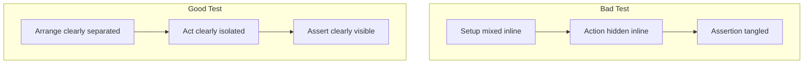

# 🧪 Arrange–Act–Assert Pattern (AAA)

The **AAA pattern** is the most common way to structure unit tests.
It keeps your tests **clean, readable, and predictable**.

Think of it as a **3-step recipe** every test should follow:

1. **Arrange** → prepare the world.
2. **Act** → do the thing under test.
3. **Assert** → check the outcome.

---

## 🔎 Step-by-Step

### 1️⃣ Arrange

- Set up everything your test needs:

  - Create objects.
  - Mock dependencies.
  - Define input data.

- Goal: put the system into the correct **starting state**.

Example:

```csharp
var repo = new Mock<IUserRepository>();
repo.Setup(r => r.GetUserById(1)).Returns(new User { Name = "Ali" });
var service = new UserService(repo.Object);
```

---

### 2️⃣ Act

- Call the method/function you want to test.
- Just **one action per test** (ideally).
- This is the behavior we want to validate.

Example:

```csharp
var result = service.GetUser(1);
```

---

### 3️⃣ Assert

- Check that the result is correct.
- Or verify that dependencies were called properly.
- This is where the test “proves” correctness.

Example:

```csharp
result.Name.Should().Be("Ali");
repo.Verify(r => r.GetUserById(1), Times.Once);
```

---

## 📊 Visual Flow

```mermaid
flowchart TD
    A[Arrange] --> B[Act] --> C[Assert]
    A -->|Set up objects, mocks, inputs| B
    B -->|Call method under test| C
    C -->|Verify outcome or interactions|
```

---

## 📖 Full Example (AAA in action)

### Code under test

```csharp
public class Calculator
{
    public int Add(int a, int b) => a + b;
}
```

### Test using AAA

```csharp
[Fact]
public void Add_ShouldReturnCorrectSum()
{
    // Arrange
    var calc = new Calculator();

    // Act
    var result = calc.Add(2, 3);

    // Assert
    result.Should().Be(5);
}
```

See how **clear** it is? Anyone can glance and know:

- What we set up
- What we did
- What we expected

---

## 💡 Why AAA matters

Without AAA, tests can get messy:

```csharp
[Fact]
public void Add_ReturnsSum()
{
    var result = new Calculator().Add(2, 3);
    Assert.Equal(5, result);
}
```

👉 Works fine, but as tests grow with mocks and setups, it gets unreadable. AAA enforces **structure**.

---

## 🚨 Without AAA (Bad Examples)

### Example 1 – Inline everything

```csharp
[Fact]
public void Add_ReturnsSum()
{
    Assert.Equal(5, new Calculator().Add(2, 3));
}
```

👉 Works, but:

- Harder to read.
- No separation between setup, action, and validation.
- Imagine adding mocks → it will become spaghetti.

---

### Example 2 – Mixed responsibilities

```csharp
[Fact]
public void GetUser_ReturnsCorrectUser()
{
    var repo = new Mock<IUserRepository>();
    repo.Setup(r => r.GetUserById(1)).Returns(new User { Name = "Ali" });
    var service = new UserService(repo.Object);
    var result = service.GetUser(1);
    repo.Verify(r => r.GetUserById(1), Times.Once);
    Assert.Equal("Ali", result.Name);
}
```

👉 Everything’s in a block, no structure.
If this test fails later, it’s harder to tell which step went wrong (setup? action? validation?).

---

## ✅ With AAA (Good Examples)

### Example 1 – Simple Calculator

```csharp
[Fact]
public void Add_ShouldReturnCorrectSum()
{
    // Arrange
    var calc = new Calculator();

    // Act
    var result = calc.Add(2, 3);

    // Assert
    result.Should().Be(5);
}
```

👉 Clear separation of roles:

- Setup (calc created).
- Action (Add method called).
- Assertion (check result).

---

### Example 2 – With mocks

```csharp
[Fact]
public void GetUser_ShouldReturnCorrectUser()
{
    // Arrange
    var repo = new Mock<IUserRepository>();
    repo.Setup(r => r.GetUserById(1)).Returns(new User { Name = "Ali" });
    var service = new UserService(repo.Object);

    // Act
    var result = service.GetUser(1);

    // Assert
    result.Name.Should().Be("Ali");
    repo.Verify(r => r.GetUserById(1), Times.Once);
}
```

👉 Each block has a **single purpose**:

- **Arrange**: define test data & mocks.
- **Act**: execute only what we’re testing.
- **Assert**: check both result & interaction.

---

## 🔎 Visual Comparison



---

## 🎯 Why AAA wins

- **Readability** → anyone can scan and understand in seconds.
- **Debuggability** → if a test fails, you know which block caused it.
- **Consistency** → all tests look the same, easier for teams.
- **Scalability** → when you add mocks/loggers/caching, AAA prevents chaos.

---

## ✅ Recap

- **Arrange**: prepare inputs and dependencies.
- **Act**: execute the function/method you’re testing.
- **Assert**: check result or interaction.
- AAA makes tests **clean, repeatable, and easy to review**.
