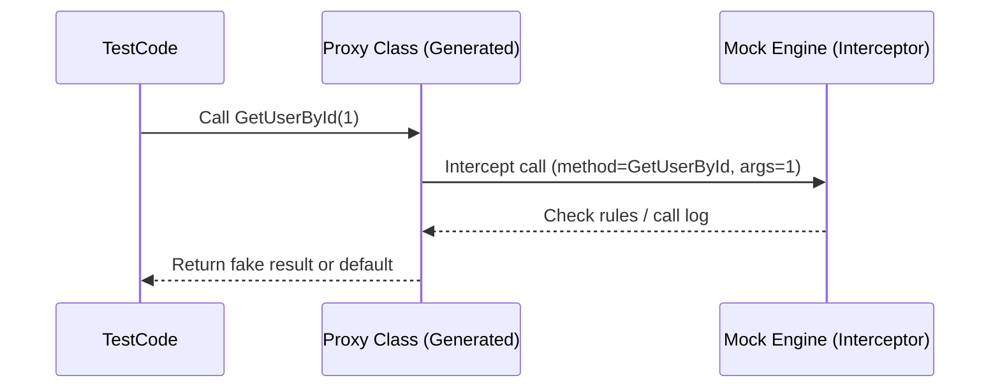
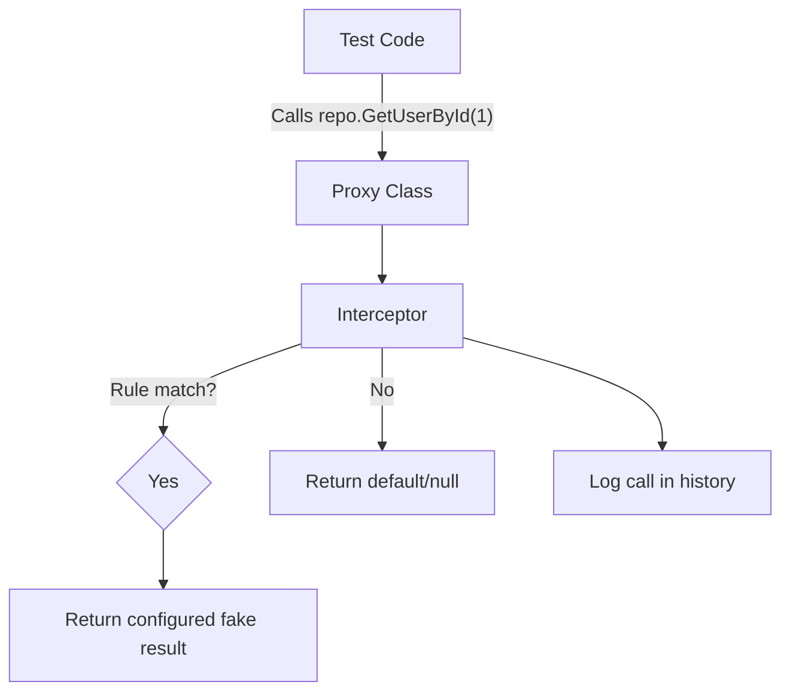

# 🛠️ How Mocking Libraries Work Internally

At their core, all mocking libraries rely on the same building blocks:

---

## 1. 🧱 Dynamic Proxy Generation

When you write:

```csharp
var repo = Substitute.For<IUserRepository>();
```

or

```csharp
var mock = new Mock<IUserRepository>();
```

The library doesn’t give you a real `UserRepository`.
Instead, it uses **dynamic proxy generation** — basically, it builds a new class **at runtime** that:

- Implements the same interface (e.g., `IUserRepository`)
- Or inherits from a class (must be `virtual` methods)
- For every method call, **redirects (intercepts) the call** to the mocking engine

👉 In .NET, this is usually done with **Castle DynamicProxy**, `Reflection.Emit`, or similar runtime IL generation.

---

## 2. 🎧 Interception Layer

Every method call is caught by the proxy.
Instead of running real code, it goes into the mocking library’s **interceptor**.

Flow:



---

## 3. 📦 Stubbing (Setting Return Values)

When you do:

```csharp
repo.GetUserById(1).Returns(new User { Name = "Ali" });
```

or in Moq:

```csharp
mock.Setup(r => r.GetUserById(1)).Returns(new User { Name = "Ali" });
```

Here’s what happens:

- The proxy intercepts the method call.
- The engine records:

  - **Method signature** (`GetUserById`)
  - **Arguments** (`1`)
  - **Configured return value** (User Ali)

- This is stored in an internal **rules dictionary** (a map of call → response).

So later when the same call comes in, it just looks up the rule.

---

## 4. 📝 Call Logging

Every intercepted call is **logged** by the engine:

- Method name
- Arguments
- Return value (if configured)
- Call count

This log is what powers:

```csharp
repo.Received(1).GetUserById(1);
mock.Verify(r => r.GetUserById(1), Times.Once);
```

👉 Verification = “Check call log for this method+args+count.”

---

## 5. 🎯 Argument Matching

Mocks don’t just match exact values.
They allow rules like:

```csharp
repo.GetUserById(Arg.Any<int>()).Returns(new User { Name = "Guest" });
```

or in Moq:

```csharp
mock.Setup(r => r.GetUserById(It.IsAny<int>())).Returns(new User { Name = "Guest" });
```

Internally:

- Instead of keying the rules dictionary with `1`, they key it with a **matcher object**.
- When a call comes in, the engine evaluates all matchers to see which one applies.

---

## 6. 🎬 Callbacks

Mocks also let you “run code” when a method is called:

```csharp
repo.When(r => r.Save(Arg.Any<User>()))
    .Do(call => Console.WriteLine($"Saved {call.Arg<User>()}"));
```

Internally, this just attaches a **delegate** to the rule so when the call is intercepted, the engine invokes your callback before returning.

---

## 7. 🧮 Default Behavior

If no rule matches:

- For reference types → return `null`
- For value types → return default (`0`, `false`)
- For collections → sometimes return empty enumerable
- For tasks → return a completed `Task`

This makes it safe to call methods without crashing.

---

## 🖼️ Visual Mental Model



---

## ⚡ Under the hood in .NET

Mock libraries heavily rely on:

- **Reflection.Emit** → build new proxy classes on the fly.
- **Castle DynamicProxy** → common proxy library used by Moq/NSubstitute.
- **Delegates/Expression Trees** → to capture setups like `r => r.GetUserById(1)`.
- **Dictionaries/Match Trees** → to map intercepted calls to configured behaviors.
- **Call loggers** → store history of invocations for `Verify()` / `Received()`.

---

## ✅ Recap (Human Version)

- A mock is basically a **puppet class** created at runtime.
- Instead of running real code, it always goes through the mocking library.
- The mocking library keeps two things inside:

  1. A **script** of how to respond (setups/returns).
  2. A **diary** of what was called (for verification).

- That’s why no DB, file, or network is touched — because you’re never using the real implementation, just a puppet controlled by the mocking library.

---

👉 Do you want me to make a **side-by-side code + diagram demo**:

- One test hitting a real EF Core repository (with DB).
- Another test hitting a mock repo (with no DB).

So you can **see exactly** how the mock steps in instead of the real class?
