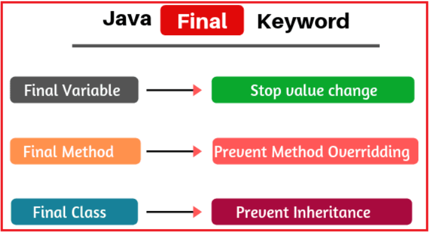

# 🔒 `final` Keyword in Java – The Simple & Professional Way

## ✅ What Is `final` in Java?

In Java, the `final` keyword **prevents modification**.

It can be applied to:

- `final` variable : Value can’t change after initialization .
- `final` method : Method can’t be overridden .
- `final` class : Class can’t be extended .

---

<div style="text-align: center;">
  
</div>

---

## 📦 1. `final` **Variables** = Like `const` in `C#`

### 🧪 Example:

```java
final int MAX_SPEED = 120;
MAX_SPEED = 200;  // ❌ Compile-time error!
```

### 🔍 Comparison with C#:

| Java                                  | C#                                     |
| ------------------------------------- | -------------------------------------- |
| `final int x = 10;`                   | `const int x = 10;`                    |
| Value fixed at runtime or constructor | Value fixed **at compile time** only   |
| Can use in constructor (blank final)  | ❌ Not allowed in C# `const`           |
| Can combine with `static`             | Can combine with `const` or `readonly` |

> ✅ Use `final` for constants and safety in code.

---

### 🔸 🔍 Blank `final` Variable

Means: declared but not initialized immediately.

```java
final int id;  // blank final

FinalDemo() {
   id = 42;  // ✅ OK, initialized in constructor
}
```

In C# you'd use `readonly` instead:

```csharp
readonly int id;
MyClass() {
   id = 42;
}
```

---

## 📌 2. `final` **Reference Variables**

You **cannot reassign the object**, but you **can change its internal state**.

```java
final Person p = new Person();
p.name = "John";     // ✅ Allowed
p = new Person();    // ❌ Not allowed
```

This is like:

```csharp
readonly Person p = new Person();
p.Name = "John";     // ✅ Allowed
p = new Person();    // ❌ Not allowed
```

---

## 🛑 3. `final` **Methods**

You **cannot override** a method marked as `final` in a subclass.

### ❌ Example:

```java
class Vehicle {
   final void start() {
      System.out.println("Engine starts");
   }
}

class Car extends Vehicle {
   void start() {  // ❌ Cannot override final method
      System.out.println("Car starts");
   }
}
```

Use when you want to **prevent subclasses from changing core logic**.

---

## 🧱 4. `final` **Class**

Means: **no one can extend** this class.

```java
final class Calculator {
    // ...
}

class MyCalc extends Calculator {}  // ❌ Error
```

Use it to **lock a class** from being subclassed (like `sealed` in C#).

---

## 🧠 Summary Table

| Feature   | `final` in Java                             | Equivalent in C#      |
| --------- | ------------------------------------------- | --------------------- |
| Variable  | Value cannot be changed                     | `const` or `readonly` |
| Method    | Cannot be overridden                        | `sealed` method       |
| Class     | Cannot be extended                          | `sealed` class        |
| Reference | Object reference is fixed, state can change | `readonly` reference  |

---

## ⚙️ Best Practices

✅ Use `final`:

- For constants
- In utility classes to prevent inheritance
- On methods with core business logic to protect them
- To improve thread-safety
