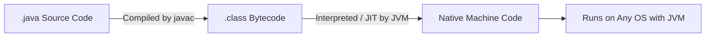

# 🧠 What Does "Java is Compiled and Interpreted" Mean?

> ✅ **Compiled**: Java source code (`.java`) is **compiled** into **bytecode** (`.class`) by the **Java Compiler** (`javac`).
> ✅ **Interpreted**: This bytecode is then **interpreted (or Just-In-Time compiled)** by the **Java Virtual Machine (JVM)** to run on any platform.

🎯 **Java has two stages:**

```ini
1. Compilation (to Bytecode) 🧩
2. Interpretation (or JIT Execution) 🚀
```

---

## 🧩 1. Java is **Compiled** (First Stage)

- You write code in `Hello.java`:

```java
public class Hello {
    public static void main(String[] args) {
        System.out.println("Hello, World!");
    }
}
```

- You run:

```bash
javac Hello.java
```

- This creates `Hello.class` — a **platform-independent file** called **bytecode**.

👉 This step is **compilation** using the `javac` compiler.

---

## 🚀 2. Java is **Interpreted** (Second Stage)

Now, when you run:

```bash
java Hello
```

- The **JVM (Java Virtual Machine)** reads that `.class` file
- It **interprets** the bytecode — turning it into **native machine code**, line by line
- Or, more efficiently, uses **JIT (Just-In-Time) Compiler** to compile "hot" code to native instructions

✅ This makes Java portable and fast across platforms.

---

## 📊 Comparison Table: Java vs Other Languages

| Language   | Compiled? | Interpreted?                                 | Platform Dependent?                  |
| ---------- | --------- | -------------------------------------------- | ------------------------------------ |
| **C++**    | ✅ Yes    | ❌ No                                        | ✅ Yes (must recompile per OS)       |
| **Python** | ❌ No     | ✅ Yes                                       | ✅ Yes (requires Python interpreter) |
| **Java**   | ✅ Yes    | ✅ Yes (JVM interprets bytecode or uses JIT) | ❌ No (Write once, run anywhere)     |

---

## 📦 Visualization: Java Execution Flow



---

## 🧠 Bonus: What is **JIT Compilation**?

JIT = **Just-In-Time Compiler** (part of the JVM)

- JVM watches which methods are used frequently ("hot spots")
- Compiles them into **native machine code**
- Improves performance over time!

🔥 That’s why Java apps often **start slower**, but **get faster while running** — unlike traditional interpreters.

---

## ✅ Summary

| Step | Tool         | Description                                         |
| ---- | ------------ | --------------------------------------------------- |
| 1️⃣   | `javac`      | Compiles `.java` to `.class` (bytecode)             |
| 2️⃣   | `java` + JVM | Interprets or JIT-compiles bytecode to machine code |

✔️ **Java is compiled to bytecode**, then **interpreted or JIT-compiled by JVM at runtime**. This dual nature gives Java:

- 🔁 Portability
- ⚡ Performance
- ♻️ Dynamic runtime optimization
