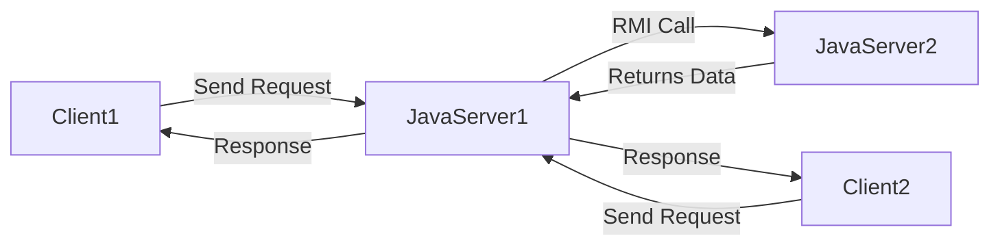

# 🌐 What Does **Java is Distributed** Mean?

> 🧩 **Java is Distributed** means: _Java has built-in support (via APIs and libraries) to build applications that run on multiple computers that work together by sharing resources and tasks._

---

## 🧠 Simple Definition

A **distributed application** is one where:

- The app runs across **multiple machines** (or systems) connected by a **network**.
- These machines **share data and computation**, and often communicate with each other to complete a task.
- For example: a **banking system**, **chat app**, or **cloud-based app** with multiple clients and servers.

✅ Java provides features and tools that **make it easier to build such distributed systems**.

---

## 🔧 Java Features That Enable Distributed Programming

Java supports distributed computing through the following built-in APIs and technologies:

### 1. 🛰️ **RMI (Remote Method Invocation)**

- Lets a Java object **invoke methods on an object running in another JVM** (possibly on a different computer).
- Like calling a method on a remote computer as if it was local.

```java
// Local call
calculator.add(5, 6);

// RMI call
RemoteCalculator.add(5, 6); // Runs on a remote machine
```

---

### 2. 📡 **Socket Programming**

- Java provides `java.net.Socket` and `ServerSocket` to manually send/receive data over **TCP/IP**.

```java
Socket socket = new Socket("localhost", 8080);
OutputStream out = socket.getOutputStream();
```

- Great for building **chat apps, multiplayer games, or simple networked tools**.

---

### 3. 🧠 **CORBA (Old but still relevant historically)**

- Java had built-in support for **CORBA (Common Object Request Broker Architecture)** to communicate with other languages (like C++) in a distributed way.

---

### 4. ☁️ **Modern Distributed Java**

In today’s world, Java is used heavily for distributed cloud-native applications with:

- **Spring Boot + Spring Cloud** (microservices, service discovery, load balancing)
- **Apache Kafka / RabbitMQ** for messaging between distributed services
- **REST APIs** for client-server communication
- **gRPC** (Java bindings available) for fast distributed RPC calls

---

## 🎯 Example Use Cases

| Application Type          | How It's Distributed                                   |
| ------------------------- | ------------------------------------------------------ |
| Online Banking            | One server for auth, another for transactions          |
| Cloud File Storage        | Multiple services: upload, index, download             |
| Multiplayer Games         | Clients send data to game server; server syncs all     |
| Chat App (e.g., WhatsApp) | Messages routed between users over distributed servers |

---

## 📊 Diagram: Java in a Distributed System

<div align="center">



</div>

---

## 🧪 Summary

✅ **Java is Distributed** because:

- It supports building apps that run on **multiple systems**.
- It has built-in tools like **RMI, sockets, networking APIs**.
- It plays well in modern distributed ecosystems (**microservices, REST, Kafka, gRPC**).

🧑‍🔬 It means Java isn't just for desktop or single-server programs — it's **made to scale across networks and machines**!
