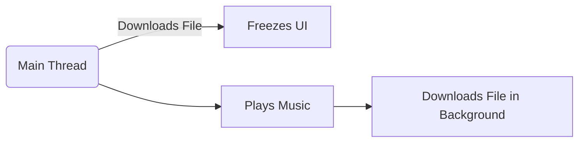

# 🔄 What Does **Java is Multithreaded** Mean?

> 🧠 **Java is Multithreaded** means: _Java can run multiple parts of a program (called threads) **at the same time**, making it faster and more responsive._

It's like a **chef cooking multiple dishes at once** 🍳🍝🥗 instead of one-by-one.

---

## 🧵 What's a Thread?

A **thread** is a lightweight unit of execution inside a program:

- A Java app always starts with **one main thread** (from `main()` method).
- You can create **more threads** to do tasks **in parallel** (e.g., downloading files, updating UI, playing music).

---

## 🤹‍♀️ Multithreading in Real Life

Imagine a music player app:

- 🎵 One thread plays music.
- 🎚️ Another thread listens for volume changes.
- 📂 Another fetches song info from the cloud.

Without multithreading, all of this would freeze and block — one task at a time. 💤

---

## 🔧 Java's Support for Multithreading

Java makes it **easy and safe** to work with threads:

### 1. **Creating a Thread (2 Ways)**

#### ✅ Way 1: Extend `Thread` class

```java
class MyThread extends Thread {
    public void run() {
        System.out.println("Running in a new thread!");
    }
}
```

#### ✅ Way 2: Implement `Runnable` interface

```java
class MyTask implements Runnable {
    public void run() {
        System.out.println("Running using Runnable!");
    }
}
```

Then start it like this:

```java
Thread t = new Thread(new MyTask());
t.start(); // Runs in parallel
```

---

## 🔁 Single Thread vs Multi-Thread (Diagram)



✅ With **multithreading**, both tasks run in parallel and your UI doesn’t freeze!

---

## 💪 Java Multithreading Features

| Feature                | Description                                         |
| ---------------------- | --------------------------------------------------- |
| `Thread` Class         | Basic thread creation                               |
| `Runnable` Interface   | Task without extending thread                       |
| `ExecutorService`      | Thread pool (for managing many threads efficiently) |
| `synchronized` Keyword | Prevents data corruption by locking shared data     |
| `wait()` / `notify()`  | Thread coordination and communication               |
| `Future`, `Callable`   | Run tasks and get return values from threads        |

---

## 🧠 Why Use Multithreading?

### ✅ Speed

Run multiple tasks **at the same time** — no waiting.

### ✅ Responsiveness

Apps remain **interactive**, even when doing heavy work.

### ✅ Efficiency

Best use of **multi-core CPUs** 🧠

---

## ⚠️ But Be Careful...

Multithreading is powerful but tricky:

- 💣 **Race conditions**: Two threads modify data at the same time.
- 🌀 **Deadlocks**: Two threads wait on each other forever.
- 🧊 **Starvation**: Some threads never get CPU time.

✅ Java gives tools like `synchronized`, `locks`, and `concurrent` package to handle this safely.

---

## 🧪 Summary

✅ **Java is Multithreaded** because:

- It can run multiple threads in **parallel**
- Has built-in tools like `Thread`, `Runnable`, `ExecutorService`, `synchronized`
- Helps you build **fast**, **responsive**, and **modern apps**
