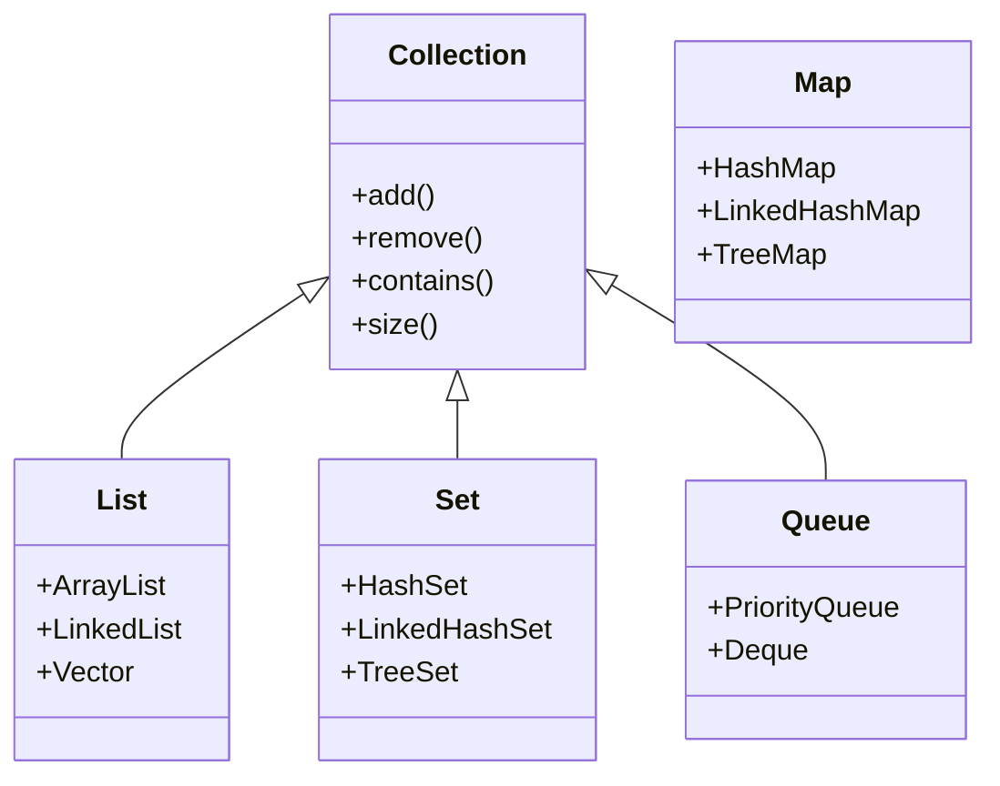

# 🧺 Java Collections Framework – The Power of Object Grouping!

Java Collections Framework (JCF) is **like a toolbox** filled with different containers (called collections) used to hold and manipulate **groups of objects**, just like C#’s `List<T>`, `Dictionary<TKey, TValue>`, etc.

---

## 🧠 Why Java Collections? (vs. Arrays)

| 🔹 Feature                      | 🔧 Arrays          | 🧺 Collections            |
| ------------------------------- | ------------------ | ------------------------- |
| Fixed size                      | ✅ Yes             | ❌ No – dynamic           |
| Type constraint                 | ✅ Same type       | ✅ Mixed or same type     |
| Prebuilt methods (search, sort) | ❌ No              | ✅ Yes                    |
| Flexibility                     | ❌ Manual resizing | ✅ Automatic resizing     |
| Use cases                       | Small static data  | Real-world, scalable apps |

---

## 📦 What Is a "Collection" in Java?

> A **collection** in Java is an object that **groups multiple elements into a single unit** – useful for storing, manipulating, and transferring data.

✅ It allows:

- Storing multiple objects (homogeneous or heterogeneous)
- Resizing dynamically
- Built-in methods for CRUD operations

---

## 🧰 What is a "Framework"?

In Java:

> A **Framework** = Set of **predefined interfaces and classes** to solve common data structure problems (insert, delete, search, sort) without reinventing the wheel.

So, **Java Collections Framework (JCF)** = Collection + Interface + Utility Methods + Built-in Data Structures

---

## 📐 JCF Hierarchy Overview (Mermaid)

<div align="center">



</div>

---

## 🔑 Core Interfaces of Java Collections

### 1. 🔁 `List<E>`

- Ordered collection
- Allows duplicates
- Access by index
- Implementations:

  - `ArrayList` (dynamic array)
  - `LinkedList` (doubly linked list)
  - `Vector` (legacy, thread-safe)

### 2. 🧮 `Set<E>`

- No duplicates allowed
- Implementations:

  - `HashSet` (no order)
  - `LinkedHashSet` (insertion order)
  - `TreeSet` (sorted)

### 3. 🪜 `Queue<E>`

- FIFO structure
- Use in messaging, job scheduling
- Implementations:

  - `PriorityQueue` (natural ordering)
  - `Deque` (double-ended queue)

### 4. 🗺️ `Map<K, V>`

- Stores data as key-value pairs
- Keys must be unique
- Implementations:

  - `HashMap`
  - `LinkedHashMap`
  - `TreeMap`

---

## 🛠️ Key Methods in Collection Interface

| Method        | Purpose                             |
| ------------- | ----------------------------------- |
| `add(E)`      | Adds an element                     |
| `remove(E)`   | Removes element                     |
| `size()`      | Returns count                       |
| `clear()`     | Removes all                         |
| `contains(E)` | Checks existence                    |
| `isEmpty()`   | Checks if empty                     |
| `toArray()`   | Converts to array                   |
| `iterator()`  | Used in loops                       |
| `stream()`    | Used in functional-style operations |

---

## 🧪 Example: Using `ArrayList`

```java
import java.util.*;

public class CollectionExample {
    public static void main(String[] args) {
        List<String> names = new ArrayList<>();

        names.add("Alice");
        names.add("Bob");
        names.add("Charlie");

        System.out.println("List size: " + names.size());
        System.out.println("Contains Bob? " + names.contains("Bob"));

        names.remove("Alice");

        for (String name : names) {
            System.out.println("Name: " + name);
        }
    }
}
```

---

## 🧠 Are Java Collection Classes Just Data Structures?

Yes ✅ – under the hood:

| Collection        | Internal Data Structure      |
| ----------------- | ---------------------------- |
| ArrayList         | Dynamic Array                |
| LinkedList        | Doubly Linked List           |
| HashSet / HashMap | Hash Table                   |
| TreeSet / TreeMap | Red-Black Tree               |
| Queue / Deque     | Circular Queue / Linked List |

So basically, Java Collection classes = pre-implemented data structures with rich APIs.

---

## 🧙‍♂️ Real Use in Projects (MVC Flow)

```plaintext
Model  →  Controller  →  View
↓           ↓            ↓
JDBC        Collection   HTML
↓           ↓            ↓
ResultSet → ArrayList → Displayed
```

- The **Model** loads data from DB (e.g., `ResultSet`)
- Converts it into **Collection** (e.g., `List<Employee>`)
- Sends it to Controller → HTML View → User

---

## 🎯 Summary: Why Use Java Collections Framework?

- ✅ Dynamic size
- ✅ Built-in methods for sorting, searching, etc.
- ✅ Homogeneous or heterogeneous storage
- ✅ Cleaner code & better memory usage
- ✅ Reusable & interchangeable implementations
