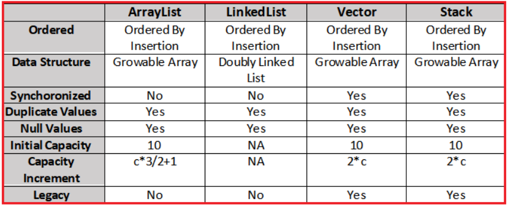
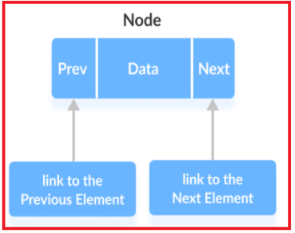
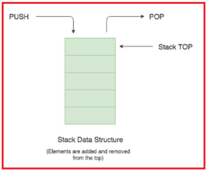

# 📚 Java List Interface

## 💡 What Is `List` in Java?

In Java, `List` is an **interface** in the `java.util` package that:

- Represents an **ordered collection** (also called a sequence)
- Allows **duplicate elements**
- Maintains the **insertion order**
- Allows **index-based access** to elements (`get(int index)`)

---

<div style="text-align: center;">
  
</div>

---

```java
// Cannot instantiate List directly; must use one of its implementations
List<String> list = new ArrayList<>();
```

---

## 📦 Implementations of List Interface

Java provides four primary implementations of the `List` interface:

| Class      | Thread-Safe | Backed By          | Allows Duplicates | Access Time | Insert/Delete Time        |
| ---------- | ----------- | ------------------ | ----------------- | ----------- | ------------------------- |
| ArrayList  | ❌ No       | Dynamic Array      | ✅ Yes            | ✅ Fast     | ❌ Slower (shifts needed) |
| LinkedList | ❌ No       | Doubly Linked List | ✅ Yes            | ❌ Slower   | ✅ Fast (No shifting)     |
| Vector     | ✅ Yes      | Dynamic Array      | ✅ Yes            | ✅ Fast     | ❌ Slower                 |
| Stack      | ✅ Yes      | Extends Vector     | ✅ Yes            | ✅ Fast     | ✅ LIFO Operations        |

---

## 1️⃣ `ArrayList` – Dynamic Array

✅ **Best for fast random access and frequent reads**

```java
List<Integer> list = new ArrayList<>();
list.add(10);
list.add(20);
list.add(1, 15); // Insert at index
list.remove(0);  // Remove by index
System.out.println(list); // [15, 20]
```

### 🧠 Memory:

- Default capacity: 10
- Capacity auto-expands (e.g., ×1.5 growth)

### ✅ Pros:

- Fast random access (`O(1)`)
- Resizable (unlike plain arrays)
- Preserves order
- Allows duplicates

### ❌ Cons:

- Slow insertion/deletion in the middle (`O(n)` due to shifting)
- Not thread-safe

### 👨‍💼 Complex Object Example:

```java
class Customer {
    String name;
    int id;
    public Customer(String name, int id) {
        this.name = name; this.id = id;
    }
    public String toString() {
        return name + " (ID: " + id + ")";
    }
}

List<Customer> customers = new ArrayList<>();
customers.add(new Customer("John", 101));
customers.add(new Customer("Jane", 102));
System.out.println(customers);
```

---

## 2️⃣ `LinkedList` – Doubly Linked List

<div style="text-align: center;">
  
</div>

---

✅ **Best for frequent insertions and deletions**

```java
LinkedList<String> list = new LinkedList<>();
list.add("Apple");
list.addFirst("Orange");
list.addLast("Banana");
list.remove("Apple");
System.out.println(list); // [Orange, Banana]
```

### 🧠 Node Structure:

Each node contains `prev`, `data`, and `next`

### ✅ Pros:

- Fast insert/delete anywhere (`O(1)` if node known)
- Efficient for FIFO/LIFO queues
- Can be used as Deque

### ❌ Cons:

- Slower access (`O(n)`)
- More memory per element (due to node pointers)

### 👨‍💼 Complex Object Example:

```java
class Student {
    String name; int age;
    Student(String name, int age) {
        this.name = name; this.age = age;
    }
    public String toString() {
        return name + " (" + age + ")";
    }
}

LinkedList<Student> students = new LinkedList<>();
students.add(new Student("Ali", 21));
students.add(new Student("Sara", 19));
System.out.println(students);
```

---

## 3️⃣ `Vector` – Thread-Safe ArrayList

✅ **Legacy version of ArrayList with synchronization**

```java
Vector<String> v = new Vector<>();
v.add("A");
v.add("B");
v.addElement("C"); // legacy method
System.out.println(v); // [A, B, C]
```

### ✅ Pros:

- Thread-safe (synchronized methods)
- Grows automatically

### ❌ Cons:

- Slower due to overhead of synchronization
- Legacy methods (e.g., `addElement`, `removeElement`) still exist

---

## 4️⃣ `Stack` – LIFO Data Structure (extends Vector)

<div style="text-align: center;">
  
</div>

---

✅ **Last-In-First-Out operations**

```java
Stack<Integer> stack = new Stack<>();
stack.push(100);
stack.push(200);
System.out.println(stack.pop()); // 200 (removes)
System.out.println(stack.peek()); // 100 (peek only)
```

### ✅ Methods:

- `push(E e)` – add to top
- `pop()` – remove top
- `peek()` – look at top
- `empty()` – check if empty

### 👨‍💼 Complex Object Example:

```java
class Task {
    String name;
    Task(String name) { this.name = name; }
    public String toString() { return name; }
}

Stack<Task> tasks = new Stack<>();
tasks.push(new Task("Build API"));
tasks.push(new Task("Test Module"));
System.out.println(tasks.pop()); // Test Module
```

---

## 🥊 Comparison Table

| Feature       | ArrayList   | LinkedList | Vector    | Stack      |
| ------------- | ----------- | ---------- | --------- | ---------- |
| Access Speed  | ✅ Fast     | ❌ Slow    | ✅ Fast   | ✅ Fast    |
| Insert/Delete | ❌ Slow     | ✅ Fast    | ❌ Slow   | ✅ LIFO    |
| Thread Safe   | ❌ No       | ❌ No      | ✅ Yes    | ✅ Yes     |
| Legacy        | ❌ No       | ❌ No      | ✅ Yes    | ✅ Yes     |
| Nulls Allowed | ✅ Yes      | ✅ Yes     | ✅ Yes    | ✅ Yes     |
| Backed By     | Array       | LinkedList | Array     | Array      |
| Use Case      | Fast search | Queue      | Sync code | LIFO stack |

---

## 🧠 Best Practices

| When To Use             | Use This                |
| ----------------------- | ----------------------- |
| Need fast search        | `ArrayList`             |
| Need fast insert/remove | `LinkedList`            |
| Need synchronization    | `Vector` or manual sync |
| Stack (LIFO) structure  | `Stack`                 |

---

## 🔐 Tip: Thread-Safe List

If you want thread-safety but prefer `ArrayList`:

```java
List<String> syncList = Collections.synchronizedList(new ArrayList<>());
```

---

## ✅ Summary

- `ArrayList`: Fast random access, poor insert/delete performance
- `LinkedList`: Great for insert/delete, slow access
- `Vector`: Like ArrayList but synchronized
- `Stack`: LIFO with legacy roots
