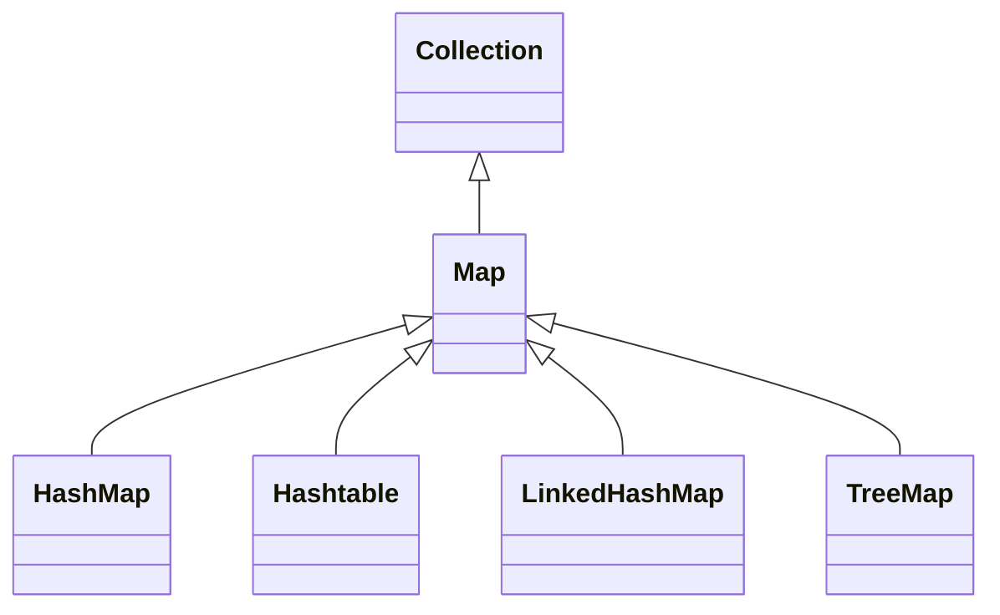

# 🗺️ Java Map Collections

## 🤔 What Is a `Map` in Java?

A **Map** is a collection that stores **data as key-value pairs**. Every key is unique. You use the **key to retrieve the value** quickly, like a dictionary or a lookup table.

> ✅ **Keys must be unique**
> ✅ **Values can be duplicated**

```java
Map<String, String> capitals = new HashMap<>();
capitals.put("France", "Paris");
capitals.put("Egypt", "Cairo");
```

---

## 🔗 Map Interface Hierarchy

<div align="center">



## </div>

## 🧪 Basic Map Methods

| Method             | Description                                        |
| ------------------ | -------------------------------------------------- |
| `put(k, v)`        | Add or replace value for key `k`                   |
| `get(k)`           | Get value for key `k`                              |
| `remove(k)`        | Remove the entry with key `k`                      |
| `containsKey(k)`   | Check if key exists                                |
| `containsValue(v)` | Check if value exists                              |
| `keySet()`         | Get all keys as a `Set`                            |
| `values()`         | Get all values as a `Collection`                   |
| `entrySet()`       | Get all key-value pairs as a `Set<Map.Entry<K,V>>` |

---

## 📦 HashMap – Most Used

✅ **Not ordered**  
✅ **Allows one `null` key**  
✅ **Not thread-safe**

```java
Map<Integer, String> map = new HashMap<>();
map.put(1, "Apple");
map.put(2, "Banana");
map.put(3, "Cherry");

System.out.println(map.get(2)); // Banana
```

---

### 🔍 HashMap – Complex Object Keys (Must override `equals()` & `hashCode()`)

```java
Map<Price, String> items = new HashMap<>();
items.put(new Price("Banana", 20), "Yellow Fruit");

// To make key work correctly, override equals() and hashCode()
```

---

## 🔐 Hashtable – Legacy, Thread-Safe

✅ **Thread-safe**  
❌ **No `null` keys or values**  
❌ **Slower than `HashMap`**

```java
Map<Integer, String> table = new Hashtable<>();
table.put(1, "John");
table.put(2, "Jane");

System.out.println(table.get(1)); // John
```

---

## 🔄 LinkedHashMap – Ordered Version of HashMap

✅ **Maintains insertion order**  
✅ **Fast iteration**  
❌ **Not thread-safe**

```java
Map<Integer, String> ordered = new LinkedHashMap<>();
ordered.put(3, "C");
ordered.put(1, "A");
ordered.put(2, "B");

System.out.println(ordered); // {3=C, 1=A, 2=B}
```

---

## 🌳 TreeMap – Sorted Map (by Key)

✅ **Sorted by keys (ascending by default)**  
❌ **No `null` keys**  
✅ **Can use custom `Comparator`**

```java
Map<String, Integer> sorted = new TreeMap<>();
sorted.put("Banana", 20);
sorted.put("Apple", 30);
sorted.put("Cherry", 10);

System.out.println(sorted); // {Apple=30, Banana=20, Cherry=10}
```

## 📐 TreeMap with Custom Comparator (e.g., Sort Employees by Salary)

```java
TreeMap<Employee, String> map = new TreeMap<>(new MySalaryComparator());
```

---

## 🧪 Example Comparison Summary

| Feature          | HashMap    | LinkedHashMap | TreeMap    | Hashtable    |
| ---------------- | ---------- | ------------- | ---------- | ------------ |
| Ordering         | ❌ No      | ✅ Insertion  | ✅ Sorted  | ❌ No        |
| Thread Safe      | ❌ No      | ❌ No         | ❌ No      | ✅ Yes       |
| Null Key Allowed | ✅ Yes (1) | ✅ Yes (1)    | ❌ No      | ❌ No        |
| Speed            | ✅ Fastest | ✅ Fast       | ⚠️ Slower  | ⚠️ Slow      |
| Use Case         | General    | Ordered Map   | Sorted Map | Multi-thread |

---

## 💡 Best Practices

- Use **HashMap** when you don’t care about order.
- Use **LinkedHashMap** when order matters (like LRU cache).
- Use **TreeMap** when you need sorting.
- Avoid **Hashtable** unless legacy or multithreading without concurrent collections.
