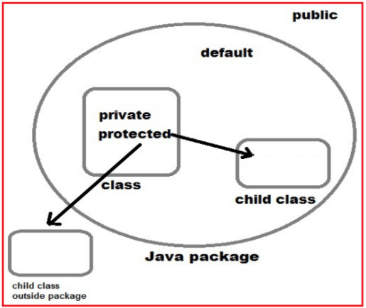
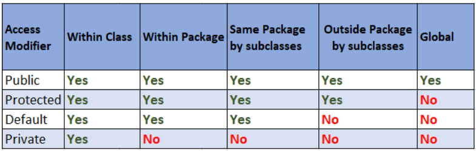

# 🔐 Access Modifiers in Java

> **Access Modifiers** define _where_ classes, methods, and variables can be accessed from. They are Java's way of enforcing **visibility rules** and supporting **encapsulation**.

---

<div style="text-align: center;">
  
</div>

---

<div style="text-align: center;">
  
</div>

---

## 🧱 What Are Access Modifiers?

In Java, access modifiers **control visibility**:

- Who can access a **class**?
- Who can call a **method**?
- Who can read/write a **field**?

### 🎯 Use case:

- Want to protect fields from external changes? → Use `private`
- Want a method visible to other packages? → Use `public`
- Want class members usable only by child classes? → Use `protected`

---

## 🧭 Types of Access Modifiers in Java

| Modifier    | Scope                                             |
| ----------- | ------------------------------------------------- |
| `public`    | Everywhere (any package)                          |
| `protected` | Same package + child classes (even in other pkgs) |
| _(default)_ | Only inside the **same package**                  |
| `private`   | Only inside the **same class**                    |

> Java does **not** support `friend`, `internal`, or `package-private` keywords explicitly like C# — instead, **no modifier** = package-private (a.k.a. default).

---

### 📊 Visibility Table

| Access Modifier | Same Class | Same Package | Subclass (Different Package) | Outside Package |
| --------------- | ---------- | ------------ | ---------------------------- | --------------- |
| `public`        | ✅         | ✅           | ✅                           | ✅              |
| `protected`     | ✅         | ✅           | ✅                           | ❌              |
| _(default)_     | ✅         | ✅           | ❌                           | ❌              |
| `private`       | ✅         | ❌           | ❌                           | ❌              |

---

## 🔍 1. `public` – Open to All

```java
public class Animal {
    public String name = "Elephant";
    public void speak() {
        System.out.println("I'm an animal.");
    }
}
```

✅ Accessible from anywhere — any class, any package.

**Usage**: Public APIs, Models, DTOs, Utility classes, Service methods

---

## 🔐 2. `private` – Class-Only Access

```java
public class BankAccount {
    private double balance;

    public double getBalance() { return balance; }
    public void deposit(double amount) {
        if (amount > 0) balance += amount;
    }
}
```

❌ Not accessible outside this class (even in the same package).

**Use it for**:

- Fields to enforce **encapsulation**
- Helper methods that shouldn't be called externally
- Constructors (for Singleton, Builder patterns)

---

## 🏠 3. _(default)_ – Package-Private

If you **don't specify** a modifier:

```java
class Dog {
    void bark() {
        System.out.println("Woof!");
    }
}
```

🟡 Accessible only within the **same package**.

**Use it for**:

- Utility/helper classes
- Internal services in monolithic packages

> This is the **default behavior** when no access modifier is used.

---

## 🛡️ 4. `protected` – Inheritance-Friendly

```java
public class Vehicle {
    protected void startEngine() {
        System.out.println("Starting engine...");
    }
}

public class Car extends Vehicle {
    public void drive() {
        startEngine(); // ✅ Allowed: accessed in subclass
        System.out.println("Driving...");
    }
}
```

🔓 Accessible:

- In the **same package**
- In **subclasses**, even from **different packages**

**Use it for**:

- Core logic intended for extension
- Template methods in abstract classes

---

## 🎯 Real Example – All Modifiers

```java
package com.example;

public class ModifierExample {
    public int pubField = 1;
    protected int protField = 2;
    int defField = 3; // default
    private int privField = 4;

    public void pubMethod() {}
    protected void protMethod() {}
    void defMethod() {}
    private void privMethod() {}
}
```

### Access from another class in same package:

```java
ModifierExample m = new ModifierExample();
System.out.println(m.pubField);   // ✅
System.out.println(m.protField);  // ✅
System.out.println(m.defField);   // ✅
System.out.println(m.privField);  // ❌ Compile Error
```

---

## 🚨 Special Notes

- You **cannot** make a **top-level class** `private` or `protected`
- You **can** use access modifiers on:

  - Class members (fields, methods)
  - Nested (inner) classes
  - Constructors

- Fields should be `private` + exposed via `getter/setter` → **encapsulation**

---

## 🧠 Best Practices

| Rule                                            | Why                                     |
| ----------------------------------------------- | --------------------------------------- |
| Make fields `private`                           | Protect internal state                  |
| Avoid public fields                             | Breaks encapsulation                    |
| Use `protected` only if subclassing is expected | Otherwise prefer `private` or `default` |
| Don’t expose everything as `public`             | Avoid unintended dependencies           |
| Start with `private`, loosen only if needed     | "Secure by default"                     |

---

## 📌 Summary

| Modifier    | Scope                                 | Use Case Example                      |
| ----------- | ------------------------------------- | ------------------------------------- |
| `public`    | Accessible from everywhere            | APIs, Public models                   |
| `private`   | Accessible only within the class      | Fields, Helpers, Constructors         |
| `protected` | Package + Subclasses (other packages) | Inheritable methods, Extensible logic |
| _(default)_ | Only inside same package              | Internal services, logic-only class   |
