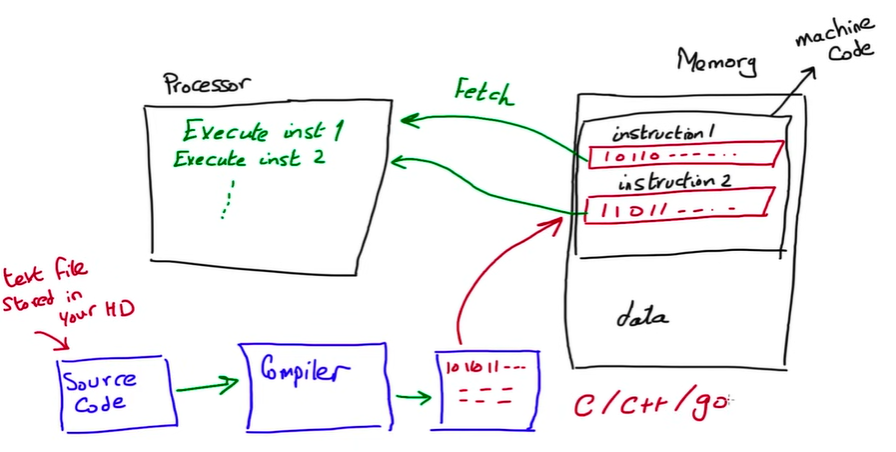
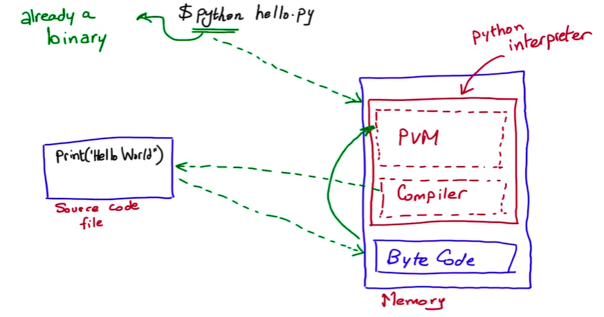

# Python Interpreter

Python interpreter is a program that reads and executes Python code. It is the heart of the Python language and is responsible for translating Python code into machine code that can be executed by the computer.

## Basics

- [Python Interpreter Basics](https://www.youtube.com/watch?v=BkHdmAhapws)

- [Python under the Hood - Memory and a Notional Machine](https://www.youtube.com/watch?v=Chw3i6cQqt0)

### Other Languages Interpreters

### Python Interpreter Architecture

## Python Interpreter Types

- CPython: The default Python interpreter.
- PyPy: A Just-In-Time (JIT) compiled version of Python.
- Jython: A Python interpreter for the Java platform.
- IronPython: A Python interpreter for the .NET platform.
- MicroPython: A lightweight Python interpreter for microcontrollers.

## Python Interpreter Architecture

The Python interpreter is a C program that reads and executes Python code. It is built on top of the CPython interpreter and is responsible for translating Python code into machine code that can be executed by the computer.

## Python Interpreter Execution Model

The Python interpreter execution model follows multiple steps from source code to execution.

1. Lexical Analysis: Converts Python code into tokens (keywords, identifiers, operators).
2. Parsing: Converts tokens into an Abstract Syntax Tree (AST).
3. Bytecode Compilation: Generates intermediate bytecode (`.pyc` file).
4. Execution on PVM: The Python Virtual Machine runs the bytecode line by line.

## Python Interpreter Memory Management

The Python interpreter uses a garbage collector to manage memory. The garbage collector is a program that runs in the background and frees memory that is no longer used by the program.

## Python Interpreter Performance Limitations

The Python interpreter is not as fast as compiled languages like C++. It is slower because it is an interpreted language and it has to translate Python code into machine code at runtime.

## Python Interpreter Security

The Python interpreter is not as secure as compiled languages like C++. It is not as secure because it is an interpreted language and it can be easily hacked.

## Python Interpreter Portability

The Python interpreter is not as portable as compiled languages like C++. It is not as portable because it is an interpreted language and it depends on the Python interpreter to run.
