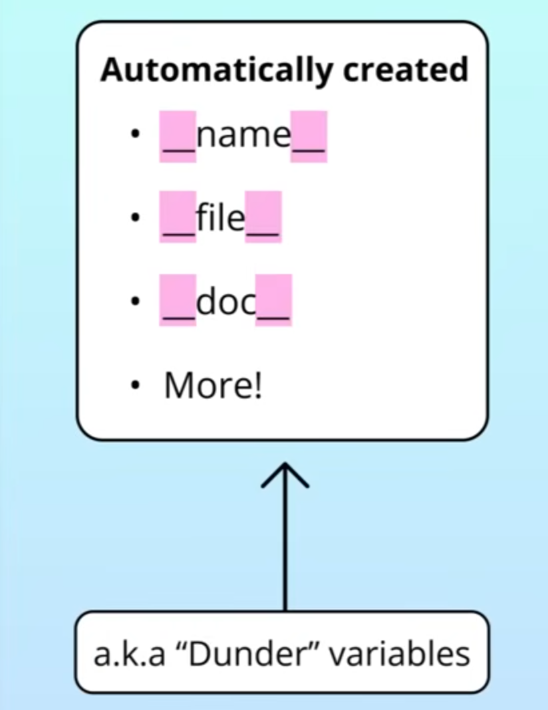
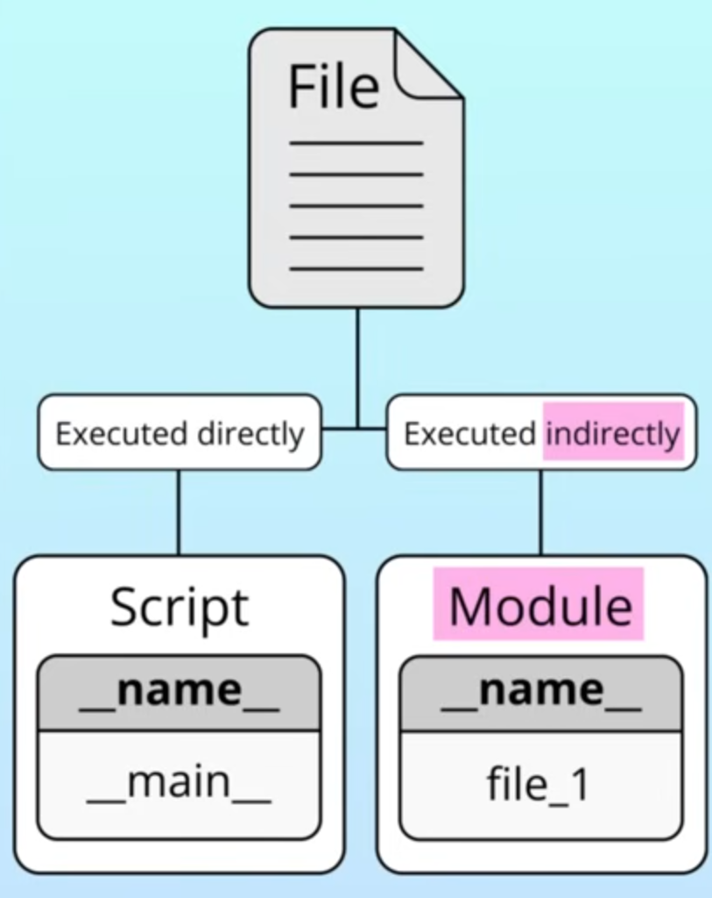

# Python `__name__` Variable

## What Is `__name__`?

* When you run a *Python* file, the interpreter automatically creates special built-in variables known as __dunders__ (double underscores).


* `__name__` is one of these variables. Its purpose is to identify the context in which the script is currently running.


## When Does `__name__` Equal `'__main__'`?

* __Execution as a Script:__ If you run the file directly (e.g., `python file1.py`), *Python* sets the `__name__` variable to the string `'__main__'`. This signals that the script is being run as the entry point.
* __Importing as a Module:__ If you import the file into another script (e.g., `import file1`), *Python* assigns the __actual module name__ (the filename) to the `__name__` variable instead. Because `'__name__'` no longer equals `'__main__'`, the code inside the conditional block is skipped.

## Practical Use Case: Testing Code

* __The Problem:__ Without this conditional, any code at the top level of your script—such as testing logic or function calls—runs automatically whenever the file is imported elsewhere, which can lead to unexpected side effects.
* __The Solution:__ By nesting your test cases or example code inside the `if __name__ == '__main__':` block, you ensure that the code executes __only when you run the file directly__ for debugging or testing purposes. This keeps your modules clean and reusable in other projects.
* *Note:* For larger projects, the instructor recommends using specialized testing frameworks like `unittest` or `pytest`.

## Examples

### 1. Identifying the `__name__` Variable

To see how the special `__name__` variable behaves, the creator uses this simple snippet:

```python
# File 1
print(__name__)

if __name__ == '__main__':
    print("Hello, world!")
```

* When __File 1__ is run directly, the output is `__main__` and the print statement executes.

### 2. Importing as a Module

When you create a __File 2__ to import __File 1__, the behavior changes:

```python
# File 2
import file1

print(f"File 2 name is: {__name__}")
```

* In this context, when __File 1__ is imported, its `__name__` becomes the module name (`'file1'`), so the code inside the `if` block in __File 1__ is __skipped__.

### 3. Practical Testing Example

The final example shows how to isolate test code from your primary functions:

```python
# File 1
def add(a, b):
    return a + b

# This code runs ONLY if File 1 is executed directly
if __name__ == '__main__':
    result = add(1, 2)
    if result == 3:
        print("Pass")
    else:
        print("Fail")
```

By nesting the test logic inside the `if __name__ == '__main__':` block, the test will not trigger when you import `add` into other files (like __File 2__), ensuring your modules remain clean and reusable.
