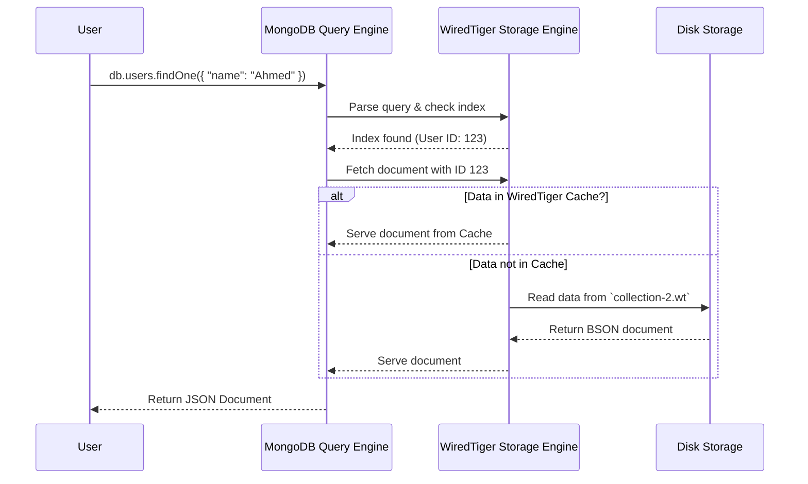

# 🛠️ **Deep Dive into the WiredTiger Storage Engine** – The Brain of MongoDB! 🚀

WiredTiger is **MongoDB’s default storage engine** and is also used in AWS DocumentDB. Unlike SQL databases, which rely on **B-Trees**, WiredTiger is designed for **high-concurrency, compression, and fast performance using a Log-Structured Merge Tree (LSM) and B+ Trees**.

This deep dive covers:
1️⃣ **How WiredTiger Works** 🛠️  
2️⃣ **How Data is Stored on Disk** 💾  
3️⃣ **How Data is Retrieved** 🔍  
4️⃣ **Detailed Sequence Diagram for Disk Reads** 🖼️

---

# 🛠️ **1️⃣ How WiredTiger Works – The High-Level View**

### 🔥 **Core Features of WiredTiger**

✅ **Uses a Combination of B+ Trees & LSM Trees** for indexing and storage.  
✅ **Supports Multi-Version Concurrency Control (MVCC)** for high concurrency reads/writes.  
✅ **Uses Write-Ahead Logging (WAL)** to ensure durability.  
✅ **Compresses Data Efficiently** using Snappy/Zlib compression.  
✅ **Supports Memory-Mapped Files (MMAP)** to speed up access.

---

# 💾 **2️⃣ How Data is Stored on Disk in WiredTiger**

## 🏗️ **Storage Components**

WiredTiger organizes data using **Table, Data Files, and Checkpoints**.

### 📂 **Storage Breakdown:**

| Component                               | Description                                                              |
| --------------------------------------- | ------------------------------------------------------------------------ |
| **Collection Table**                    | Each MongoDB collection is stored as a separate **table** in WiredTiger. |
| **B-Trees & LSM Trees**                 | Used for indexing and efficient data retrieval.                          |
| **Data Files (`.wt`)**                  | Each collection is stored in a `.wt` file (e.g., `collection-2.wt`).     |
| **Write-Ahead Log (`WiredTigerLog.*`)** | Used for durability and crash recovery.                                  |
| **Metadata (`WiredTiger.wt`)**          | Stores metadata about collections, indexes, and transactions.            |

### 📂 **File Structure Example (Inside MongoDB Data Directory)**

```
/data/db/
  ├── WiredTiger.wt                # Metadata for all tables
  ├── WiredTigerLog.0000000001      # Write-Ahead Log
  ├── collection-2-1123456789.wt    # Collection Data File
  ├── index-3-1123456789.wt         # Index Data File
```

📌 **Each `.wt` file is a self-contained table stored in B-Trees or LSM Trees!**  
📌 **Indexes are also stored in `.wt` files separately for faster lookups.**

---

# 🔍 **3️⃣ How Data is Retrieved from Disk (Read Workflow)**

Now, let’s break down how **MongoDB fetches a document from WiredTiger** when a user executes:

```json
db.users.findOne({ "name": "Ahmed" })
```

### **🛠️ Step-by-Step Read Process**

1️⃣ **Query Parser:** The query is received and parsed.  
2️⃣ **Query Planner:** The best index (if available) is selected.  
3️⃣ **Index Lookup:** WiredTiger fetches the index from the `.wt` file.  
4️⃣ **Document Lookup:** If found in the index, WiredTiger fetches the actual document from disk.  
5️⃣ **Cache Check:** If data is frequently accessed, it's served from **WiredTiger’s in-memory cache** instead of disk.  
6️⃣ **Return Data:** The document is sent back to the user.

---

# 🖼️ **4️⃣ Sequence Diagram – How WiredTiger Retrieves Data from Disk**

Here’s a **Mermaid Sequence Diagram** to visualize the data retrieval process! 🎯



📌 **Key Takeaways from the Sequence Diagram:**

- MongoDB first **checks indexes** before scanning the collection.
- WiredTiger **caches** frequently accessed data to avoid disk reads.
- If data is **not in cache**, it’s read from the `.wt` file on **disk**.
- **BSON format** is read from disk and returned as **JSON** to the user.

---

# 🎯 **5️⃣ Optimizations & Performance Features in WiredTiger**

WiredTiger **optimizes performance** using:

### 🚀 **1. WiredTiger Cache**

- Stores frequently accessed documents **in memory**.
- Avoids expensive disk reads.
- By default, **uses 50% of available RAM**.

### 📊 **2. Write-Ahead Logging (WAL)**

- Writes are first logged to `WiredTigerLog` before committing.
- Ensures **data durability** (prevents corruption on crashes).

### 📈 **3. Compression for Disk Efficiency**

- Uses **Snappy or Zlib compression** to reduce storage size.
- Faster reads due to **smaller data blocks**.

### 🔄 **4. Multi-Version Concurrency Control (MVCC)**

- Allows **simultaneous reads & writes** without locking.
- Each user sees a **consistent snapshot** of data.

---

# 🏁 **Final Thoughts**

🔥 **WiredTiger is a powerful storage engine designed for speed and scalability.**  
✅ **Uses B-Trees & LSM Trees for efficient indexing.**  
✅ **Leverages in-memory caching to avoid disk reads.**  
✅ **Uses Write-Ahead Logging (WAL) for durability.**  
✅ **Optimized for concurrent access with MVCC.**

💡 **Next Topic?** Do you want a deep dive into **how WiredTiger handles writes & journaling? 🚀🔥**
