# Concurrency 🆚 Parallelism

- **Concurrency:** Managing Multi Tasks at Once.
- **Parallelism:** Executing Multi Tasks at Once.

## Concurrency

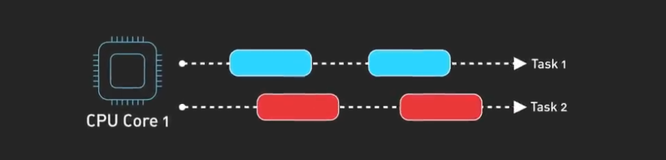
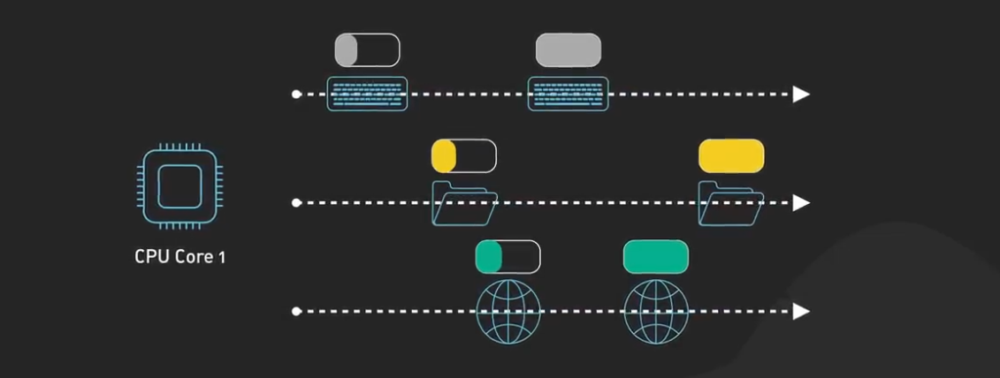

- Example
  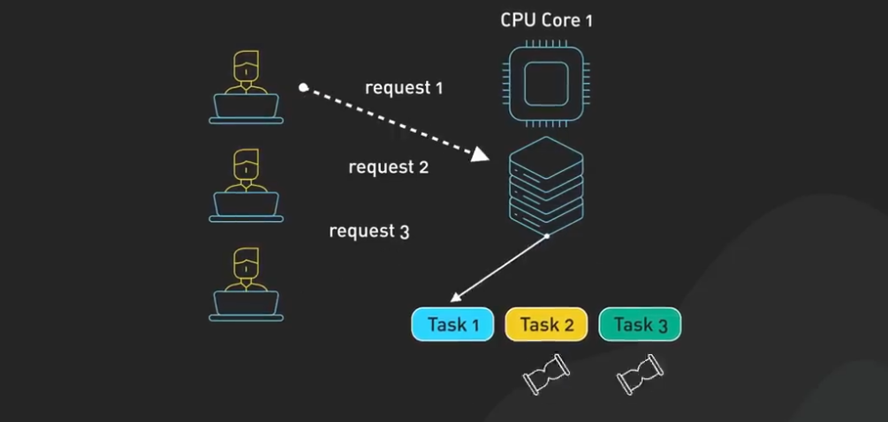
  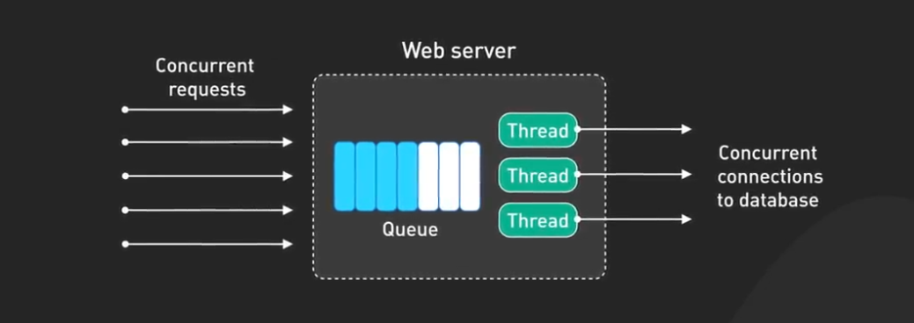

## Parallelism

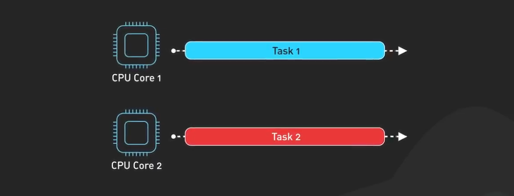
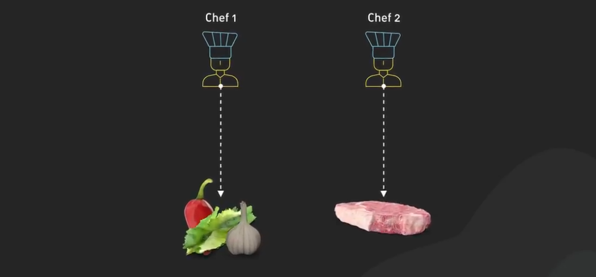
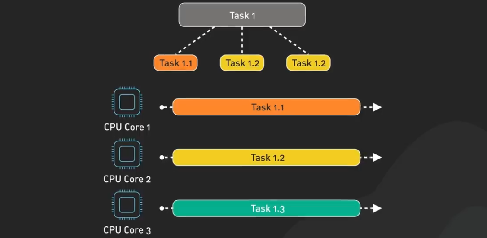

- Example

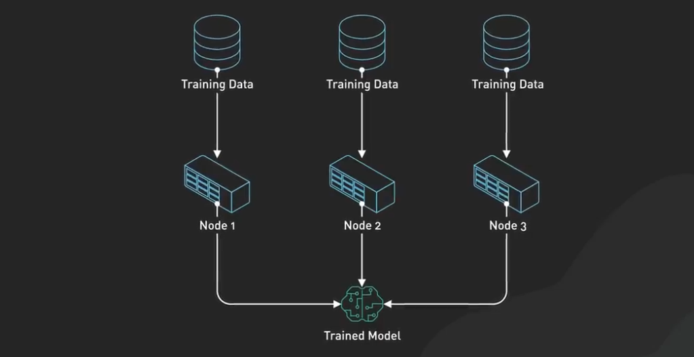
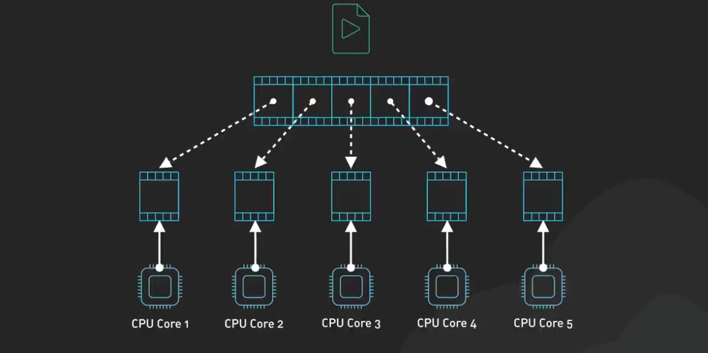
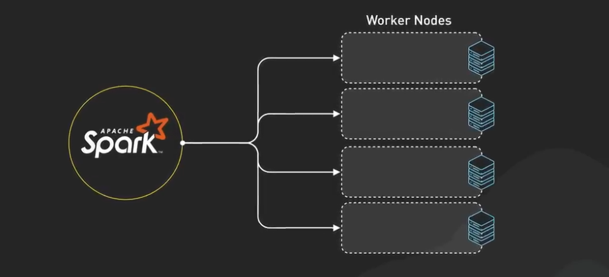

## Concurrency With Parallelism Not Opposite

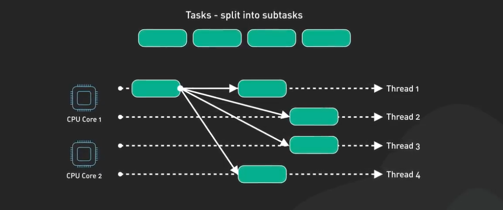
