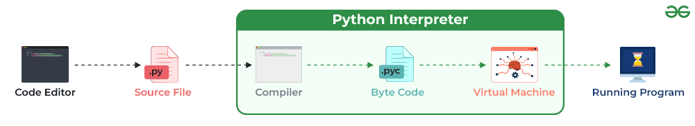

# **🐍 Understanding Python Environment – A Complete Guide**

Python provides a **flexible and isolated runtime environment** to ensure that each project has its own dependencies and settings **without conflicts**.

This guide will cover:  
✔ **What is a Python Environment?**  
✔ **System-wide Python vs. Virtual Environments (`venv`)**  
✔ **How Python Runs Code**  
✔ **Managing Python Versions**  
✔ **Dependency Management (`pip`, `requirements.txt`, `pyproject.toml`)**  
✔ **Python Virtual Environments (`venv`, `virtualenv`, `conda`)**  
✔ **Using Environment Variables in Python**  
✔ **Configuring and Checking the Python Environment**

---

## **1️⃣ What is a Python Environment?**

A **Python environment** refers to the **set of configurations** that determine how Python executes programs.  
It consists of:  
✔ **Python Interpreter** → The program that runs Python code.  
✔ **Libraries & Packages** → Installed via `pip` to extend Python’s functionality.  
✔ **Environment Variables** → Used to configure Python applications dynamically.  
✔ **Virtual Environments (`venv`)** → Isolated environments for different projects.

### **🔹 Why Does Python Need Virtual Environments?**

Unlike .NET, Python **does not automatically isolate project dependencies**, so you need virtual environments to:  
✔ Keep dependencies **separate** for each project.  
✔ Prevent **version conflicts** between projects.  
✔ Avoid modifying **system-wide Python** installations.

---

## **2️⃣ How Python Runs Code (Execution Model)**

Python is an **interpreted language**, meaning it runs code **line by line** instead of compiling it to machine code.

### **Steps of Python Execution**

**1️⃣ Write Python Code (`.py` file)**

```python
print("Hello, Python!")
```

**2️⃣ Python Interpreter Translates It to Bytecode (`.pyc` file)**  
**3️⃣ Python Virtual Machine (PVM) Executes the Bytecode**

---



---

## **3️⃣ System-wide Python vs. Virtual Environments**

### **🔹 System-wide Python Installation**

By default, Python is installed **globally** on your machine:

- **Windows**: `C:\Python38\`
- **Linux/macOS**: `/usr/bin/python3`

If you install a package using:

```sh
pip install flask
```

It **modifies the system-wide Python**, affecting all projects.

### **🔹 Problems with Global Python Installation**

❌ **Version Conflicts** – If one project needs Flask 2.0 but another needs Flask 1.1, they will overwrite each other.  
❌ **Difficult to Manage** – Hard to track which project uses which dependencies.  
❌ **Risky Modifications** – Modifying system-wide Python can break critical system applications.

---

## **4️⃣ Python Virtual Environments (`venv`)**

A **virtual environment (`venv`)** is an **isolated Python workspace** that allows each project to have its own **independent dependencies**.

### **🔹 How Virtual Environments Work**

1️⃣ Creates a separate folder (e.g., `.venv/`) inside the project.  
2️⃣ Copies the **Python interpreter** into `.venv/`.  
3️⃣ Installs **project-specific dependencies** inside `.venv/` instead of the system Python.  
4️⃣ When activated, Python **uses the virtual environment** instead of the global installation.

### **🔹 Creating and Using a Virtual Environment**

#### ✅ **Step 1: Create a Virtual Environment**

```sh
python -m venv .venv
```

This creates a `.venv/` folder with a separate Python environment.

#### ✅ **Step 2: Activate the Virtual Environment**

✔ **Windows (CMD/PowerShell)**

```sh
.venv\Scripts\activate
```

✔ **macOS/Linux (Bash/Zsh)**

```sh
source .venv/bin/activate
```

Now, `(venv)` appears in your terminal, meaning **Python is running inside the virtual environment**.

#### ✅ **Step 3: Install Dependencies Locally**

```sh
pip install flask numpy pandas
```

This installs Flask, NumPy, and Pandas **inside `.venv/`, not globally**.

#### ✅ **Step 4: Deactivate the Virtual Environment**

To return to the **system-wide Python**, run:

```sh
deactivate
```

---

## **5️⃣ Managing Dependencies in Python**

Python uses `pip` to install and manage dependencies.

### **🔹 Using `requirements.txt` for Dependency Management**

To save installed packages:

```sh
pip freeze > requirements.txt
```

To install dependencies from `requirements.txt`:

```sh
pip install -r requirements.txt
```

### **🔹 Using `pyproject.toml` for Modern Dependency Management**

New Python projects use `pyproject.toml` for better control:

```toml
[tool.poetry.dependencies]
python = "^3.8"
flask = "^2.0"
numpy = "^1.21"
```

📌 This is similar to `.csproj` in .NET for defining dependencies.

---

## **6️⃣ Using Environment Variables in Python**

Environment variables help **configure applications dynamically**.

### **🔹 Setting an Environment Variable**

✔ **Windows (CMD)**

```sh
set API_KEY=12345
```

✔ **Linux/macOS**

```sh
export API_KEY=12345
```

### **🔹 Reading Environment Variables in Python**

```python
import os
api_key = os.getenv("API_KEY")
print(f"API Key: {api_key}")
```

📌 **If the variable doesn’t exist, `os.getenv()` returns `None`.**

---

## **7️⃣ Alternative Virtual Environment Tools**

Python provides additional tools for managing environments:

### **🔹 `virtualenv` (More Features than `venv`)**

`virtualenv` works like `venv` but supports:
✔ Faster environment creation  
✔ Cross-platform compatibility  
✔ Advanced activation scripts

Install `virtualenv`:

```sh
pip install virtualenv
```

Create an environment:

```sh
virtualenv my_env
```

---

### **🔹 `conda` (Best for Data Science & Machine Learning)**

Anaconda provides a **more powerful package manager** for scientific computing.

Create an environment with Anaconda:

```sh
conda create --name my_env python=3.9
```

Activate it:

```sh
conda activate my_env
```

Install a package:

```sh
conda install numpy
```

📌 **When to Use `venv` vs. Anaconda?**
✔ **Use `venv`** for web development, scripting, automation.  
✔ **Use `conda`** for data science, machine learning, and AI.

---

## **8️⃣ Checking and Configuring Python Environment**

### **🔹 Checking Python Version**

```sh
python --version
```

### **🔹 Checking Installed Packages**

```sh
pip list
```

### **🔹 Checking Virtual Environment Status**

To see if you’re inside a virtual environment:

```python
import sys
print(sys.prefix)
```

---

## **🔄 9️⃣ Summary: How Python Handles Environments**

| Feature                           | How Python Handles It                                   |
| --------------------------------- | ------------------------------------------------------- |
| **Python Versions**               | Installed globally, switchable with `pyenv` or `conda`. |
| **Virtual Environments (`venv`)** | Isolated environments per project.                      |
| **Dependency Management**         | `pip`, `requirements.txt`, `pyproject.toml`.            |
| **Environment Variables**         | Managed using `os.getenv()`.                            |
| **Alternative Tools**             | `virtualenv`, `conda` for scientific computing.         |

---

## **🚀 Next Step: Python `venv` vs. .NET Environment**

Now that you understand **how Python environments work**, would you like a **direct comparison between Python `venv` and .NET environments**? 🚀🔥
