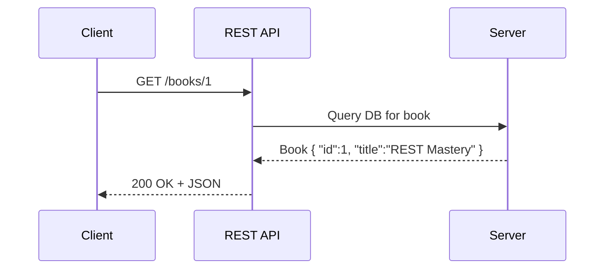

# 🔑 What is an API? What is REST?

## 🤝 What is an API?

**Definition (official-ish):**
An **API (Application Programming Interface)** is a contract that allows two software components to communicate with each other using a set of defined rules.

💡 Think of an API as a **waiter** in a restaurant:

- You (the client) ask for food (request).
- The waiter (API) carries your request to the kitchen (server).
- The kitchen prepares the meal (business logic).
- The waiter brings it back to you (response).

👉 You don’t enter the kitchen yourself. You don’t care how they cook it. You just get what you asked for.

---

### 🛠️ Types of APIs (quick context)

- **Local APIs** → inside the same app (e.g., DLL, SDK).
- **Web APIs** → across the internet using HTTP.
- **OS APIs** → like Windows API, Android API.
- **Library APIs** → e.g., .NET Collections, Java APIs.

In our case → we’re focused on **Web APIs** (HTTP-based).

---

## 🌳 What is REST?

**REST = Representational State Transfer**
(📌 fancy term coined by Roy Fielding in 2000).

It’s an **architectural style** for designing networked applications.
Not a protocol. Not a library. Just **guidelines**.

---

### 🚦 REST Principles (the “rules of the road”)

1. **Client–Server Separation**

   - Client (frontend) and server (backend) are independent.
   - Example: Your Angular app calls your .NET Web API.

2. **Statelessness**

   - Each request from the client must contain all the info needed.
   - Server doesn’t remember “who you are” between requests.
   - Example: Every request must include an `Authorization` token.

3. **Uniform Interface**

   - Use standard HTTP methods (GET, POST, PUT, DELETE).
   - URLs identify resources.
   - Responses use standard formats (usually JSON).

4. **Cacheable**

   - Responses must define whether they can be cached.
   - Saves time and resources.

5. **Layered System**

   - Clients don’t know if they’re talking to the real server or a proxy/load balancer.

6. **(Optional) Code on Demand**

   - Server can return executable code (like JavaScript), but rarely used in APIs.

---

## 📖 Example in Action

Let’s say you have a **Books API**.

- **GET** `/books/1` → returns details of book with ID 1.
- **POST** `/books` → creates a new book.
- **PUT** `/books/1` → updates book with ID 1.
- **DELETE** `/books/1` → deletes book with ID 1.

👉 All just by following REST conventions, no need to invent new rules.

---

## 🔎 Visual Flow

---

## 🎯 Why REST became so popular?

- ✅ Simple: Uses plain HTTP (everyone knows it).
- ✅ Scalable: Stateless design fits the web.
- ✅ Interoperable: Any client (browser, mobile app, IoT device) can call it.
- ✅ Flexible: Works with JSON, XML, YAML, even plain text.

---

## ✅ Recap

- **API** = waiter between client and server.
- **REST** = a style of building web APIs with rules like statelessness and uniform interface.
- REST APIs use **HTTP methods + URLs + JSON** to make systems talk to each other.

---

👉 Next in **REST API Basics**, we can cover:

- **HTTP basics (methods, headers, status codes)**
- or
- **Request/Response lifecycle**

Which one do you want to dive into first?
