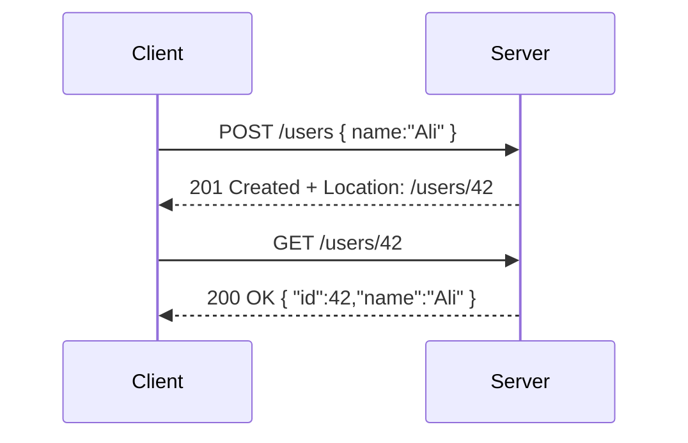

# ⚡ HTTP Basics: Methods, Headers, Status Codes

## 🔨 HTTP Methods (a.k.a. “verbs”)

Think of HTTP methods like **actions** you tell the server to perform.
In REST, they map directly to **CRUD operations** (Create, Read, Update, Delete).

| Method     | Meaning    | Typical REST Use | Example                              |
| ---------- | ---------- | ---------------- | ------------------------------------ |
| **GET**    | Fetch data | Read resource(s) | `GET /users/1`                       |
| **POST**   | Create new | Create resource  | `POST /users` with JSON body         |
| **PUT**    | Replace    | Full update      | `PUT /users/1` (replace user)        |
| **PATCH**  | Modify     | Partial update   | `PATCH /users/1` (update only email) |
| **DELETE** | Remove     | Delete resource  | `DELETE /users/1`                    |

💡 Memory trick:

- **GET** = bring it
- **POST** = add it
- **PUT** = replace it
- **PATCH** = tweak it
- **DELETE** = remove it

---

## 📦 HTTP Headers

Headers are like the **metadata** of a request/response — little notes attached to help servers and clients understand the message.

### 🔹 Common Request Headers

- `Accept: application/json` → tell server you want JSON back.
- `Content-Type: application/json` → what format your body is in.
- `Authorization: Bearer <token>` → auth token for security.
- `User-Agent: Mozilla/5.0` → info about client making request.

### 🔹 Common Response Headers

- `Content-Type: application/json` → response format.
- `Cache-Control: no-cache` → whether response can be cached.
- `ETag: "abc123"` → version identifier for resource (helps caching).
- `Location: /users/2` → often used in `201 Created` responses to point to the new resource.

---

## 🚦 HTTP Status Codes

Status codes tell the **outcome** of a request. They follow the pattern:

- **1xx** → Informational
- **2xx** → Success
- **3xx** → Redirection
- **4xx** → Client error
- **5xx** → Server error

### 🔹 **Most Important Ones**

#### ✅ **Success (2xx)**

- **200 OK** → request succeeded.
- **201 Created** → resource created (usually with `POST`).
- **202 async accepted** → request is added to a queue and will be handled later..
- **204 No Content** → success, but nothing to return (e.g., `DELETE`).

#### 🔁 **Redirection & Caching (3xx)**

These status codes don’t mean failure — they guide the client to take **another step**. Think of them as polite nudges.

**🧭 Permanent Redirects:**

- **301 Moved Permanently**  
  → The resource has moved to a new URL **forever**.  
  → Clients (and search engines) should **update their links**.  
  → Example: `GET /old-page` → `301` → `Location: /new-page`

- **308 Permanent Redirect**  
  → Same as 301, but **preserves the HTTP method**.  
  → If you `POST /old`, the client will `POST /new` — not switch to `GET`.  
  → Useful for APIs where method matters.

**🔄 Temporary Redirects:**

- **302 Found**  
  → Resource is temporarily elsewhere.  
  → Clients should **not update bookmarks**.  
  → Often used for login flows or short-lived redirects.

- **303 See Other**  
  → Tells the client: “Go fetch the result using `GET` from this other URI.”  
  → Common after a `POST` that triggers a redirect to a result page.

🧠 **Caching & Efficiency:**

- **304 Not Modified**  
  → “You already have the latest version — no need to download again.”  
  → Used with headers like `If-Modified-Since` or `ETag`.  
  → Saves bandwidth and speeds up client-side performance.

---

#### ❌ **Client Errors (4xx)**

- **400 Bad Request** → malformed or invalid input (e.g., missing fields, bad JSON).
- **401 Unauthorized** → authentication required or invalid token (means “unauthenticated”).
- **403 Forbidden** → authenticated but not allowed to access the resource (RBAC failure).
- **404 Not Found** → resource doesn’t exist at the requested URI.
- **405 Method Not Allowed** → HTTP verb not supported for this endpoint (e.g., `PUT` on a read-only route).
- **409 Conflict** → request conflicts with current state (e.g., duplicate entry (**idempotency**), version mismatch).
- **415 Unsupported Media Type** → wrong `Content-Type` header (e.g., expecting `application/json`).
- **422 Unprocessable Entity** → semantic validation failed (e.g., valid JSON but invalid business logic).
- **429 Too Many Requests** → rate limit exceeded; client should back off or retry later.

---

#### 💀 **Server Errors (5xx)**

- **500 Internal Server Error** → generic crash.
- **502 Bad Gateway** → upstream service failed.
- **503 Service Unavailable** → server down or overloaded.
- **504 Gateway Timeout** → server didn’t respond in time.

---

## 🖼️ Example REST Interaction

### Request

```http
POST /users HTTP/1.1
Host: api.example.com
Content-Type: application/json
Authorization: Bearer abc123
Accept: application/json

{
  "name": "Ali",
  "email": "ali@example.com"
}
```

### Response

```http
HTTP/1.1 201 Created
Content-Type: application/json
Location: /users/42

{
  "id": 42,
  "name": "Ali",
  "email": "ali@example.com"
}
```

👉 Notice:

- **Method** = `POST` (create).
- **Headers** tell format + auth.
- **Status code** = `201 Created`.
- **Location header** points to the new user.

---

## 📊 Visual Flow

<div align="center">



</div>

---

## 🎯 Recap

- **Methods** = actions (GET, POST, PUT, PATCH, DELETE).
- **Headers** = metadata (content type, auth, caching).
- **Status codes** = outcome (2xx success, 4xx client errors, 5xx server errors).

Together, they form the **language of REST APIs**.
