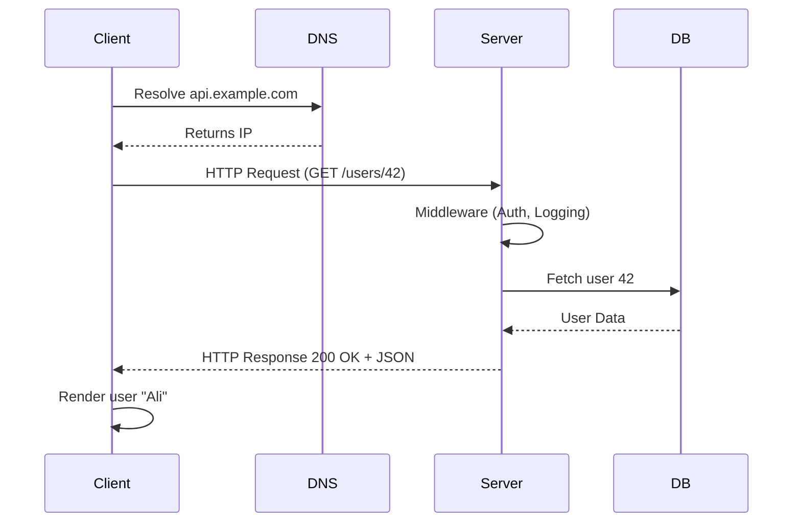

# 🌍 Request/Response Lifecycle

## 🛫 Step 1: The Client Makes a Request

Your client (browser, mobile app, Postman, Angular/React app, etc.) initiates a request:

- **Method**: `GET`, `POST`, etc.
- **URL**: e.g., `https://api.example.com/users/42`
- **Headers**: metadata (`Authorization`, `Content-Type`, etc.)
- **Body**: data (only for `POST`, `PUT`, `PATCH`).

👉 Think of it like mailing a letter:

- **Address** = URL
- **Envelope** = headers
- **Message inside** = body

---

## 📬 Step 2: DNS & Networking

Before the request even reaches your app:

1. **DNS Lookup** → domain (`api.example.com`) becomes an IP.
2. **TCP Handshake** → connection established.
3. **TLS/SSL** (if HTTPS) → encrypted channel created.

💡 Without this, your request is just yelling into the void.

---

## 🏢 Step 3: Server Receives & Routes the Request

The server (API backend) receives the request and:

1. **Routing** → Maps the URL + Method to a handler.

   - `GET /users/42` → `UserController.GetUser(42)`

2. **Middleware** runs first:

   - Logging, authentication, rate-limiting, etc.

3. **Controller/Service logic** executes.

   - Fetch data from DB, call external API, apply business rules.

---

## 🛠️ Step 4: Processing

Inside the server, common tasks happen:

- **Validation** (is input valid?).
- **Authentication & Authorization** (are you allowed?).
- **Business Logic** (rules of the app).
- **Database Access** (read/write).
- **Side Effects** (send emails, call other APIs, log events).

---

## 📦 Step 5: Response is Built

The server prepares:

- **Status Code** (`200`, `201`, `404`, etc.).
- **Headers** (`Content-Type`, `Cache-Control`, etc.).
- **Body** (JSON/XML/HTML).

Example:

```http
HTTP/1.1 200 OK
Content-Type: application/json

{
  "id": 42,
  "name": "Ali",
  "email": "ali@example.com"
}
```

---

## 🚚 Step 6: Response Travels Back

- Goes over the same TCP/TLS connection.
- Hits client (browser/app).
- Client library (Axios, Fetch, HttpClient, etc.) parses it.

If JSON: client deserializes into objects.

---

## 🎬 Step 7: Client Handles Response

Now client code reacts:

- ✅ Success → display data, redirect, show toast.
- ❌ Error → show “Not Found” / “Something went wrong.”

Example in JavaScript:

```js
fetch("/users/42")
  .then((res) => res.json())
  .then((user) => console.log(user.name)) // "Ali"
  .catch((err) => console.error("Error:", err));
```

---

## 🖼️ Visual Lifecycle

<div align="center">



</div>

---

## ✅ Recap

1. **Client crafts request** (method + headers + body).
2. **DNS + network handshake** deliver it.
3. **Server routes** it to right handler.
4. **Middleware + business logic** run.
5. **Response built** with status, headers, and body.
6. **Response returned** via same connection.
7. **Client consumes & acts** on response.

> 💡 A REST API call is like a round-trip flight: request takes off → lands on server → does business → returns back as a response.
