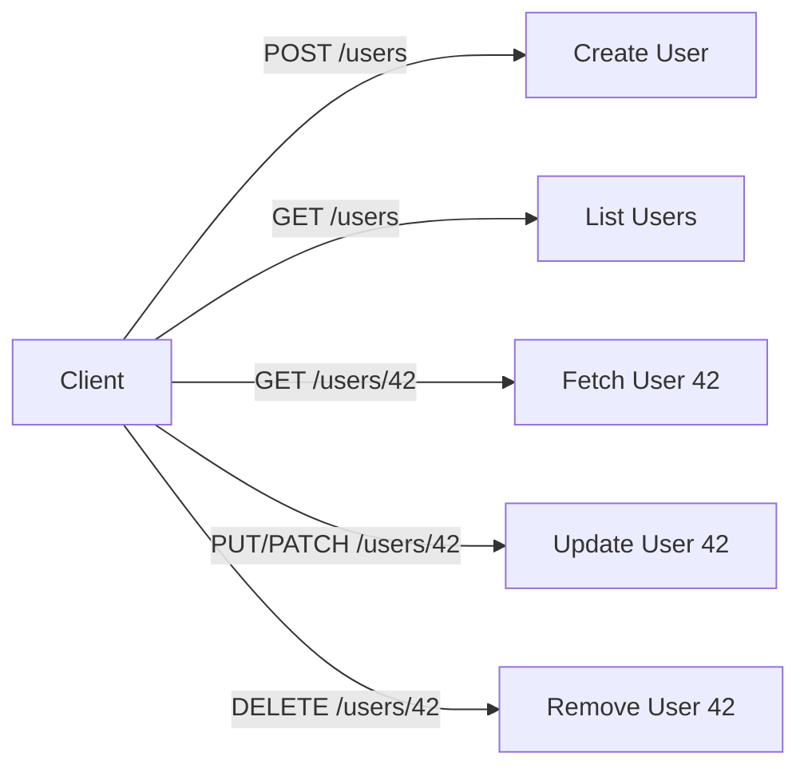

# 📖 CRUD Operations in REST

CRUD is the bread 🍞 and butter 🧈 of APIs. Every backend, from a simple TODO app to Amazon’s checkout API, follows this pattern.

---

## 🧩 Step 1: CRUD Refresher

- **C** → Create (add new data)
- **R** → Read (get data)
- **U** → Update (modify existing data)
- **D** → Delete (remove data)

---

## 🌐 Step 2: REST Mapping

In REST, CRUD maps neatly to HTTP **methods**:

| CRUD                 | HTTP Method | Example URL | Meaning                     |
| -------------------- | ----------- | ----------- | --------------------------- |
| **Create**           | `POST`      | `/users`    | Add a new user              |
| **Read (list)**      | `GET`       | `/users`    | Get all users               |
| **Read (single)**    | `GET`       | `/users/42` | Get user with ID 42         |
| **Update (replace)** | `PUT`       | `/users/42` | Replace user with ID 42     |
| **Update (partial)** | `PATCH`     | `/users/42` | Change only part of user 42 |
| **Delete**           | `DELETE`    | `/users/42` | Remove user with ID 42      |

👉 Think of it like verbs (`POST`, `GET`, etc.) acting on nouns (`/users`).

---

## 🧑‍💻 Step 3: Examples with JSON

### 1️⃣ Create (POST)

```http
POST /users
Content-Type: application/json

{
  "name": "Ali",
  "email": "ali@example.com"
}
```

Response:

```http
201 Created
Location: /users/42

{
  "id": 42,
  "name": "Ali",
  "email": "ali@example.com"
}
```

---

### 2️⃣ Read (GET)

```http
GET /users/42
```

Response:

```http
200 OK
{
  "id": 42,
  "name": "Ali",
  "email": "ali@example.com"
}
```

---

### 3️⃣ Update (PUT vs PATCH)

**PUT (replace whole object):**

```http
PUT /users/42
Content-Type: application/json

{
  "id": 42,
  "name": "Ali Updated",
  "email": "ali.new@example.com"
}
```

**PATCH (update only part):**

```http
PATCH /users/42
Content-Type: application/json

{
  "email": "ali.new@example.com"
}
```

---

### 4️⃣ Delete (DELETE)

```http
DELETE /users/42
```

Response:

```http
204 No Content
```

---

## 🖼️ Visual CRUD Flow



---

## ⚡ Pro Tips

- ✅ Use **nouns** (`/users`, `/orders`), not verbs (`/getUser`).
- ✅ Use **plural** (`/users`) for collections.
- ✅ Return proper **status codes** (`201 Created`, `404 Not Found`).
- ✅ PUT = replace whole object, PATCH = partial update.
- ✅ DELETE usually returns `204 No Content` (no body).

---

## ✅ Recap

- CRUD = Create, Read, Update, Delete.
- REST maps CRUD → `POST`, `GET`, `PUT/PATCH`, `DELETE`.
- URLs = resources (`/users/42`).
- Responses = JSON + status codes.

> 💡 If you can CRUD it, you can REST it.
