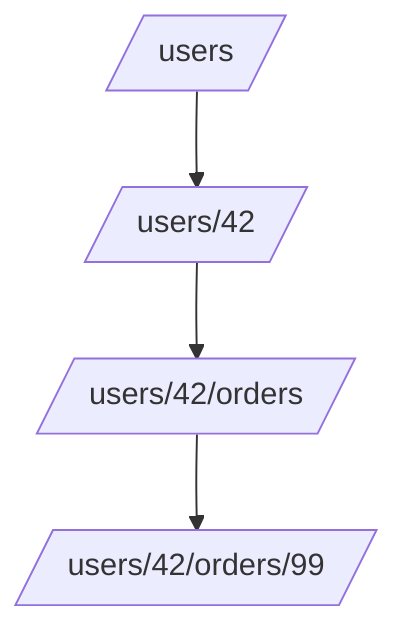

# 📍 Resources and URIs

## 🧩 What is a Resource?

In REST, **everything is a resource**.

- A user 👤
- A product 📦
- An order 🧾
- Even a photo 📸

Think of a resource as a **thing** in your system that clients can interact with.

👉 Resources are identified by **URIs** (Uniform Resource Identifiers).

---

## 🌐 What is a URI?

A URI is the **address** where a resource lives.

- Example: `https://api.example.com/users/42`
- `https://` → protocol
- `api.example.com` → domain
- `/users/42` → **path to resource**

---

## 🏗️ Designing Resource URIs

### 🔑 Golden Rules

1. **Use nouns, not verbs**
   ❌ `/getUser`
   ✅ `/users/42`

2. **Use plurals for collections**

   - `/users` → list of users
   - `/users/42` → single user

3. **Hierarchy shows relationships**

   - `/users/42/orders` → orders of user 42
   - `/users/42/orders/99` → specific order

4. **Use path for hierarchy, query for filters**

   - `/products/123/reviews` → reviews of product 123
   - `/products?category=electronics&sort=price` → filtered search

5. **Use IDs in path, not in query**
   ❌ `/getUser?id=42`
   ✅ `/users/42`

---

## 🧑‍💻 Examples

### Users

- `GET /users` → all users
- `GET /users/42` → single user
- `POST /users` → create user
- `PUT /users/42` → replace user
- `DELETE /users/42` → delete user

### Nested Resources

- `GET /users/42/orders` → all orders for user 42
- `GET /users/42/orders/99` → specific order

### Filtering

- `GET /orders?status=pending` → only pending orders
- `GET /products?sort=price&limit=10` → sorted + paginated

---

## 🖼️ Visual Hierarchy

---

## ⚡ Pro Tips

- ✅ Keep URIs lowercase (`/users`, not `/Users`).
- ✅ Use hyphens for readability (`/product-reviews`).
- ✅ Don’t expose internal DB keys (e.g., `/users/rowid-123`).
- ✅ URIs should be **predictable** — clients should guess them easily.
- ✅ Version your APIs in URI if needed: `/v1/users/42`.

---

## ✅ Recap

- **Resource = thing** (user, product, order).
- **URI = address** of the resource.
- Good URI design = predictable, consistent, and noun-based.
- Use **hierarchy for relationships**, **query params for filters**.

> 💡 If your API URIs read like **sentences**, you’re on the right track.
