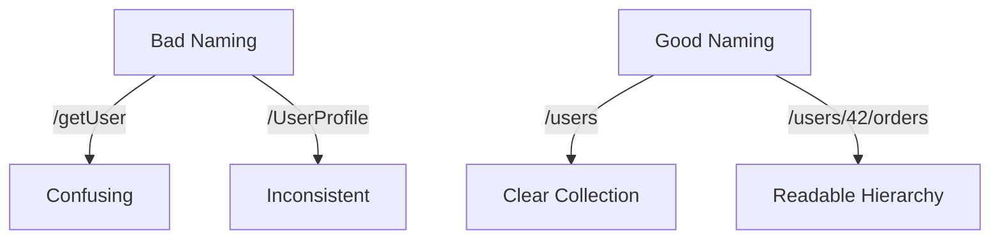

# 📝 Consistent Naming Conventions

## 🧩 Why Naming Matters

- Developers using your API should **guess the endpoint names** without reading docs.
- Bad names → confusion, bugs, frustration 🤯.
- Good names → smooth developer experience ✨.

👉 Rule of thumb: _If someone can predict the endpoint, you’re doing it right._

---

## 📌 1. Use Nouns, Not Verbs

- REST is **resource-oriented**, not action-oriented.
- The HTTP method already tells the **action** (GET, POST, PUT, DELETE).

❌ `/getUser`
✅ `/users/42`

---

## 📌 2. Use Plural Nouns for Collections

- Endpoints should describe **collections of resources**.

❌ `/user`
✅ `/users`

Example:

- `GET /users` → list all users
- `GET /users/42` → single user

---

## 📌 3. Keep It Lowercase & Hyphenated

- URIs are case-sensitive → stick to lowercase.
- Use **hyphens** (`-`) for readability.

❌ `/UserProfile`
❌ `/user_profile`
✅ `/user-profile`

---

## 📌 4. Consistent Hierarchy

- Express **relationships** using nested paths.

✅ `/users/42/orders/99` → Order 99 belongs to User 42.

But don’t nest too deeply:
❌ `/companies/5/departments/3/teams/7/users/42/orders/99`
(too painful 😵)

---

## 📌 5. Use Query Params for Filtering, Not Paths

❌ `/users/active`
✅ `/users?status=active`

❌ `/orders/by-date/2025-09-30`
✅ `/orders?date=2025-09-30`

---

## 📌 6. Keep Consistent Across Resources

- If one collection is plural, keep **all** plural.
  ❌ `/users`, `/order`
  ✅ `/users`, `/orders`

- If you use `id` in one place, don’t switch to `uid` somewhere else.

---

## 🖼️ Visual Examples

---

## ⚡ Pro Tips

- ✅ Always **predictable** (`/users`, `/orders`, `/products`).
- ✅ **Plural nouns** for collections.
- ✅ **Hyphens** for readability.
- ✅ **Consistency across endpoints**.
- ✅ Avoid verbs — let HTTP methods define the action.

---

## ✅ Recap

- REST URIs = **nouns** (resources), not verbs.
- Use **plural lowercase nouns** with hyphens.
- Express **hierarchy** with paths, **filters** with query params.
- Keep naming **consistent across the whole API**.

> 💡 A well-named API feels like reading a story: `/users/42/orders/99` → _“Get me order 99 from user 42.”_
