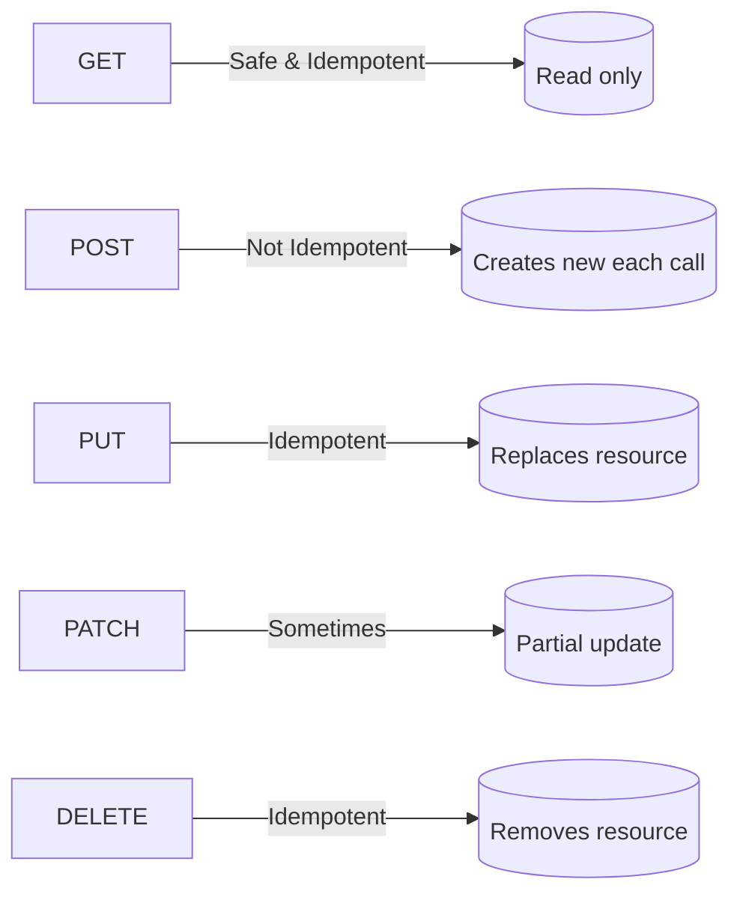

# ⚡ HTTP Methods & Idempotency

## 📌 Common HTTP Methods in REST

| Method     | Typical Use                    | Example            | Notes                                   |
| ---------- | ------------------------------ | ------------------ | --------------------------------------- |
| **GET**    | Read data                      | `GET /users/42`    | Safe, no side effects                   |
| **POST**   | Create new resource            | `POST /users`      | Not idempotent (creates new every time) |
| **PUT**    | Replace resource (full update) | `PUT /users/42`    | Idempotent                              |
| **PATCH**  | Partial update                 | `PATCH /users/42`  | Not guaranteed idempotent               |
| **DELETE** | Remove resource                | `DELETE /users/42` | Idempotent                              |

---

## 🧠 Idempotency Explained

**Idempotent =** doing the same operation **multiple times** gives the **same result**.

- Like turning a light switch **off twice** → light is still off.
- Not idempotent = pressing “add 1 coin” multiple times keeps adding coins.

---

## 🔍 Method by Method

### 1️⃣ GET

- **Usage**: fetch resources.
- **Idempotent?** ✅ Yes.
- **Safe?** ✅ Yes (doesn’t change server state).

Example:

```http
GET /users/42
```

No matter how many times → same result (unless data changes elsewhere).

---

### 2️⃣ POST

- **Usage**: create new resource.
- **Idempotent?** ❌ No.
- **Safe?** ❌ No (changes server state).

Example:

```http
POST /orders
{
  "item": "Laptop"
}
```

- Call once → order #101 created.
- Call again → order #102 created.

👉 Each call creates **new resource** → not idempotent.

---

### 3️⃣ PUT

- **Usage**: replace resource completely.
- **Idempotent?** ✅ Yes.
- **Safe?** ❌ No.

Example:

```http
PUT /users/42
{
  "id": 42,
  "name": "Ali",
  "email": "ali@example.com"
}
```

- First call → user updated.
- Call again with same body → nothing changes.
- Same result → **idempotent**.

---

### 4️⃣ PATCH

- **Usage**: update part of resource.
- **Idempotent?** 🤷 Sometimes.
- **Safe?** ❌ No.

Example:

```http
PATCH /users/42
{
  "loginCount": 5
}
```

If PATCH means “set loginCount = 5” → idempotent.
If PATCH means “increment loginCount by 5” → not idempotent.

---

### 5️⃣ DELETE

- **Usage**: remove resource.
- **Idempotent?** ✅ Yes.
- **Safe?** ❌ No.

Example:

```http
DELETE /users/42
```

- First call → user gone.
- Second call → user still gone (maybe 404, but state = same).

---

## 🖼️ Visual Summary

<div align="center">



</div>

---

## ⚡ Pro Tips

- ✅ Use **POST** only for create (don’t overload it for updates).
- ✅ Use **PUT** for full replace, **PATCH** for partial updates.
- ✅ GET requests should never change server state (even logs/metrics should be careful).
- ✅ DELETE should return `204 No Content` when successful.
- ✅ Idempotency is crucial for **retries** (e.g., when a request is retried after timeout).

---

## ✅ Recap

- **GET** = safe + idempotent.
- **POST** = not idempotent.
- **PUT** = idempotent (full replace).
- **PATCH** = maybe idempotent (depends on semantics).
- **DELETE** = idempotent.

> 💡 Rule of thumb: “Idempotent methods can be retried without fear. Non-idempotent ones (like POST) need extra care.”
