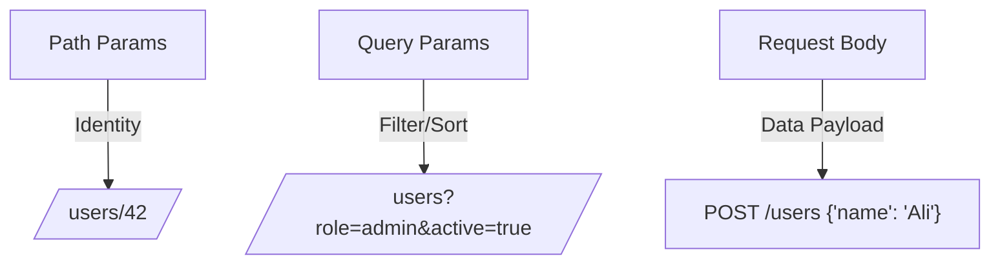

# 🔑 Query Parameters, Path Parameters, and Request Bodies

## 🧩 1. Path Parameters

📍 **Definition**: Values that identify **a specific resource** in the URI path.

- They are **mandatory**.
- They usually represent **IDs or unique identifiers**.

**Example:**

```http
GET /users/42
```

- `42` is a **path parameter** → it uniquely identifies the user.

👉 Use path params when:

- Referring to **one specific resource**.
- Expressing **hierarchy**.

✅ Good: `/users/42/orders/99`  
❌ Bad: `/getUser?id=42`

---

## 🧩 2. Query Parameters

📎 **Definition**: Key-value pairs in the URL, used for **filtering, sorting, or pagination**.

- They are **optional**.
- Do not define identity, just modify the result set.

**Example:**

```http
GET /products?category=electronics&sort=price&limit=10&page=2
```

- `category=electronics` → filter
- `sort=price` → sorting
- `limit=10&page=2` → pagination

👉 Use query params when:

- You want **search/filter criteria**.
- You want **optional refinements** to a resource.

✅ Good: `/orders?status=pending&sort=date`  
❌ Bad: `/users?id=42` (should be `/users/42`).

---

## 🧩 3. Request Body

📦 **Definition**: The payload you send with `POST`, `PUT`, or `PATCH`.

- Used to send **data to create or update resources**.
- Usually JSON in REST.

**Example (POST request):**

```http
POST /users
Content-Type: application/json

{
  "name": "Ali",
  "email": "ali@example.com"
}
```

**Example (PATCH request):**

```http
PATCH /users/42
Content-Type: application/json

{
  "email": "ali.new@example.com"
}
```

👉 Use request body when:

- Sending **complex data**.
- Creating/updating resources.
- Never for GET requests (should remain safe & cacheable).

---

## 🖼️ Visual Comparison

<div align="center">



</div>

---

## ⚡ Pro Tips

- ✅ Use **path params** for identity (who/what).
- ✅ Use **query params** for filtering/sorting/pagination (how you want it).
- ✅ Use **request body** for create/update data (what to change).
- ✅ Keep GET requests **body-free** (body in GET is non-standard).
- ✅ Don’t overload query params with sensitive data (like passwords).

---

## ✅ Recap

- **Path Params** → identify the **resource**. (`/users/42`)
- **Query Params** → refine/search/filter results. (`/users?role=admin`)
- **Request Body** → provide **data** for create/update. (`POST /users { ... }`)

> 💡 Think of it like this:

- **Path** = “Where is it?”
- **Query** = “How should I filter/sort it?”
- **Body** = “What data am I sending?”
