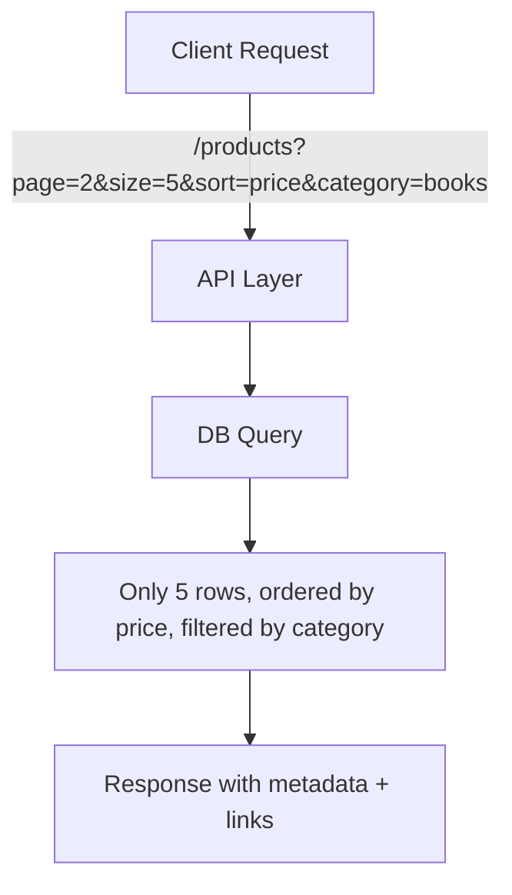

# 📊 Pagination, Sorting & Filtering (Handling Big Datasets)

## 🧩 Why Do We Need This?

Imagine:

- You’re building an API for **e-commerce products** 🛒.
- The DB has **10 million items**.
- If the API returns all in one go → 💥 server meltdown + client timeout.

👉 That’s why we **page results** (small chunks), **sort them** (consistent order), and **filter them** (only what the client needs).

---

## 1️⃣ Pagination

### Common Techniques

#### a) **Offset & Limit** (SQL style)

```http
GET /products?offset=0&limit=10
GET /products?offset=10&limit=10
```

✅ Simple, easy.  
❌ Large offsets = slow queries (DB still scans).

---

#### b) **Page & Size** (Human-friendly)

```http
GET /products?page=1&size=10
GET /products?page=2&size=10
```

✅ Easier for clients.  
❌ Same large-skip problem for huge datasets.

---

#### c) **Cursor-based** (a.k.a. Keyset pagination)

```http
GET /products?after=product123&limit=10
```

✅ Super fast for huge datasets.  
✅ Works great for infinite scroll (social feeds).  
❌ More complex to implement.

---

### Example Response with Pagination Metadata

```json
{
  "data": [
    { "id": 1, "name": "Laptop" },
    { "id": 2, "name": "Mouse" }
  ],
  "pagination": {
    "page": 1,
    "size": 2,
    "totalPages": 50,
    "totalItems": 100
  }
}
```

---

## 2️⃣ Sorting

Let clients control order.

```http
GET /products?sort=price
GET /products?sort=-createdAt   # minus = descending
```

✅ Useful for ordering by **date, price, rating, etc.**  
✅ Multiple sorts possible:

```http
GET /products?sort=price,-rating
```

---

## 3️⃣ Filtering

Clients rarely need “all” data. Let them **filter**.

```http
GET /products?category=electronics&brand=sony&price_lt=500
```

👉 Common filter styles:

- `field=value` → `?status=active`
- Range queries → `?price_lt=1000&price_gt=100`
- Lists → `?ids=1,2,3`
- Dates → `?createdAfter=2024-01-01`

---

## 🖼️ Visual Example

<div align="center">



</div>

---

## 🔗 HATEOAS-Style Pagination Links

```json
{
  "data": [ ... ],
  "links": {
    "self": "/products?page=2&size=5",
    "next": "/products?page=3&size=5",
    "prev": "/products?page=1&size=5"
  }
}
```

✅ Helps clients **navigate** easily.

---

## ⚡ Pro Tips

- ✅ Always set **default page size** (e.g., 20).
- ✅ Allow clients to change `size` but enforce **max limit** (e.g., 100).
- ✅ For **real-time feeds** → use **cursor-based pagination**.
- ✅ Document filters & sorts clearly.
- ✅ Keep sorting predictable (always use a tiebreaker field like `id`).

---

## ✅ Recap

- **Pagination** = split data into smaller chunks.
- **Sorting** = let clients choose order.
- **Filtering** = only return what’s needed.
- Use **offset/page for simplicity**, **cursor for huge/real-time datasets**.
- Always return **metadata or navigation links**.

> 💡 Think of it like Netflix 🎬:
>
> - Pagination = next page of movies
> - Sorting = “Sort by Popularity”
> - Filtering = “Show only Sci-Fi under 2 hours”
