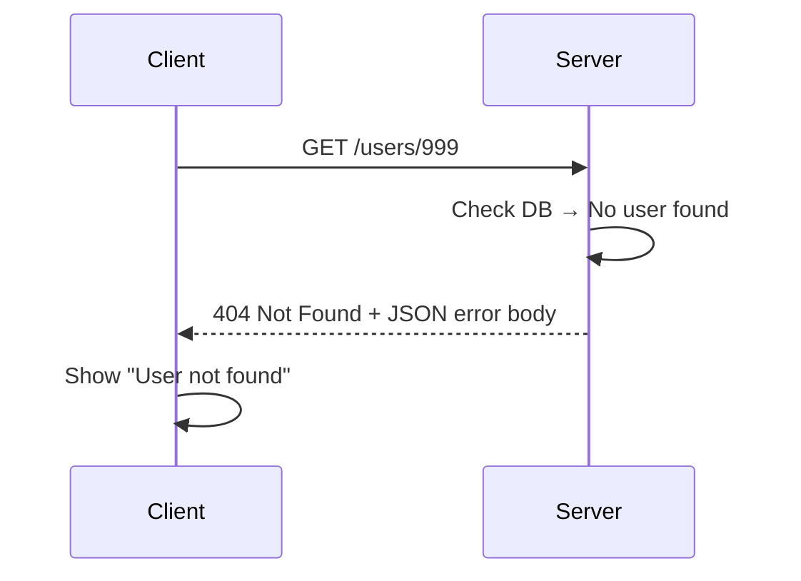

# 🚨 Error Handling & Status Codes

## 🧩 Why Error Handling Matters

Imagine using an API that only ever replies:

```json
{ "error": "something went wrong" }
```

You’d cry. 😭

Good error handling should tell you:

- **What happened** (status code).
- **Why it happened** (message/code).
- **How to fix it** (hint/details).

---

## 📌 HTTP Status Code Categories

| Code Range | Meaning         | Example                            |
| ---------- | --------------- | ---------------------------------- |
| **2xx**    | ✅ Success      | `200 OK`, `201 Created`            |
| **3xx**    | 🔀 Redirection  | `301 Moved Permanently`            |
| **4xx**    | ❌ Client Error | `400 Bad Request`, `404 Not Found` |
| **5xx**    | 💥 Server Error | `500 Internal Server Error`        |

---

## 🔍 Common Status Codes for REST APIs

### ✅ Success

- **200 OK** → standard success.
- **201 Created** → new resource created.
- **204 No Content** → success but nothing to return (often after DELETE).

---

### ❌ Client Errors (4xx)

- **400 Bad Request** → invalid input.
- **401 Unauthorized** → no valid auth credentials.
- **403 Forbidden** → authenticated, but not allowed.
- **404 Not Found** → resource doesn’t exist.
- **409 Conflict** → duplicate or conflicting state (e.g., creating same username).
- **422 Unprocessable Entity** → validation failed (common in APIs).

---

### 💥 Server Errors (5xx)

- **500 Internal Server Error** → generic server crash.
- **502 Bad Gateway** → upstream service error.
- **503 Service Unavailable** → server down/overloaded.
- **504 Gateway Timeout** → server didn’t respond in time.

---

## 📦 Standard Error Response Structure

Most modern APIs follow a **consistent JSON structure** for errors:

```json
{
  "error": {
    "code": "USER_NOT_FOUND",
    "message": "User with ID 42 does not exist.",
    "details": {
      "id": 42,
      "resource": "users"
    },
    "traceId": "abc123"
  }
}
```

### Key Parts:

- `code`: machine-friendly error identifier.
- `message`: human-readable explanation.
- `details`: extra info (optional).
- `traceId`: helps debug logs/tracing.

---

## 🖼️ Error Handling Flow



---

## ⚡ Pro Tips

- ✅ Always return **meaningful status codes** (don’t use `200` with error messages).
- ✅ Use **422** for validation errors (clearer than `400`).
- ✅ Keep **error codes stable** across versions (clients depend on them).
- ✅ Include a **trace ID** to debug production issues.
- ✅ Don’t leak sensitive info (like stack traces) in production.

---

## ✅ Recap

- Use **2xx** for success, **4xx** for client mistakes, **5xx** for server crashes.
- Provide **structured JSON error responses**.
- Make error messages **developer-friendly** (actionable, not vague).
- Always be **consistent** in your API error format.

> 💡 A good API makes errors as helpful as success responses — that’s what developers love.
