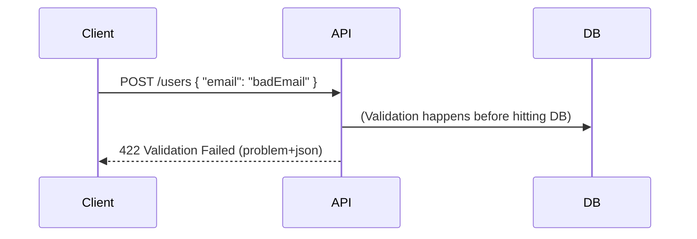

# ❌ Error Handling (Problem+JSON, Error Codes)

## 🧩 Why Error Handling Matters

Imagine you call an API and it replies:

```json
{ "error": "Something went wrong" }
```

😡 → Not helpful.
What went wrong? Validation? Authentication? Server crash?

👉 Good APIs **communicate clearly**:

- What failed
- Why it failed
- How to fix it

---

## 1️⃣ HTTP Status Codes Recap

- `4xx` → Client messed up 🙃 (bad input, unauthorized).
- `5xx` → Server messed up 💥 (bug, outage).

**Common ones**:

- **400** Bad Request → malformed request body
- **401** Unauthorized → missing/invalid auth
- **403** Forbidden → no permission
- **404** Not Found → resource doesn’t exist
- **409** Conflict → duplicate resource
- **422** Unprocessable Entity → validation errors
- **500** Internal Server Error → generic server failure
- **503** Service Unavailable → downtime/overload

---

## 2️⃣ The `problem+json` Standard (RFC 7807)

Instead of inventing custom formats, use a **standardized error response**.

### Example Response

```http
HTTP/1.1 400 Bad Request
Content-Type: application/problem+json
```

```json
{
  "type": "https://api.example.com/errors/invalid-input",
  "title": "Invalid input",
  "status": 400,
  "detail": "The field 'email' must be a valid email address.",
  "instance": "/users/123"
}
```

### Fields Explained

- **type** → URI that documents the error type
- **title** → Short human-readable summary
- **status** → HTTP status code
- **detail** → Extra info (specific to request)
- **instance** → The specific resource/request that failed

---

## 3️⃣ Validation Errors Example

If multiple fields fail, return them all:

```json
{
  "type": "https://api.example.com/errors/validation",
  "title": "Validation Failed",
  "status": 422,
  "errors": {
    "email": "Invalid email format",
    "password": "Password must be at least 8 characters"
  }
}
```

✅ This helps clients fix **all issues at once**.

---

## 4️⃣ Example in Flow



---

## 5️⃣ Pro Tips

- ✅ Always use **correct status code** (don’t return 200 with "error").
- ✅ Use **problem+json** for consistency.
- ✅ Include **machine-readable fields** (like `errors.email`) for clients.
- ✅ Hide internal stack traces → never expose DB/stack info.
- ✅ Log detailed errors internally, but return safe, helpful messages externally.
- ✅ Provide a **link in `type`** where developers can read more about that error.

---

## ✅ Recap

- **400-series** → client errors, **500-series** → server errors.
- Use **problem+json (RFC 7807)** for standardized responses.
- Return **validation details** so clients know how to fix requests.
- Keep errors **useful but safe**.

> 💡 Good error handling = fewer support tickets + happier developers.
