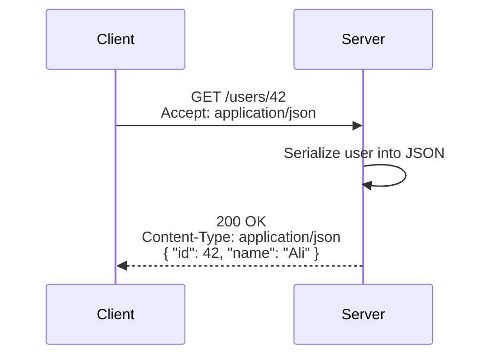

# 📦 Content Negotiation (JSON, XML, etc.)

## 🧩 What is Content Negotiation?

Content Negotiation = a **conversation between client and server** to decide **in which format** the data should be exchanged.

👉 Example:

- Some clients love **JSON** (modern web apps).
- Some legacy clients need **XML**.
- Some systems want **CSV/Excel**.

Instead of building multiple APIs, we make **one API** that supports multiple formats.

---

## 🔑 How Does It Work?

The magic happens in HTTP **headers**:

### 1️⃣ `Accept` header (client → server)

Client says what it wants:

```http
GET /users/42
Accept: application/json
```

or

```http
Accept: application/xml
```

### 2️⃣ `Content-Type` header (server → client)

Server replies with what it’s giving:

```http
HTTP/1.1 200 OK
Content-Type: application/json

{
  "id": 42,
  "name": "Ali"
}
```

---

## 🧑‍💻 Example in Action

### Request JSON

```http
GET /users/42
Accept: application/json
```

Response:

```json
{
  "id": 42,
  "name": "Ali"
}
```

### Request XML

```http
GET /users/42
Accept: application/xml
```

Response:

```xml
<User>
  <Id>42</Id>
  <Name>Ali</Name>
</User>
```

---

## 🖼️ Visual Flow



---

## 📌 When to Use

- **JSON** → default for modern REST APIs (lightweight, widely supported).
- **XML** → legacy systems, SOAP replacements.
- **CSV/Excel** → data export/reporting.
- **HTML** → if API doubles as a web page (rare in pure APIs).

---

## ⚡ Pro Tips

- ✅ Always default to **JSON** unless client asks otherwise.
- ✅ Be explicit: use `Content-Type` in both request & response.
- ✅ Support only formats you can realistically maintain (don’t promise XML if nobody tests it).
- ✅ Don’t auto-switch based on query params (`/users?format=xml`) unless needed for browsers.
- ✅ Avoid sending multiple formats in one response (confuses clients).

---

## ✅ Recap

- **Content Negotiation** = client says “I want JSON/XML,” server replies accordingly.
- Uses **Accept** (client) and **Content-Type** (server) headers.
- JSON is the standard default, but APIs can support XML, CSV, HTML, etc.
- Keep it **consistent, predictable, and minimal**.

> 💡 A REST API should feel like a multilingual waiter: it gives you the same dish (data) in the language (format) you prefer.
