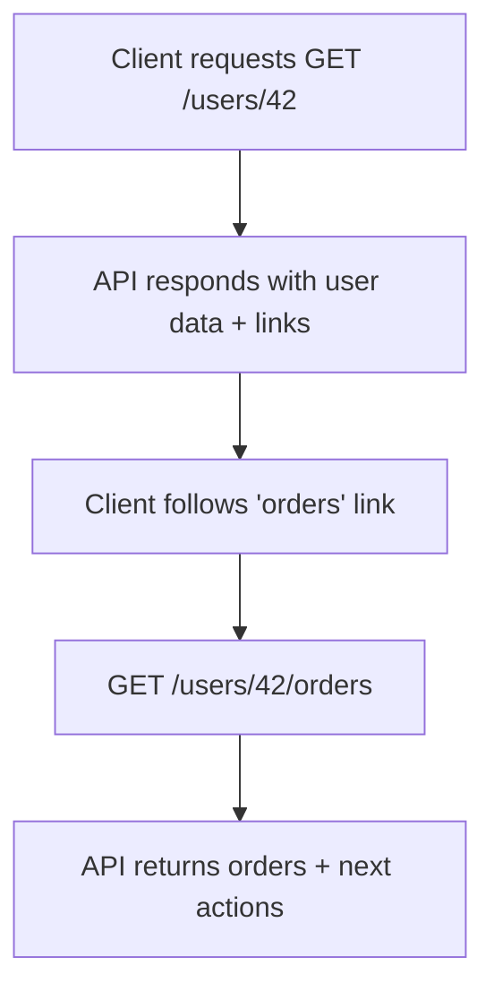

# 🔗 HATEOAS (Hypermedia as the Engine of Application State)

---

## 🧩 What is HATEOAS?

HATEOAS means:

> An API response should not just give **data**, but also **links** (actions) the client can take next.

👉 Think of it like a **GPS system**: you don’t just get your current location (data), but also **directions** on where you can go next.

---

## ❌ Without HATEOAS

Client has to know all URLs in advance (hard-coded):

```json
{
  "id": 42,
  "name": "Ali"
}
```

The client must guess:

- How do I get Ali’s orders?
- How do I update Ali’s profile?

---

## ✅ With HATEOAS

Response guides the client with hyperlinks:

```json
{
  "id": 42,
  "name": "Ali",
  "links": [
    { "rel": "self", "href": "/users/42" },
    { "rel": "orders", "href": "/users/42/orders" },
    { "rel": "update", "href": "/users/42", "method": "PUT" }
  ]
}
```

👉 Now the client doesn’t need to hard-code endpoints. The API **teaches the client what’s possible next**.

---

## 🖼️ Visual Flow

<div align="center">



</div>

It’s like navigating through a web page with hyperlinks.

---

## 🔧 Example: Order Workflow

### Step 1: Create an order

```http
POST /orders
```

Response:

```json
{
  "id": 101,
  "status": "PENDING",
  "links": [
    { "rel": "self", "href": "/orders/101" },
    { "rel": "cancel", "href": "/orders/101/cancel", "method": "POST" },
    { "rel": "pay", "href": "/orders/101/pay", "method": "POST" }
  ]
}
```

---

### Step 2: Pay the order

```http
POST /orders/101/pay
```

Response:

```json
{
  "id": 101,
  "status": "PAID",
  "links": [
    { "rel": "self", "href": "/orders/101" },
    { "rel": "ship", "href": "/orders/101/ship", "method": "POST" }
  ]
}
```

---

👉 Notice how:

- Available actions **change dynamically** with state.
- Clients don’t need to memorize business rules (like “only ship after pay”).
- The API itself teaches the workflow.

---

## ⚡ Benefits of HATEOAS

- ✅ Clients discover APIs dynamically (less documentation needed).
- ✅ Easier versioning (new links = new actions).
- ✅ Clear workflows enforced by server.
- ✅ Reduces client-side hardcoding of routes.

---

## ⚠️ Downsides

- Adds complexity in building responses.
- Not all clients/libraries support following links.
- Many teams drop it for simplicity → they prefer static docs (Swagger, OpenAPI).

---

## ✅ Recap

- HATEOAS = responses include **hyperlinks for next actions**.
- Makes APIs **self-discoverable** and workflow-driven.
- Great for evolving APIs and guiding clients.
- Not always used in practice, but powerful for **truly RESTful design**.

> 💡 Think of HATEOAS as **turning your API into an interactive storybook**: each page tells you what you can do next.
