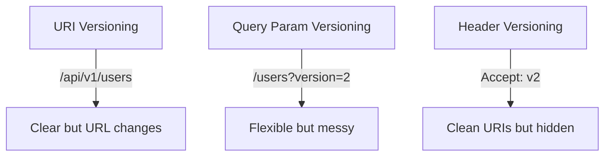

# 🔢 Versioning Strategies (URI, Header, Query Param)

## 🧩 Why Version APIs?

- APIs live long 🧓 → clients depend on them.
- When you need to **change behavior** (rename fields, new response format, remove legacy features), you can’t break existing clients.
- Versioning = evolve without chaos.

👉 Rule: _Don’t break old clients. Add new versions._

---

## 📌 Common Versioning Strategies

### 1️⃣ URI Versioning (Most Popular)

Put the version directly in the URL.

Example:

```http
GET /api/v1/users/42
GET /api/v2/users/42
```

✅ Easy to understand.  
✅ Clear separation of versions.  
❌ URL changes → not truly “RESTful” (resource identity shifts).  
❌ Duplicated docs/endpoints if not managed carefully.

👉 Best when: Big breaking changes.

---

### 2️⃣ Query Parameter Versioning

Version specified in query string.

Example:

```http
GET /users/42?version=1
GET /users/42?version=2
```

✅ Easy to implement.  
✅ Clients can choose versions dynamically.  
❌ Less common, often seen as “messy”.  
❌ Harder to cache (different query = different resource).

👉 Best when: You want quick & flexible version selection.

---

### 3️⃣ Header Versioning

Version declared in request headers (`Accept` or custom header).

Example:

```http
GET /users/42
Accept: application/vnd.myapi.v2+json
```

or

```http
X-API-Version: 2
```

✅ Clean URIs (no version in path).  
✅ True to REST philosophy (same resource, different representation).  
❌ Clients must know headers → harder to test/debug.  
❌ Hidden from URL → less obvious for humans.

👉 Best when: You want to keep URLs stable & “pure REST”.

---

## 🧑‍💻 Real-Life Examples

- **GitHub API** → uses **Header Versioning** with media types:

  ```http
  Accept: application/vnd.github.v3+json
  ```

- **Stripe API** → uses **Date-based Versioning** in headers:

  ```http
  Stripe-Version: 2022-11-15
  ```

- **Google APIs** → use **URI Versioning**:

  ```ini
  https://www.googleapis.com/drive/v3/files
  ```

---

## 🖼️ Visual Comparison

<div align="center">



</div>

---

## ⚡ Pro Tips

- ✅ Choose **one strategy** and stick with it.
- ✅ URI versioning is easiest for public APIs.
- ✅ Header versioning is cleanest but needs good docs.
- ✅ Avoid “silent changes” → always bump version for breaking changes.
- ✅ Use **semantic versioning** in docs, even if not in URLs (`v1.2`, `v2`).
- ✅ Deprecate old versions gradually (warn before removing).

---

## ✅ Recap

- **URI versioning** → `/v1/` in path (most common).
- **Query param** → `?version=2` (quick & dirty).
- **Header** → `Accept` or `X-API-Version` (cleaner, but hidden).
- Versioning = protecting old clients while evolving new features.

> 💡 Think of versioning like Netflix profiles — everyone gets their own experience without messing with others.
