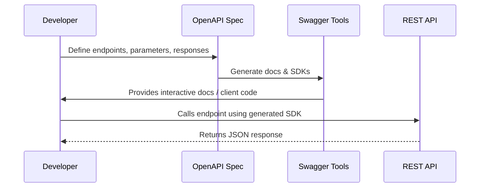

# 📖 OpenAPI / Swagger Specification

## 1️⃣ Why Documentation Matters

Imagine you’ve built a fantastic REST API — but if developers don’t know **how to call it**, it’s useless.

- Good documentation = fewer support tickets + faster adoption.
- Poor documentation = frustration + wrong API usage.

That’s where **OpenAPI (formerly Swagger)** comes in.

---

## 2️⃣ What is OpenAPI?

**OpenAPI Specification (OAS)** is an **industry standard** way to describe REST APIs.

- Written in **YAML** or **JSON**.
- Defines **endpoints, methods, parameters, responses, authentication, and schemas**.
- Acts as a **contract** between backend and frontend (or any client).

💡 Swagger is the **tooling ecosystem** around OpenAPI (e.g., Swagger Editor, Swagger UI, Swagger Codegen).

---

## 3️⃣ How It Works

### 📌 Example OpenAPI Snippet (YAML)

```yaml
openapi: 3.0.0
info:
  title: User API
  version: 1.0.0
paths:
  /users/{id}:
    get:
      summary: Get user by ID
      parameters:
        - in: path
          name: id
          required: true
          schema:
            type: integer
      responses:
        "200":
          description: User found
          content:
            application/json:
              schema:
                $ref: "#/components/schemas/User"
        "404":
          description: User not found
components:
  schemas:
    User:
      type: object
      properties:
        id:
          type: integer
        name:
          type: string
```

👉 This says:

- API has a `/users/{id}` endpoint.
- Supports `GET`.
- Takes an integer path param.
- Returns `200` with a JSON `User` object, or `404` if missing.

---

## 4️⃣ Swagger Tools

- **Swagger Editor** → Write OpenAPI spec in browser.
- **Swagger UI** → Interactive docs (click → try out → send request).
- **Swagger Codegen / OpenAPI Generator** → Generate client SDKs (C#, JS, Python) or server stubs from the spec.

So instead of writing boilerplate HTTP code, you can auto-generate.

---

## 5️⃣ Sequence: Dev Workflow with OpenAPI

<div align="center">



</div>

---

## 6️⃣ Benefits of OpenAPI

- ✅ **Clarity** – Everyone knows how endpoints behave.
- ✅ **Consistency** – No guessing parameter names or status codes.
- ✅ **Automation** – Generate code, docs, and tests.
- ✅ **Discoverability** – Developers can “try before they code” in Swagger UI.
- ✅ **Integration** – Works with API gateways (AWS API Gateway, Azure API Management, Kong).

---

## 7️⃣ Real Example: Swagger UI

Imagine visiting:
👉 `https://api.example.com/docs`

You’ll see a **Swagger UI page**:

- Lists endpoints (`/users`, `/orders`, `/products`).
- Click an endpoint → expand details.
- Fill in parameters → click “Try it out” → sends real request to API.

This removes guesswork and makes APIs **self-explaining**.

---

## ✅ Recap

- **OpenAPI** = standard spec for documenting REST APIs.
- **Swagger** = tooling around OpenAPI.
- **Spec** defines everything: endpoints, params, responses, schemas.
- **Tools** provide interactive docs, SDK generation, and validation.
- Essential for **collaboration, adoption, and maintainability**.

---

👉 Next up in this section, we can cover **API documentation portals (Swagger UI, Redoc, Postman Collections)**.

Do you want me to go **Swagger vs Redoc vs Postman** next, or go deeper into **how to actually write OpenAPI specs**?
