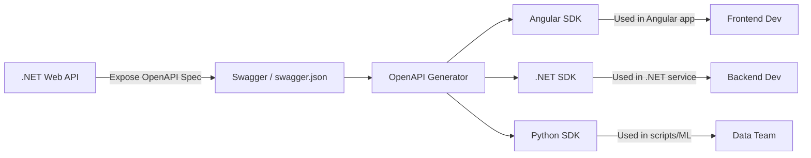

# 📦 API Client SDK Generation

👉 You already have an **OpenAPI spec** (`openapi.yaml/json`) that describes your API.  
Instead of asking developers to manually write `fetch`/`HttpClient`/`requests` code, you can **auto-generate a library (SDK)** in their favorite language.

So instead of:

```js
fetch("https://api.example.com/users/42", { headers: { Authorization: "Bearer xyz" } })
  .then((res) => res.json())
  .then((user) => console.log(user.name));
```

They just do:

```js
const user = await client.users.getUser(42);
console.log(user.name);
```

---

## 🚀 How it works (in steps)

1. **You define your API** in OpenAPI (`openapi.yaml`).

   - It lists endpoints, inputs, outputs, and errors.

2. **Run a generator** (e.g., OpenAPI Generator).

   - It spits out a ready-to-use SDK for JavaScript, C#, Python, etc.

3. **Publish or share** the SDK.

   - Other devs just `npm install your-sdk`, `pip install`, or `dotnet add package`.

4. **Developers use it** like any other library.

   - They don’t worry about URLs, headers, JSON parsing, etc.
   - They just call functions.

---

## 🛠️ Example

Your spec has:

```yaml
paths:
  /users/{id}:
    get:
      operationId: getUser
      parameters:
        - name: id
          in: path
          required: true
          schema: { type: integer }
      responses:
        "200":
          description: OK
          content:
            application/json:
              schema:
                $ref: "#/components/schemas/User"
```

Generated **C# client**:

```csharp
var api = new UsersApi("https://api.example.com", "Bearer xyz");
var user = await api.GetUserAsync(42);
Console.WriteLine(user.Name);
```

Generated **Python client**:

```python
api = UsersApi("https://api.example.com", token="xyz")
user = api.get_user(42)
print(user.name)
```

---

## 🌟 Why it’s useful

- **Consistency** → Everyone uses the API in the same way.
- **Less boilerplate** → No more manual JSON/HTTP handling.
- **Type safety** → IDE autocompletes method names, validates inputs.
- **Time saver** → One spec → many SDKs.

---

## ✅ In one line:

**API client SDK generation = take your OpenAPI spec → push a button → get a plug-and-play library for developers.**

## 💭 API Client SDK Generation for .NET + Angular Developers

Imagine you’ve built a **.NET Web API** for users, products, and orders. You want your **Angular frontend** (and maybe other clients) to call it.

Without SDK generation, you’d:

- Write Angular `HttpClient` calls for every endpoint.
- Manually type interfaces for User, Product, etc.
- Hope you don’t mismatch property names or forget a status code.
- Do the same again if you add a **mobile app**, a **Python script**, or another .NET service.

👉 Painful. Error-prone. Lots of duplication.

---

### 1️⃣ The OpenAPI Spec (the contract)

Your .NET API can auto-expose an OpenAPI spec (via **Swashbuckle/Swagger**). Example snippet:

```yaml
openapi: 3.0.0
info:
  title: Shop API
  version: 1.0.0
paths:
  /users/{id}:
    get:
      summary: Get user by ID
      parameters:
        - in: path
          name: id
          schema: { type: integer }
          required: true
      responses:
        "200":
          description: OK
          content:
            application/json:
              schema:
                $ref: "#/components/schemas/User"
components:
  schemas:
    User:
      type: object
      properties:
        id: { type: integer }
        name: { type: string }
```

This **YAML file is the single truth** about your API.

---

### 2️⃣ SDK Generation for Angular

Now, instead of writing:

```ts
this.http.get<User>(`/api/users/${id}`).subscribe((u) => console.log(u.name));
```

You generate an **Angular TypeScript SDK** using **OpenAPI Generator**:

```bash
openapi-generator-cli generate \
  -i http://localhost:5000/swagger/v1/swagger.json \
  -g typescript-angular \
  -o ./src/app/api
```

This produces:

- ✅ **UserService** class with `getUser(id)`
- ✅ **User** model with strong typing
- ✅ Preconfigured Angular `HttpClient` wrapper

Now frontend devs just do:

```ts
this.userService.getUser(42).subscribe((user) => {
  console.log(user.name); // type-safe, no magic strings
});
```

---

### 3️⃣ SDK Generation for .NET

What if another **.NET microservice** wants to consume your Shop API?

You run:

```bash
openapi-generator-cli generate \
  -i http://localhost:5000/swagger/v1/swagger.json \
  -g csharp-netcore \
  -o ./ShopApiClient
```

Now you get a **.NET client library**:

```csharp
var api = new UsersApi("https://localhost:5000", new ApiClient("Bearer token"));
var user = await api.GetUserAsync(42);
Console.WriteLine(user.Name);
```

No manual `HttpClient` code. No JSON parsing. Strongly typed models.

---

### 4️⃣ The Flow for You (Full Stack)



---

### 5️⃣ Why It Rocks for You

- **Single source of truth**: Backend defines API once.
- **Angular** → gets ready-made service classes + models.
- **.NET** → gets typed SDK without reinventing HttpClient.
- **Other teams** (Python, Java, etc.) → get their SDKs too.
- **Consistency** → if you change API, regenerate SDKs, everyone stays in sync.

---

✅ In short:
As a **.NET backend + Angular frontend dev**, SDK generation means:

- You **focus on business logic** in .NET.
- Angular (or other clients) get **ready-to-use, type-safe methods**.
- No wasted time writing HTTP boilerplate.
