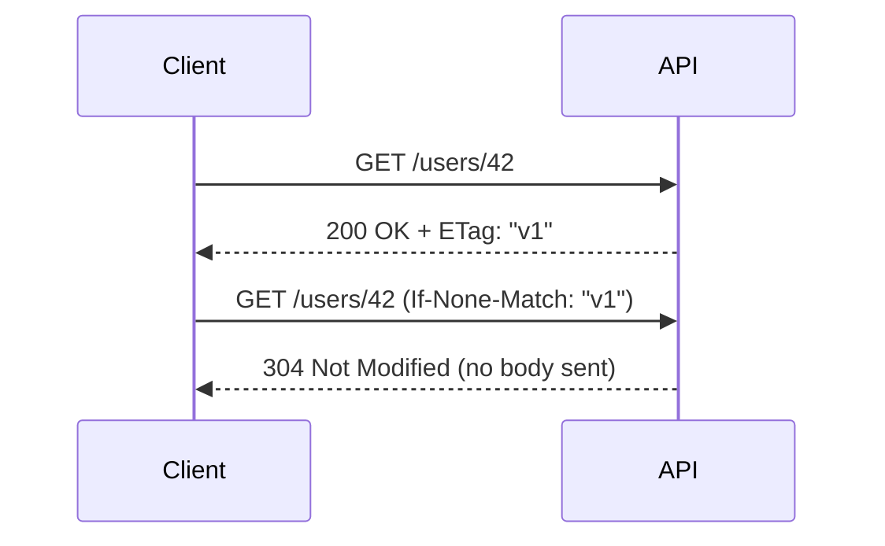

# 🗂️ Caching in REST APIs (ETag, Last-Modified, Cache-Control)

## 🧩 Why Caching Matters

- Every time you hit an API → the server, DB, and network are stressed.
- Without caching → repeated requests = wasted time + money 💸.
- With caching → the client can reuse responses safely.

👉 Goal: Serve data **fast** without breaking **freshness**.

---

## 🔑 The Building Blocks

Caching in HTTP has 3 main tools:

1. **Cache-Control** → how long/manner a response can be cached.
2. **Last-Modified** → tells client when resource last changed.
3. **ETag (Entity Tag)** → fingerprint/hash of resource for change detection.

Let’s break them down.

---

## 1️⃣ Cache-Control

The **`Cache-Control` header** tells browsers/proxies how to cache.

### Example:

```http
HTTP/1.1 200 OK
Cache-Control: public, max-age=3600
```

- `public` → anyone (browser, proxy, CDN) can cache it.
- `max-age=3600` → valid for 3600s (1 hour).

### Variants

- `no-store` → don’t cache at all.
- `no-cache` → can store, but must **revalidate with server** before reuse.
- `private` → only the browser can cache, not proxies.

👉 Think of it like **expiry labels** on food 🍎.

---

## 2️⃣ Last-Modified

The **`Last-Modified` header** tells client when resource last changed.

### Response Example

```http
HTTP/1.1 200 OK
Last-Modified: Tue, 30 Sep 2025 10:00:00 GMT
```

### Next Client Request

```http
GET /users/42
If-Modified-Since: Tue, 30 Sep 2025 10:00:00 GMT
```

- If resource hasn’t changed → server returns `304 Not Modified`.
- Saves bandwidth, because the **body isn’t resent**.

---

## 3️⃣ ETag (Entity Tag)

ETag = unique **fingerprint** of a resource (often a hash).

### Response Example

```http
HTTP/1.1 200 OK
ETag: "abc123"
```

### Next Client Request

```http
GET /users/42
If-None-Match: "abc123"
```

- If same → server replies `304 Not Modified`.
- If different → server sends new version with new ETag.

👉 Safer than `Last-Modified` because:

- Handles updates faster than seconds.
- Works even if clocks differ.

---

## 🖼️ Sequence Flow

<div align="center">



</div>

---

## 🔧 Practical Example: User Profile

### First Request

```http
GET /users/42
```

Response:

```http
200 OK
Cache-Control: private, max-age=600
ETag: "user42-v1"
Content-Type: application/json
```

```json
{ "id": 42, "name": "Ali", "email": "ali@example.com" }
```

---

### Second Request (after 5 mins)

```http
GET /users/42
If-None-Match: "user42-v1"
```

Response:

```http
304 Not Modified
```

👉 No JSON body sent → client just reuses cached copy.

---

## ⚡ Combining Strategies

- `Cache-Control` → for **expiry rules**.
- `ETag` → for **change detection**.
- `Last-Modified` → for **human-readable timestamps**.

A good API usually uses both `Cache-Control` + `ETag`.

---

## ✅ Best Practices

- ✅ Use `ETag` for dynamic resources.
- ✅ Use `Cache-Control` headers for static assets (images, docs).
- ✅ Use `private` for user-specific data (profiles, dashboards).
- ✅ For public content → `public, max-age=86400` (cache 1 day).
- ✅ Always allow conditional requests (`If-None-Match`, `If-Modified-Since`).

---

## ✅ Recap

- Caching = speed + scalability.
- **Cache-Control** defines caching rules.
- **Last-Modified** enables timestamp-based revalidation.
- **ETag** enables hash-based revalidation (more reliable).
- Together → APIs serve **fresh data fast**, while saving resources.

> 💡 Think of caching like a **fridge**: you don’t cook the same meal every time — you reuse it until it goes bad.
