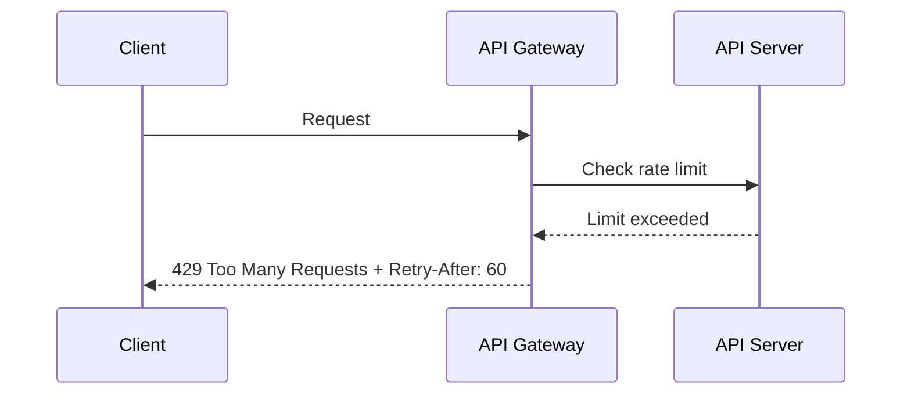

# ⏳ Rate Limiting & Throttling in REST APIs

## 🧩 Why We Need It

Imagine you own a pizza shop 🍕:

- One customer orders **1000 pizzas per minute** → kitchen explodes.
- Fair policy: each customer can only order **3 pizzas per minute**.

👉 That’s **rate limiting** in API terms:

- Protects server from overload.
- Prevents a single client from hogging resources.
- Keeps service reliable for everyone.

---

## 🔑 Core Concepts

- **Rate Limiting** → Hard cap on requests (e.g., 100 req/min per user).
- **Throttling** → Slowing down or delaying requests once limit is exceeded.
- **Quotas** → Long-term limits (e.g., 10,000 req/day).

---

## 1️⃣ Simple Example

**Policy**: 100 requests per minute per API key.

### Scenario

- Client sends 101st request in 1 min.
- Server responds:

  ```http
  HTTP/1.1 429 Too Many Requests
  Retry-After: 60
  ```

👉 `429` = standard “too many requests” error.  
👉 `Retry-After` = tells client when to try again.

---

## 2️⃣ Techniques to Implement

### 🔹 Fixed Window

- Count requests in fixed time slots.
- Example: 100 req/min → counter resets at each new minute.

❌ Issue: Burst at end + start of window = 200 requests in 2 seconds.

---

### 🔹 Sliding Window

- Counter moves with time.
- Always counts “last N seconds.”
- More accurate, but needs tracking per request.

---

### 🔹 Token Bucket (most popular)

- Bucket holds tokens (capacity = limit).
- Each request consumes a token.
- Tokens refill at fixed rate.
- If bucket empty → request denied.

👉 Allows bursts but controls overall rate.

---

### 🔹 Leaky Bucket

- Similar to token bucket but enforces **steady outflow**.
- Incoming requests > outflow = dropped.
- Smooths out spikes.

---

## 3️⃣ Real-World Examples

### GitHub API

- **Limit**: 5000 requests/hour per user.
- Response headers:

  ```http
  X-RateLimit-Limit: 5000
  X-RateLimit-Remaining: 4999
  X-RateLimit-Reset: 1372700873
  ```

---

### Twitter API (X)

- Different tiers (Free, Basic, Enterprise).
- Example: 300 tweets/read requests per 15 minutes.

---

### Stripe API

- Uses token bucket.
- Returns `429 Too Many Requests` when exceeded.
- Encourages retry with exponential backoff.

---

## 4️⃣ Example API Flow

<div align="center">



</div>

---

## 5️⃣ Best Practices

- ✅ Always return `429 Too Many Requests` with `Retry-After`.
- ✅ Use **headers** (`X-RateLimit-Limit`, `X-RateLimit-Remaining`) to help clients self-regulate.
- ✅ Apply **per-user** or **per-API-key** limits (not just per-IP).
- ✅ For public APIs → different tiers (free vs premium).
- ✅ Use **token bucket** for flexible but fair throttling.
- ✅ Encourage retries with **exponential backoff** (don’t hammer retry).

---

## ✅ Recap

- **Rate limiting** = how many requests a client can make.
- **Throttling** = slowing down when limit is hit.
- Implemented with **Fixed Window, Sliding Window, Token Bucket, Leaky Bucket**.
- Standard way to tell client = `429 Too Many Requests + Retry-After`.
- Big APIs (GitHub, Stripe, Twitter) use these patterns daily.

> 💡 Think of rate limiting like an **API traffic light** 🚦: too many cars? → stop, wait, try again later.
