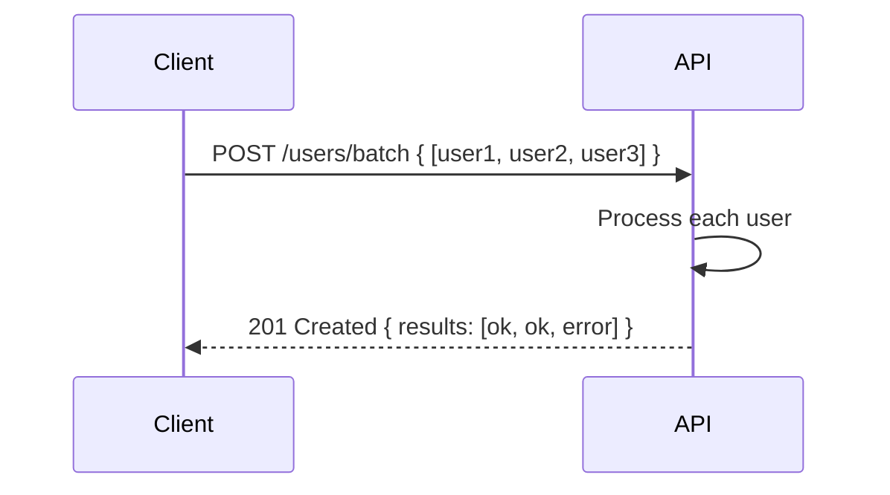

# 📦 Bulk Operations (Batch Endpoints)

## 🧩 Why Bulk Operations?

Imagine you need to:

- Create 100 users
- Delete 50 products
- Update 30 orders

Without bulk: → 180 separate API calls 😱

- More network overhead
- Slower
- Harder to guarantee consistency

👉 Bulk operations = handle **many items in one request**.

---

## 1️⃣ Common Approaches

### 🔹 Batch Endpoint

- A dedicated endpoint (like `/batch` or `/bulk`) that accepts **multiple operations**.

Example:

```http
POST /users/batch
```

Request body:

```json
[
  { "name": "Ali", "email": "ali@test.com" },
  { "name": "Sara", "email": "sara@test.com" }
]
```

Response:

```json
[
  { "id": 1, "name": "Ali", "email": "ali@test.com" },
  { "id": 2, "name": "Sara", "email": "sara@test.com" }
]
```

---

### 🔹 Mixed Operation Batch

Some APIs allow **different actions in one call**.

```http
POST /batch
```

Request body:

```json
{
  "operations": [
    { "method": "POST", "path": "/users", "body": { "name": "Ali" } },
    { "method": "DELETE", "path": "/orders/123" },
    { "method": "PUT", "path": "/products/42", "body": { "price": 99.99 } }
  ]
}
```

Response:

```json
{
  "results": [
    { "status": 201, "body": { "id": 1, "name": "Ali" } },
    { "status": 204 },
    { "status": 200, "body": { "id": 42, "price": 99.99 } }
  ]
}
```

👉 Google APIs and Facebook Graph API support this style.

---

### 🔹 Bulk Delete/Update with Filters

Instead of sending IDs one by one:

```http
DELETE /orders?status=cancelled
```

👉 Deletes **all cancelled orders** in one go.

---

## 2️⃣ Example: Bulk Order Creation

```http
POST /orders/batch
```

Request:

```json
{
  "orders": [
    { "customer": "Ali", "items": [1, 2, 3] },
    { "customer": "Sara", "items": [4, 5] }
  ]
}
```

Response:

```json
{
  "results": [
    { "id": 101, "customer": "Ali", "status": "CREATED" },
    { "id": 102, "customer": "Sara", "status": "CREATED" }
  ]
}
```

---

## 3️⃣ Error Handling in Bulk

Bulk APIs need **per-item results**.

```json
{
  "results": [
    { "id": 101, "status": "CREATED" },
    { "error": "Invalid item ID 999", "status": 400 }
  ]
}
```

👉 This way, one bad item doesn’t kill the whole batch.

---

## 🖼️ Flow Diagram

<div align="center">



</div>

---

## ⚡ Best Practices

- ✅ Support **per-item results** (don’t fail all if one fails).
- ✅ Document **max batch size** (to avoid server overload).
- ✅ Return **detailed errors** per item.
- ✅ Consider **async bulk jobs** (for very large datasets).
- ✅ Use bulk endpoints for **create/update/delete**, but keep them predictable.

---

## ✅ Recap

- Bulk operations = fewer requests, faster APIs.
- Styles: simple bulk (`/batch`), mixed ops, bulk filters.
- Must return **per-item results**.
- Watch out for batch size limits + async jobs for heavy lifting.

> 💡 Bulk APIs = like ordering **a combo meal** instead of 10 separate burgers 🍔🍟🥤.
