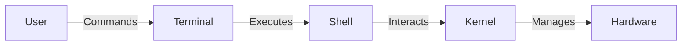

# 🚀 **Roadmap to Mastering Shell Scripting in Linux**

Mastering Shell Scripting requires a combination of theoretical knowledge and practical experience. Below is a structured roadmap enriched with examples, diagrams, and exercises to guide you from beginner to expert.

---

## 📌 **Phase 1: Foundations of Linux & Shell**

Before diving into scripting, ensure you have a solid understanding of the Linux command line and the shell environment.

### 🔹 **1. Understanding Linux Shells & Terminals**

✅ **What is a Shell?**

- A command-line interpreter that allows users to interact with the OS.
- Common Shells:
  - **Bash (Bourne Again Shell)** – Most widely used
  - **Zsh (Z Shell)** – More features, powerful completion
  - **Fish (Friendly Interactive Shell)** – Modern, user-friendly
  - **Sh (Bourne Shell)** – The original UNIX shell

✅ **Terminal vs Shell vs Kernel**



✅ **Checking the default shell:**

```bash
echo $SHELL
```

✅ **Changing the default shell:**

```bash
chsh -s /bin/zsh
```

✅ **Exercise**:

- Find out which shell you are using.
- Change to a different shell and revert back.

---

## 🎯 **Phase 2: Basic Shell Scripting**

### 🔹 **2. Writing & Running Your First Script**

✅ **Creating a Shell Script**

```bash
#!/bin/bash
echo "Hello, World!"
```

✅ **Making It Executable**

```bash
chmod +x script.sh
./script.sh
```

✅ **Shebang (`#!`) and Its Importance**

- Tells the OS which interpreter to use.
- Example for Python: `#!/usr/bin/python3`

✅ **Exercise**:

- Write a script that prints your name and the current date.

---

### 🔹 **3. Shell Variables & User Input**

✅ **Declaring and Using Variables**

```bash
name="John Doe"
echo "Hello, $name"
```

✅ **User Input with `read`**

```bash
echo "Enter your name:"
read username
echo "Hello, $username!"
```

✅ **Environment Variables**

```bash
echo $HOME
export MY_VAR="Custom Value"
echo $MY_VAR
```

✅ **Exercise**:

- Write a script that asks for the user's name and age, then prints a greeting.

---

### 🔹 **4. Conditional Statements (`if` & `case`)**

✅ **If-Else Statements**

```bash
echo "Enter a number:"
read num
if [ $num -gt 10 ]; then
    echo "Number is greater than 10"
else
    echo "Number is 10 or less"
fi
```

✅ **Case Statement**

```bash
echo "Enter a day:"
read day
case $day in
    Monday) echo "Start of the week!" ;;
    Friday) echo "Weekend is near!" ;;
    *) echo "It's just another day." ;;
esac
```

✅ **Exercise**:

- Write a script that checks if a given number is even or odd.

---

## ⚙ **Phase 3: Looping & Functions**

### 🔹 **5. Loops (`for`, `while`, `until`)**

✅ **For Loop**

```bash
for i in {1..5}; do
    echo "Number: $i"
done
```

✅ **While Loop**

```bash
count=1
while [ $count -le 5 ]; do
    echo "Count: $count"
    ((count++))
done
```

✅ **Until Loop**

```bash
num=1
until [ $num -gt 5 ]; do
    echo "Number: $num"
    ((num++))
done
```

✅ **Exercise**:

- Write a script to print numbers from 1 to 10 using all three loop types.

---

### 🔹 **6. Functions in Shell Scripting**

✅ **Defining and Calling Functions**

```bash
function greet {
    echo "Hello, $1!"
}
greet "Alice"
```

✅ **Returning Values**

```bash
function sum {
    result=$(( $1 + $2 ))
    echo $result
}
sum 5 10
```

✅ **Exercise**:

- Create a function that calculates the factorial of a number.

---

## 🔥 **Phase 4: Advanced Shell Scripting**

### 🔹 **7. File Handling & Redirection**

✅ **Reading a File**

```bash
while read line; do
    echo "$line"
done < file.txt
```

✅ **Writing to a File**

```bash
echo "This is a test" > output.txt
```

✅ **Appending to a File**

```bash
echo "More data" >> output.txt
```

✅ **Exercise**:

- Write a script that counts the number of lines in a file.

---

### 🔹 **8. Working with Arguments & Flags**

✅ **Handling Script Arguments**

```bash
echo "Script Name: $0"
echo "First Argument: $1"
echo "Second Argument: $2"
```

✅ **Using Flags**

```bash
while getopts "n:a:" opt; do
    case $opt in
        n) name=$OPTARG ;;
        a) age=$OPTARG ;;
    esac
done
echo "Name: $name, Age: $age"
```

✅ **Exercise**:

- Write a script that takes a filename as an argument and checks if it exists.

---

### 🔹 **9. Process Management & Background Jobs**

✅ **Listing Running Processes**

```bash
ps aux
```

✅ **Killing a Process**

```bash
kill <PID>
```

✅ **Running a Script in Background**

```bash
./script.sh &
```

✅ **Exercise**:

- Write a script that starts a background job and then terminates it.

---

## 🛠 **Phase 5: Real-World Applications**

### 🔹 **10. Automation & Scheduling Tasks**

✅ **Cron Jobs**

```bash
crontab -e
# Run a script every day at 5 AM
0 5 * * * /path/to/script.sh
```

✅ **Exercise**:

- Create a cron job to back up a directory every day.

---

### 🔹 **11. Shell Scripting for System Administration**

✅ **Monitoring System Usage**

```bash
df -h
free -m
```

✅ **Log Analysis**

```bash
tail -f /var/log/syslog
```

✅ **Exercise**:

- Write a script to check if a service is running and restart it if not.

---

## 🎓 **Final Phase: Mastery & Best Practices**

### 🔹 **12. Debugging & Optimization**

✅ **Debugging Scripts**

```bash
bash -x script.sh
```

✅ **Shell Scripting Best Practices**

- Use meaningful variable names.
- Write modular and reusable scripts.
- Handle errors properly using `trap`.

---

## 🎯 **Final Challenge**

✅ Create a full-fledged backup script that:

- Accepts a source and destination directory.
- Creates a compressed archive.
- Uses logging and error handling.
