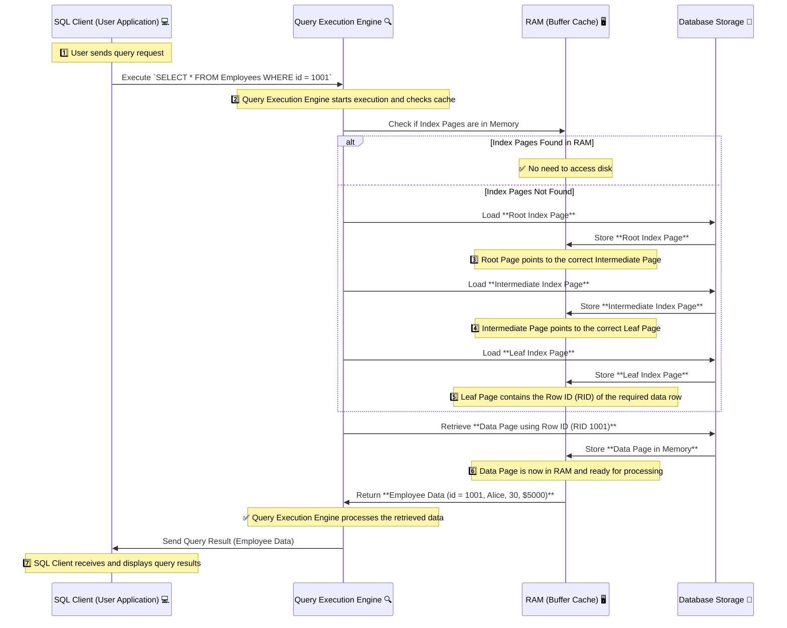
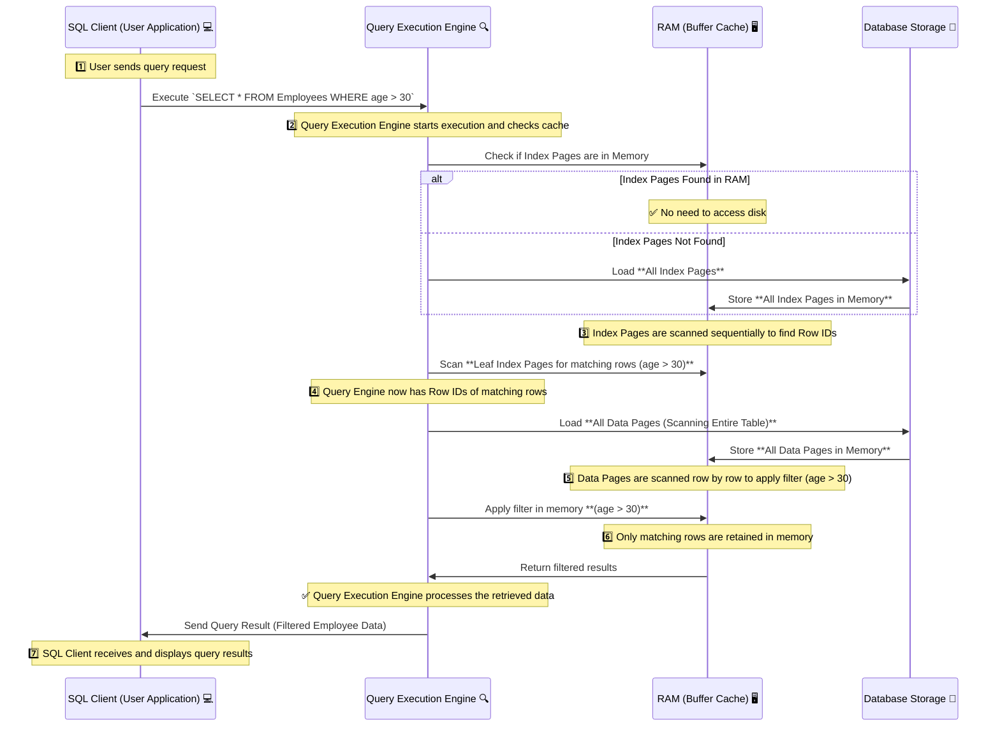

# 🔎 **Index Seek vs. Index Scan: A Deep Dive**

Indexes help databases **retrieve data efficiently**, but the way they are used—either via **Index Seek or Index Scan**—greatly affects **query performance**.

✅ **Index Seek** efficiently **navigates the B-Tree index**, **loads only necessary index pages into memory**, retrieves the **row IDs (RID)**, and fetches **only the required data pages**.  
❌ **Index Scan** **loads all index pages and data pages into memory**, then **applies the filter in RAM**, making it **much slower** for large datasets.

---

## **📌 How Indexes Store Data (B-Tree Structure)**

Indexes are **stored in structured pages** using a **B-Tree (Balanced Tree) structure**, with three levels:

| **Page Type**          | **Function**                                                      |
| ---------------------- | ----------------------------------------------------------------- |
| **Root Page**          | Entry point for searches, stores pointers to intermediate pages.  |
| **Intermediate Pages** | Store **pointers to leaf pages** for faster lookups.              |
| **Leaf Pages**         | Contain **Row IDs (RID)** or **actual data (Clustered Indexes).** |

✅ **Index pages are separate from data pages** and allow fast lookups.

---

## **📌 What is Index Seek?**

✔ **Index Seek is a targeted search** that **navigates the B-Tree structure**, locates **only relevant rows**, and retrieves **only required data pages**.

### **🔹 Lifecycle of an Index Seek**

**1️⃣ Index Pages Are Loaded into Memory:**

- The **query optimizer** chooses an **Index Seek**.
- The **Root Page** of the index **is loaded into memory**.
- The **B-Tree algorithm** is applied to **find the row location**.

**2️⃣ B-Tree Traversal Finds the Row ID (RID):**

- The index **searches efficiently** using **logarithmic O(log N) complexity**.
- The **Leaf Page is reached**, containing the **Row ID (RID)**.

**3️⃣ Data Page Is Retrieved Using RID:**

- The **exact data page** is fetched based on **row pointers**.
- **Only necessary pages are read** from disk.

**4️⃣ Data Is Returned to the Query Engine:**

- The **required row(s)** are sent back to the client.

---

### **🔍 Example: How Index Seek Works**

✔ **Scenario: Searching for `id = 1001` in an Index**

```sql
SELECT * FROM Employees WHERE id = 1001;
```

| **Index Level**                 | **Page Content**                                             |
| ------------------------------- | ------------------------------------------------------------ |
| **Root Page**                   | Pointers to **Intermediate Pages**                           |
| **Intermediate Page 1**         | Pointers to **Leaf Pages (id: 1 - 1000, 1001 - 2000, etc.)** |
| **Leaf Page (id: 1001 - 2000)** | **Row ID (1001) → Page 50**                                  |
| **Data Page 50**                | Full record: **(1001, Alice, 30, \$5000)**                   |

---

### **🔹 Index Seek Execution Process**



✔ **Only relevant index pages and the required data page are accessed**.  
✔ **Efficient B-Tree search avoids reading unnecessary pages**.

---

## **📌 What is Index Scan?**

❌ **Index Scan reads all index pages sequentially, loads all data pages into memory, and applies the filter later**.

### **🔹 Lifecycle of an Index Scan**

**1️⃣ Full Index Read:**

- The database **reads the entire index sequentially**.

**2️⃣ All Data Pages Are Loaded into Memory:**

- It **does not use row locators**, so it **loads all rows into RAM**.

**3️⃣ Filter Applied in Memory:**

- The **filter condition (e.g., `age > 30`)** is evaluated **after loading all pages**.

**4️⃣ Results Are Returned:**

- The **matching rows are sent back**, but at a **high CPU and I/O cost**.

---

### **🔍 Example: How Index Scan Works**

✔ **Scenario: Searching for `age > 30`**

```sql
SELECT * FROM Employees WHERE age > 30;
```

| **Index Level** | **Page Content**                            |
| --------------- | ------------------------------------------- |
| **Root Page**   | Pointers to all rows.                       |
| **Leaf Pages**  | Contains **all employee records**.          |
| **Data Pages**  | All pages loaded into RAM before filtering. |

---

### **🔹 Index Scan Execution Process**



✔ **Index Scan loads the entire table, even if only a few rows are needed**.  
✔ **Very slow for large tables** because of **high disk I/O & memory usage**.

---

## **🚀 Performance Comparison: Index Seek vs. Index Scan**

| **Feature**      | **Index Seek ✅**                | **Index Scan ❌**               |
| ---------------- | -------------------------------- | ------------------------------- |
| **Data Access**  | Uses **B-Tree traversal**        | Reads **all index rows**        |
| **Performance**  | ✅ **Faster (Selective Read)**   | ❌ **Slower (Full Index Scan)** |
| **I/O Overhead** | ✅ **Low (Minimal page reads)**  | ❌ **High (Loads all pages)**   |
| **CPU Cost**     | ✅ **Low (Minimal computation)** | ❌ **High (Filter in memory)**  |

✔ **Index Seek retrieves data efficiently using structured B-Tree search**.  
❌ **Index Scan reads unnecessary pages, making it slower for large datasets**.

---

## **🤔 How to Avoid Index Scans?**

### **✅ Solution 1: Ensure Queries Use Indexed Columns**

```sql
CREATE INDEX idx_age ON Employees(age);
```

🔹 **Now queries using `WHERE age > 30` will perform an Index Seek**.

### **✅ Solution 2: Use Selective Filters**

❌ **Bad Query (Index Scan)**

```sql
SELECT * FROM Employees WHERE age > 30;
```

✅ **Optimized Query (Index Seek)**

```sql
SELECT * FROM Employees WHERE age = 35;
```

🔹 **Using equality `=` ensures Index Seek**.

### **✅ Solution 3: Use Query Hints to Force Index Seek**

```sql
SELECT * FROM Employees WITH (INDEX(idx_age)) WHERE age = 35;
```

🔹 **Explicitly instructs the optimizer to use `idx_age`**.

---

## **📒 Final Thoughts**

✔ **Index Seek is faster** because it:

- **Loads only necessary index pages into memory**.
- **Applies B-Tree traversal** for fast lookups.
- **Fetches only the required data pages**.

✔ **Index Scan is slower** because it:

- **Reads the entire index sequentially**.
- **Loads all data pages into memory before filtering**.
