# Syntax Error Notes

- Mermaid syntax requires quoted labels when the text includes parentheses, spaces, or special characters.
- markdown language only supported in some mermaid diagrams. For example, flowcharts but sequence diagrams do not.
- Don't use _node_ as class name, it is reserved word in mermaid.js
- Use `classDef` to define styles and `class` to apply them to specific nodes.
- Use `-.->` for dashed arrows in flowcharts.
- Use `subgraph` to group related nodes together.
- Use `config` block for global settings like theme and appearance.
- Use `---` to separate configuration and diagram sections in Mermaid.
- Always test Mermaid diagrams in a Mermaid live editor to ensure correctness.
- For complex diagrams, break them into smaller parts and combine them later.

```mermaid
---
config:
  look: handDrawn
  theme: dark
title: "Azure VM Storage: Host Cache vs. Temp Disk"
---

flowchart TB
    subgraph VM["Azure Virtual Machine"]
        A["Your App"] --> B["Guest OS"]
        B --> C["**Virtual Disk Driver**"]
        B --> D["**Temp Disk (Ephemeral)**"]
    end

    subgraph Host["**Physical Host (Hypervisor)**"]
        C --> E["💾 **Host Cache Layer**"]
        D --> F["**Local SSD (Temp Disk)**"]
    end

    E --> G["**Managed Disk in Azure Storage**"]
    F -.-> G

    classDef disk fill:#f9f,stroke:#333,color:#111;
    classDef cache fill:#99ffa5,stroke:#333,color:#111;
    classDef temp fill:#ffcc99,stroke:#333,color:#111;

    class E,G disk
    class F temp
    class D temp
    class C cache
```

